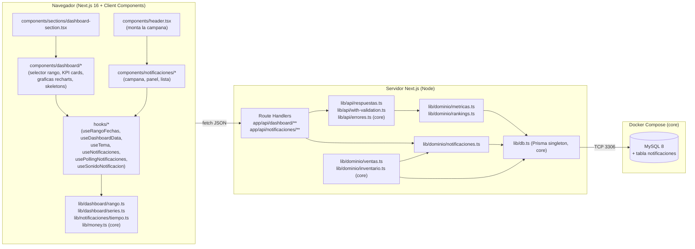
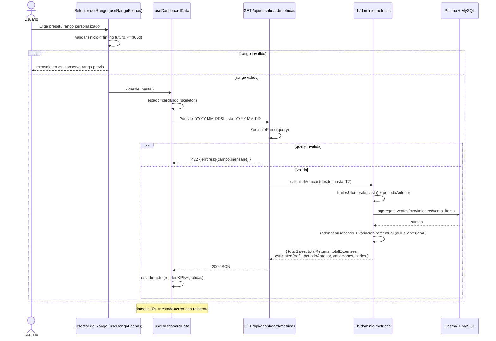
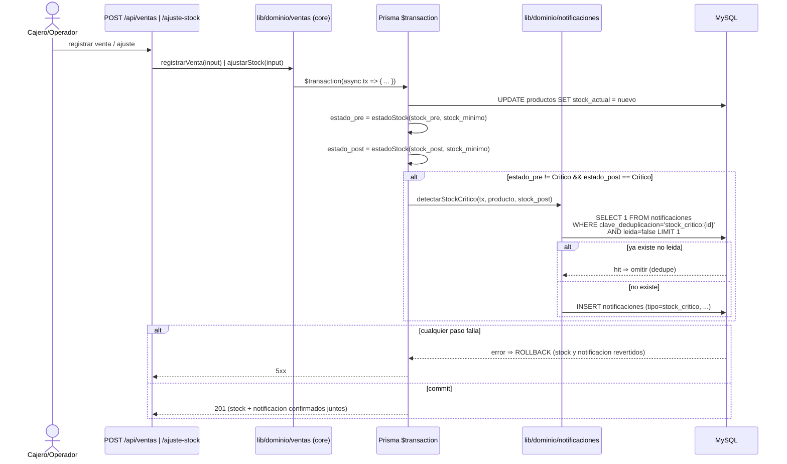
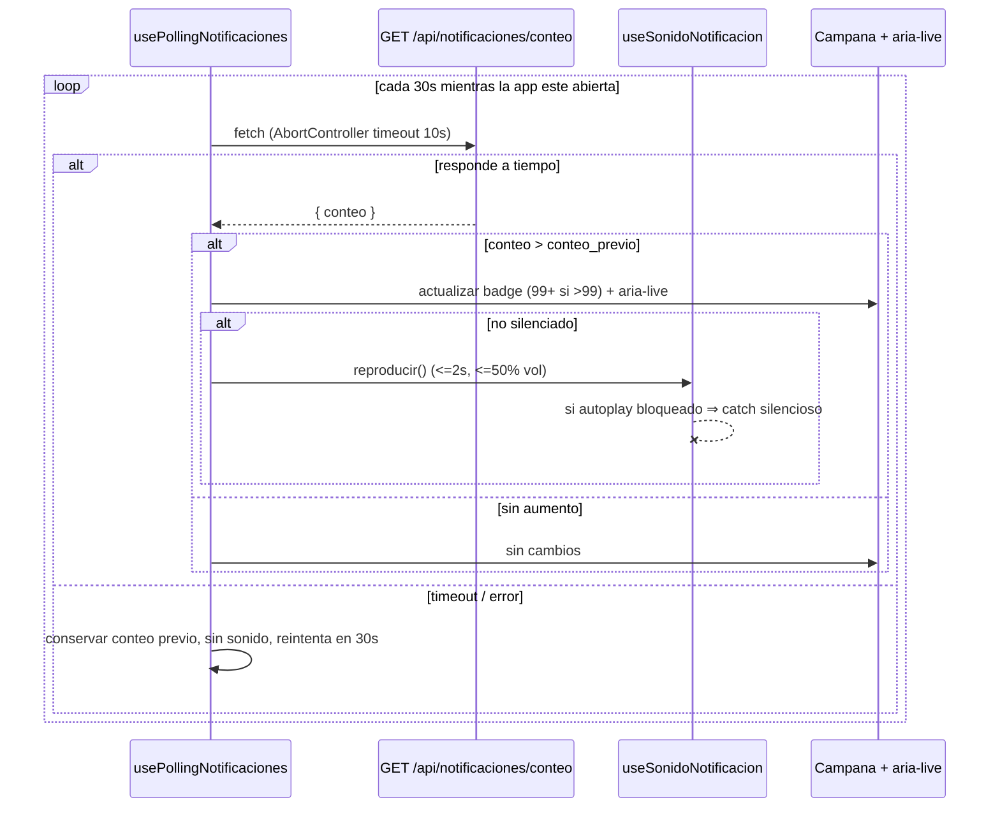
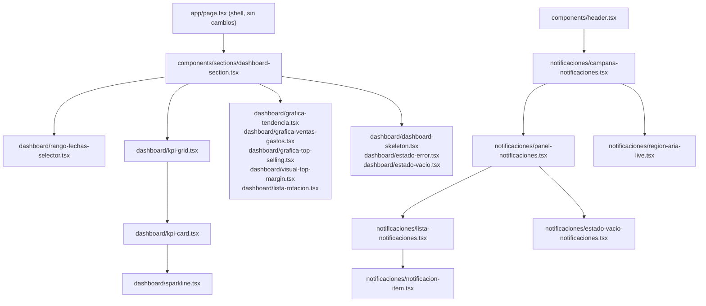

# Design Document

> Documento de diseño técnico de la feature `dashboard-metricas-notificaciones`.
> El encabezado raíz se mantiene en inglés por requisito del validador del spec,
> igual que en `inventario-ventas-core`.
> El cuerpo de la guía está en español, igual que la app Dego.

## Overview

`dashboard-metricas-notificaciones` añade a Dego dos subsistemas que se apoyan
directamente sobre el modelo de datos y la capa de API construidos en
`inventario-ventas-core`:

**Parte A — Dashboard analítico.** Reemplaza el dashboard actual basado en datos
mock (`components/sections/dashboard-section.tsx`) por un panel que consume datos
reales. Incorpora un selector de Rango_Fechas con presets, cuatro tarjetas KPI con
variación porcentual y sparkline, y un conjunto de visualizaciones `recharts`
(tendencia de ventas, comparativa ventas vs gastos, barras de `topSelling`, visual
de `topMargin`, listas de `topRotation`/`lowRotation`). Se nutre de dos nuevos
endpoints agregados: `GET /api/dashboard/metricas` y `GET /api/dashboard/rankings`.

**Parte B — Sistema de notificaciones.** Introduce la tabla `notificaciones` en el
esquema Prisma, la detección de stock crítico integrada dentro de la transacción de
venta/ajuste del spec core, cuatro endpoints REST, un centro de notificaciones
(campana con badge en el header, panel `Popover`/`Sheet`, lista con tiempo relativo
en español), un sonido sutil silenciable y un ciclo de *polling* cliente cada 30 s.

Lo que se construye:

- **Capa de dominio analítico** (`lib/dominio/metricas.ts`, `lib/dominio/rankings.ts`)
  con funciones puras de cálculo (presets de rango, agrupación de series, variación
  porcentual, ordenamiento de rankings) y agregaciones Prisma.
- **Capa de dominio de notificaciones** (`lib/dominio/notificaciones.ts`) con la
  detección de stock crítico, deduplicación lógica y creación transaccional,
  enganchada dentro de las transacciones existentes de `lib/dominio/ventas.ts` y
  `lib/dominio/inventario.ts` (ajuste de stock) **sin romper el spec core**.
- **Route Handlers** nuevos bajo `app/api/dashboard/**` y `app/api/notificaciones/**`,
  validados con Zod (`withValidation` para body, validación de query con `safeParse`),
  respuestas uniformes vía `lib/api/respuestas.ts` y errores vía `mapPrismaError`.
- **Componentes de UI** en `components/dashboard/` y `components/notificaciones/`,
  reutilizando exclusivamente primitivas shadcn/ui de `components/ui/` y `recharts`.
- **Hooks de cliente**: `useRangoFechas`, `useDashboardData`, `useTema` (Parte A);
  `useNotificaciones`, `usePollingNotificaciones`, `useSonidoNotificacion` (Parte B).
- **Funciones puras** candidatas a *property-based testing* con `fast-check`:
  cálculo de presets de rango, agrupación de `Serie_Tendencia` por día, variación
  porcentual, redondeo bancario aplicado a métricas, ordenamiento/desempate de
  rankings, formato de tiempo relativo en español y deduplicación lógica.

Cómo encaja: el shell `app/page.tsx` no cambia. `dashboard-section.tsx` deja de
declarar mock data y pasa a montar los componentes nuevos consumiendo
`useDashboardData`. El único punto de montaje global nuevo es la campana en
`components/header.tsx` (que hoy ya tiene un placeholder `Bell`). La precisión
monetaria reutiliza `redondearBancario` de `lib/money.ts`; la zona horaria reutiliza
`date-fns-tz` y la variable `TZ` ya definidas en el core. No se añaden librerías de
UI nuevas (R12.1, R12.2); `recharts`, `react-day-picker`, `date-fns` y `sonner` ya
están en `package.json`.

### Mapeo de secciones a requisitos

| Sección del diseño | Requisitos cubiertos |
| --- | --- |
| Architecture | R2, R3, R7, R11, R14 |
| Components and Interfaces | R1, R4, R5, R9, R10, R12, R13 |
| Data Models | R6 |
| API Design | R2, R3, R8 |
| Correctness Properties | R1, R2, R3, R6, R7, R9, R10 |
| Error Handling | R2, R3, R5, R7, R8, R9, R11 |
| Testing Strategy | Todos (estrategia dual PBT + ejemplares) |


## Architecture

### Diagrama de capas



Capas (extienden las del core, no las sustituyen):

1. **UI client**: `dashboard-section.tsx` monta `components/dashboard/*`; la campana
   en `components/header.tsx` monta `components/notificaciones/*`. Sólo primitivas
   shadcn/ui + `recharts`.
2. **Hooks de cliente**: fetch, estados de carga/error/vacío, polling, sonido, tema.
3. **Utilidades puras de cliente** (`lib/dashboard/*`, `lib/notificaciones/tiempo.ts`):
   sin *side effects*, candidatas a PBT.
4. **Route Handlers**: validan query/body con Zod y delegan. No contienen reglas de
   negocio.
5. **Capa de dominio analítico** (`lib/dominio/metricas.ts`, `rankings.ts`): traduce
   el Rango_Fechas a límites UTC, ejecuta agregaciones Prisma y aplica redondeo.
6. **Capa de dominio de notificaciones** (`lib/dominio/notificaciones.ts`): se invoca
   **dentro** de las transacciones del core; aplica deduplicación y persiste.
7. **Prisma + MySQL 8**: mismo singleton, esquema extendido con `notificaciones`.

### Flujo A — Cálculo de métricas del Dashboard



### Flujo B — Detección de stock crítico dentro de la transacción



### Flujo C — Polling cliente + sonido




## Components and Interfaces

### Jerarquía y composición



### Componentes del Dashboard (`components/dashboard/`)

| Archivo | Responsabilidad | shadcn/ui que reutiliza | Requisitos |
| --- | --- | --- | --- |
| `rango-fechas-selector.tsx` | Presets (`hoy`, `esta_semana`, `este_mes`, `mes_anterior`, `personalizado`) y, en personalizado, calendario de rango `react-day-picker`. Muestra el rango activo legible en español. Valida inicio≤fin, no futuro, ≤366 días. | `Select`/`ToggleGroup`, `Popover`, `Calendar`, `Button` | R1.1–R1.10 |
| `kpi-grid.tsx` | Contenedor de las 4 tarjetas KPI en orden Ventas Totales, Devoluciones, Gastos, Ganancia Estimada. | `—` (grid Tailwind) | R4.1 |
| `kpi-card.tsx` | Tarjeta KPI: valor monetario formateado, variación con signo+icono o "Sin datos previos", estado de error. Reutiliza patrón de `components/stat-card.tsx`. | `Card`, `Badge` | R4.1–R4.9 |
| `sparkline.tsx` | Mini gráfica de la Serie_Tendencia de la métrica; muestra "Sin datos suficientes" con <2 puntos. | `recharts` (`LineChart`) | R4.7, R4.8 |
| `grafica-tendencia.tsx` | Línea/barra de la Serie_Tendencia de Ventas con ejes y leyenda. | `recharts`, `Card` | R5.1, R5.3 |
| `grafica-ventas-gastos.tsx` | Comparativa Ventas vs Gastos con leyenda y ejes. | `recharts`, `Card` | R5.2, R5.3 |
| `grafica-top-selling.tsx` | Barras de `topSelling` (máx 10) ordenadas desc por unidades. | `recharts`, `Card` | R5.4 |
| `visual-top-margin.tsx` | Visual de `topMargin` (máx 10) por margen. | `recharts`, `Card` | R5.5 |
| `lista-rotacion.tsx` | Listas/tablas de `topRotation` (desc) y `lowRotation` (asc), máx 10. | `Table`, `Card`, `Badge` | R5.6, R5.7 |
| `tabla-accesible-grafica.tsx` | Alternativa textual/tabla con los mismos datos de cada gráfica, navegable por teclado. | `Table` | R13.7 |
| `dashboard-skeleton.tsx` | Estado de carga tipo esqueleto de tarjetas y gráficas. | `Skeleton` | R5.10, R1.4 |
| `estado-error.tsx` | Mensaje de error en español + botón de reintento; conserva estructura sin datos parciales. | `Alert`, `Button` | R5.11, R5.12, R4.9 |
| `estado-vacio.tsx` | "No hay datos para el período seleccionado". | `Card` | R5.13 |

`dashboard-section.tsx` queda como punto de montaje (R12.6): elimina el mock,
consume `useDashboardData(rango)` y renderiza skeleton/error/vacío/datos según estado.

### Componentes de Notificaciones (`components/notificaciones/`)

| Archivo | Responsabilidad | shadcn/ui que reutiliza | Requisitos |
| --- | --- | --- | --- |
| `campana-notificaciones.tsx` | Icono `Bell` con `Badge_Conteo` (1–99, "99+" si >99), `aria-label` dinámico, abre el panel. Se monta en `components/header.tsx`. | `Button`, `Badge`, `Popover`/`Sheet` | R9.1–R9.3, R13.1, R13.2 |
| `panel-notificaciones.tsx` | Contenedor del panel; cabecera con "Marcar todas como leídas"; recarga lista al abrir; muestra error/reintento. | `Popover`/`Sheet`, `ScrollArea`, `Button` | R9.4, R9.9, R9.10, R11.6, R11.7 |
| `lista-notificaciones.tsx` | Lista ordenada desc por `creado_en`; renderiza items o estado vacío. | `ScrollArea` | R9.4, R9.11 |
| `notificacion-item.tsx` | Título, mensaje, tiempo relativo en español; indicador visual de no leída; marca leída al clic. | `Button`, `Badge` | R9.5, R9.6, R9.7, R9.8 |
| `estado-vacio-notificaciones.tsx` | "No tienes notificaciones". | `—` | R9.11 |
| `region-aria-live.tsx` | Región `aria-live="polite"` que anuncia notificaciones nuevas. | `—` | R13.3 |

### Punto de montaje en el header

`components/header.tsx` ya contiene un placeholder `Bell` con un punto rojo estático.
Se sustituye por `<CampanaNotificaciones />`, que encapsula icono, badge real y panel.
Es la **única edición** sobre el shell existente; el resto vive en carpetas nuevas.

### Hooks de cliente (`hooks/`)

```ts
// hooks/use-rango-fechas.ts
export type PresetRango = "hoy" | "esta_semana" | "este_mes" | "mes_anterior" | "personalizado"
export type RangoFechas = { desde: string; hasta: string } // YYYY-MM-DD, inclusivo

export type UseRangoFechas = {
  preset: PresetRango
  rango: RangoFechas
  etiquetaLegible: string                  // "2 abr 2025 – 20 abr 2025"
  setPreset(p: PresetRango): void
  setPersonalizado(desde: string, hasta: string): { ok: true } | { ok: false; mensaje: string }
  error: string | null
}
// Estado inicial: preset "este_mes" (R1.1). Usa lib/dashboard/rango.ts (puro).

// hooks/use-dashboard-data.ts
export type EstadoCarga = "inicial" | "cargando" | "listo" | "error" | "vacio"
export type UseDashboardData = {
  estado: EstadoCarga
  metricas: MetricasDTO | null
  rankings: RankingsDTO | null
  reintentar(): void
}
// Lanza fetch a /metricas y /rankings al cambiar rango. timeout 10s (R5.11).
// estado "vacio" cuando ambas respuestas no traen datos (R5.13).

// hooks/use-tema.ts
export type UseTema = {
  tema: "light" | "dark"
  colores: { primary: string; chart1: string; chart2: string; muted: string; foreground: string }
}
// Lee las CSS vars del tema activo (next-themes) para pasarlas a recharts (R5.8, R5.9, R12.4).

// hooks/use-notificaciones.ts
export type UseNotificaciones = {
  items: NotificacionDTO[]
  conteo: number
  estado: "inicial" | "cargando" | "listo" | "error"
  recargar(): Promise<void>
  marcarLeida(id: string): Promise<void>     // optimista con rollback en fallo (R9.8)
  marcarTodasLeidas(): Promise<void>          // optimista con rollback en fallo (R9.10)
}

// hooks/use-polling-notificaciones.ts
export type UsePollingNotificaciones = {
  conteo: number
  onAumento(cb: (nuevo: number) => void): void
}
// setInterval 30s; AbortController con timeout 10s (R11.1, R11.4); en fallo conserva
// conteo previo y reintenta (R11.5). Dispara sonido si aumento y no silenciado (R11.3).

// hooks/use-sonido-notificacion.ts
export type UseSonidoNotificacion = {
  silenciado: boolean
  alternarSilencio(): void                    // persiste en localStorage (R10.5)
  reproducir(): void                          // <=2s, volumen 0.5; catch silencioso (R10.8)
}
// Default activado cuando no hay preferencia (R10.6). Asset en public/.
```

### Utilidades puras de cliente

```ts
// lib/dashboard/rango.ts
export function presetARango(preset: PresetRango, hoy: Date, tz: string): RangoFechas
export function validarRangoPersonalizado(
  desde: string | null, hasta: string | null, hoy: Date
): { ok: true; rango: RangoFechas } | { ok: false; mensaje: string }
export function etiquetaLegible(rango: RangoFechas): string  // es-ES, "2 abr 2025 – 20 abr 2025"

// lib/dashboard/series.ts
export function agruparPorDia(
  puntos: Array<{ creado_en: string; valor: number }>, rango: RangoFechas, tz: string
): Array<{ fecha: string; valor: number }>      // un punto por día del rango, ceros incluidos
export function variacionPorcentual(actual: number, anterior: number): number | null
                                                  // null cuando anterior === 0 (R2.12)

// lib/notificaciones/tiempo.ts
export function tiempoRelativoEs(desde: Date, ahora: Date): string
// <60s "Hace un momento"; 1..59 min "Hace N min"; 1..23 h "Hace N h";
// 1..6 d "Hace N d"; >=7 d fecha dd/mm/aaaa (R9.5)
```

### Sonido sutil

- Un único asset corto en `public/notificacion.mp3` (≤2 s, tono suave).
- `useSonidoNotificacion` crea un `HTMLAudioElement` perezoso, fija `volume = 0.5`
  (R10.2) y llama `play()` envuelto en `try/catch`/`.catch()` para tolerar el bloqueo
  de autoplay (R10.8) sin mostrar error ni interrumpir.
- La preferencia `silenciado` se persiste en `localStorage` bajo la clave
  `dego:sonido_notificacion` (R10.5); ausencia ⇒ activado (R10.6).
- El sonido nunca es el único canal: la notificación siempre se muestra en el centro
  y se anuncia por `aria-live` (R10.7, R13.3).


## Data Models

### Extensión del esquema Prisma

Se añade el modelo `Notificacion` a `prisma/schema.prisma`. El resto del esquema del
core no cambia. MySQL 8 no soporta índices únicos parciales nativos sobre columnas
nullable como Postgres, pero **trata múltiples `NULL` como no conflictivos** en un
índice `@unique`, lo que satisface R6.5 (unicidad sólo para valores no nulos,
múltiples filas con `clave_deduplicacion` NULL permitidas).

```prisma
// prisma/schema.prisma  (añadido)

model Notificacion {
  id                   String    @id @default(uuid()) @db.Char(36)
  tipo                 String    @db.VarChar(40)        // "stock_critico" en alcance actual
  titulo               String    @db.VarChar(160)
  mensaje              String    @db.VarChar(400)
  producto_id          String?   @db.Char(36)
  // onDelete SetNull: al borrar el producto se conserva la notificacion (R6.8)
  producto             Producto? @relation(fields: [producto_id], references: [id], onDelete: SetNull)
  leida                Boolean   @default(false)
  // UNIQUE sobre nullable: MySQL admite multiples NULL ⇒ dedupe sólo en no nulos (R6.5)
  clave_deduplicacion  String?   @unique @db.VarChar(120)
  creado_en            DateTime  @default(now())        // UTC, asignado por el sistema (R6.1)

  @@index([leida])                                       // R6.2
  @@index([creado_en])                                   // R6.3
  @@map("notificaciones")
}
```

En el modelo `Producto` del core se añade el lado inverso de la relación (cambio
aditivo, no rompe el esquema existente):

```prisma
model Producto {
  // ... campos existentes del core ...
  notificaciones  Notificacion[]   // relación inversa (onDelete SetNull en Notificacion)
}
```

> Nota sobre `onDelete: SetNull`: el spec core hace **baja lógica** de productos
> (`activo = false`), no borrado físico. La regla `SetNull` cubre R6.8 para el caso
> en que en el futuro se elimine físicamente un producto, dejando `producto_id` NULL
> y conservando la notificación.

### Migración Prisma

```bash
pnpm prisma migrate dev --name notificaciones
# genera prisma/migrations/<ts>_notificaciones/migration.sql
```

`migration.sql` esperado (esencial):

```sql
CREATE TABLE `notificaciones` (
  `id` CHAR(36) NOT NULL,
  `tipo` VARCHAR(40) NOT NULL,
  `titulo` VARCHAR(160) NOT NULL,
  `mensaje` VARCHAR(400) NOT NULL,
  `producto_id` CHAR(36) NULL,
  `leida` BOOLEAN NOT NULL DEFAULT false,
  `clave_deduplicacion` VARCHAR(120) NULL,
  `creado_en` DATETIME(3) NOT NULL DEFAULT CURRENT_TIMESTAMP(3),
  PRIMARY KEY (`id`),
  UNIQUE INDEX `notificaciones_clave_deduplicacion_key` (`clave_deduplicacion`),
  INDEX `notificaciones_leida_idx` (`leida`),
  INDEX `notificaciones_creado_en_idx` (`creado_en`),
  CONSTRAINT `notificaciones_producto_id_fkey`
    FOREIGN KEY (`producto_id`) REFERENCES `productos`(`id`)
    ON DELETE SET NULL ON UPDATE CASCADE
) ENGINE=InnoDB;
```

### DTOs (serializadores)

Se centraliza en `lib/api/serializadores.ts` (mismo archivo del core, ampliado).
`Decimal` de Prisma se convierte a `number` con `redondearBancario` antes de salir.

```ts
// Métricas — GET /api/dashboard/metricas
export type MetricaConVariacion = {
  actual: number                 // redondeado a 2 decimales
  anterior: number               // métrica del Periodo_Anterior
  variacionPorcentual: number | null   // null si anterior === 0 (R2.12)
}

export type MetricasDTO = {
  rango: { desde: string; hasta: string }
  periodoAnterior: { desde: string; hasta: string }
  totalSales: MetricaConVariacion
  totalReturns: MetricaConVariacion
  totalExpenses: MetricaConVariacion
  estimatedProfit: MetricaConVariacion
  series: {
    ventas: Array<{ fecha: string; valor: number }>      // por día, para sparkline y tendencia
    gastos: Array<{ fecha: string; valor: number }>      // comparativa ventas vs gastos
  }
}

// Rankings — GET /api/dashboard/rankings
export type RankingItemVenta = {
  producto_id: string
  nombre: string
  unidadesVendidas: number
  montoVendido: number           // redondeado
}
export type RankingItemMargen = {
  producto_id: string
  nombre: string
  margen: number                 // precio_venta - precio_compra, redondeado
}
export type RankingItemRotacion = {
  producto_id: string
  nombre: string
  unidadesSalida: number
}
export type RankingsDTO = {
  rango: { desde: string; hasta: string }
  limite: number
  topSelling: RankingItemVenta[]      // desc por unidades, desempate id asc (R3.6)
  topMargin: RankingItemMargen[]      // desc por margen, desempate id asc (R3.7)
  topRotation: RankingItemRotacion[]  // desc por salida, desempate id asc (R3.8)
  lowRotation: RankingItemRotacion[]  // asc por salida (incluye ceros), desempate id asc (R3.9)
}

// Notificaciones
export type NotificacionDTO = {
  id: string
  tipo: string
  titulo: string
  mensaje: string
  producto_id: string | null
  leida: boolean
  creado_en: string              // ISO 8601 UTC
}
export function toNotificacionDTO(n: PNotificacion): NotificacionDTO { /* ... */ }
```

### Zona horaria e inclusividad del rango

- La app usa `TZ` (p. ej. `America/Mexico_City`) ya definida en `.env` del core, con
  `date-fns-tz` para conversiones.
- `lib/dominio/metricas.ts` convierte `desde`/`hasta` (fechas civiles `YYYY-MM-DD` en
  `TZ`) a límites instantáneos UTC: `inicioUtc = zonedTimeToUtc(desde 00:00:00, TZ)` y
  `finUtc = zonedTimeToUtc(hasta 23:59:59.999, TZ)`. La consulta filtra
  `creado_en >= inicioUtc AND creado_en <= finUtc` (R2.4, inclusivo en ambos extremos).
- El Periodo_Anterior es el rango de igual número de días que termina el día anterior
  a `desde` (R2.11): `duracionDias = diffDias(desde, hasta) + 1`;
  `anteriorHasta = desde − 1 día`; `anteriorDesde = anteriorHasta − (duracionDias − 1)`.


## API Design

### Envoltorio de respuesta y validación

Se reutilizan exactamente los helpers del core: `ok`, `creado`, `errorValidacion`,
`errorConflicto`, `errorServidor` (`lib/api/respuestas.ts`), `withValidation` para
body y `mapPrismaError` para errores Prisma. Para endpoints **GET con query string**
se valida con un `safeParse` sobre los `searchParams` y, en fallo, se responde
`errorValidacion(errores)` (HTTP 422) — mismo shape `{ error: { codigo: "VALIDACION",
mensaje, detalles: { errores: [{ campo, mensaje }] } } }` exigido por R2.3, R3.3,
R8.10. Todos responden `Content-Type: application/json; charset=utf-8` (R2.14, R3.13,
R8.11).

### Catálogo de endpoints

| Método | Path | Request (Zod) | Respuesta éxito | Errores | Requisitos |
| --- | --- | --- | --- | --- | --- |
| `GET` | `/api/dashboard/metricas` | query `metricasQuerySchema { desde, hasta }` | `200 MetricasDTO` | `VALIDACION` 422, `CONSULTA_TIMEOUT` 504, `BD_NO_DISPONIBLE` 503 | R2.1–R2.14, R14.7 |
| `GET` | `/api/dashboard/rankings` | query `rankingsQuerySchema { desde, hasta, limite? }` | `200 RankingsDTO` | `VALIDACION` 422, `CONSULTA_TIMEOUT` 504, `BD_NO_DISPONIBLE` 503 | R3.1–R3.13, R14.7 |
| `GET` | `/api/notificaciones` | query `listarNotifQuerySchema { solo_no_leidas? }` | `200 NotificacionDTO[]` (máx 100) | `VALIDACION` 422, `BD_NO_DISPONIBLE` 503 | R8.1–R8.4, R8.11 |
| `GET` | `/api/notificaciones/conteo` | — | `200 { conteo: number }` | `BD_NO_DISPONIBLE` 503 | R8.5, R8.11, R14.3 |
| `PATCH` | `/api/notificaciones/{id}` | path `id: uuid` | `200 NotificacionDTO` | `NOTIFICACION_NO_ENCONTRADA` 404, `VALIDACION` 422 | R8.6, R8.7, R8.8 |
| `POST` | `/api/notificaciones/marcar-todas-leidas` | — | `200 { actualizadas: number }` | `BD_NO_DISPONIBLE` 503 | R8.9, R8.11 |

### Esquemas Zod

```ts
// lib/schemas/dashboard.ts
import { z } from "zod"

const fechaIso = z.string().regex(/^\d{4}-\d{2}-\d{2}$/, "Formato de fecha inválido (YYYY-MM-DD)")

const rangoBase = z.object({
  desde: fechaIso,
  hasta: fechaIso,
}).superRefine((v, ctx) => {
  if (v.desde > v.hasta) {
    ctx.addIssue({ code: "custom", path: ["desde"],
      message: "La fecha de inicio debe ser anterior o igual a la fecha de fin" })
  }
  if (diffDiasInclusivo(v.desde, v.hasta) > 366) {
    ctx.addIssue({ code: "custom", path: ["hasta"],
      message: "El rango no puede exceder 366 días" })
  }
})

export const metricasQuerySchema = rangoBase

export const rankingsQuerySchema = z.object({
  desde: fechaIso,
  hasta: fechaIso,
  // query llega como string ⇒ coerción + rango 1..50, default 5
  limite: z.coerce.number().int().min(1).max(50).default(5),
}).superRefine(/* mismas reglas desde<=hasta y <=366d que rangoBase */ () => {})

// lib/schemas/notificaciones.ts
export const listarNotifQuerySchema = z.object({
  // sólo admite "true" | "false"; default "false" (R8.2)
  solo_no_leidas: z.enum(["true", "false"]).default("false"),
})

export const notifIdParamSchema = z.object({ id: z.string().uuid() })
```

> Las fechas inválidas, ausentes o vacías son rechazadas por `fechaIso` (cadena que no
> casa el patrón) generando una entrada por parámetro en `{ errores }` (R2.2, R2.3,
> R3.2, R3.3). El cálculo no se ejecuta si la validación falla.

### Capa de dominio analítico

```ts
// lib/dominio/metricas.ts
export async function calcularMetricas(
  desde: string, hasta: string, tz = process.env.TZ ?? "America/Mexico_City"
): Promise<MetricasDTO> {
  const actual = limitesUtc(desde, hasta, tz)
  const anterior = periodoAnterior(desde, hasta)          // R2.11 (función pura)
  const antLim = limitesUtc(anterior.desde, anterior.hasta, tz)

  const [mAct, mAnt] = await Promise.all([
    agregarMetricas(actual),                              // ventas/devoluciones/gastos
    agregarMetricas(antLim),
  ])

  const conVar = (a: number, b: number): MetricaConVariacion => ({
    actual: redondearBancario(a),
    anterior: redondearBancario(b),
    variacionPorcentual: variacionPorcentual(a, b),       // null si b === 0 (R2.12)
  })

  return {
    rango: { desde, hasta },
    periodoAnterior: anterior,
    totalSales: conVar(mAct.totalSales, mAnt.totalSales),
    totalReturns: conVar(mAct.totalReturns, mAnt.totalReturns),
    totalExpenses: conVar(mAct.totalExpenses, mAnt.totalExpenses),
    estimatedProfit: conVar(mAct.estimatedProfit, mAnt.estimatedProfit),
    series: { ventas: mAct.serieVentas, gastos: mAct.serieGastos },
  }
}

// agregarMetricas usa consultas Prisma sobre indices existentes (R14.6):
//  totalSales    = SUM(ventas.total) WHERE estado='completada' AND creado_en in [ini,fin]
//  totalReturns  = SUM(mov.cantidad_abs * producto.precio_venta)
//                  WHERE mov.tipo='devolucion' AND creado_en in [ini,fin]
//  totalExpenses = SUM(vi.cantidad * producto.precio_compra)
//                  FROM venta_items vi JOIN ventas v ON vi.venta_id=v.id
//                  WHERE v.estado='completada' AND v.creado_en in [ini,fin]
//  estimatedProfit = totalSales - totalExpenses
// Las series se agrupan por día con agruparPorDia (función pura) sobre filas crudas.
```

```ts
// lib/dominio/rankings.ts
export async function calcularRankings(
  desde: string, hasta: string, limite: number, tz = process.env.TZ ?? "America/Mexico_City"
): Promise<RankingsDTO> { /* agregaciones + ordenarRanking (puro) + limite */ }

// ordenarRanking(items, claveValor, direccion) ordena por la métrica y desempata
// SIEMPRE por producto_id ascendente (R3.6–R3.9). Es función pura ⇒ candidata PBT.
```

### Capa de dominio de notificaciones y enganche transaccional

```ts
// lib/dominio/notificaciones.ts
import type { Prisma } from "@prisma/client"

export type EstadoStock = "En Stock" | "Bajo Stock" | "Crítico"

// Misma regla que el core (R Estado_Stock): Crítico si stock=0 o stock<=minimo*0.3
export function estadoStock(stockActual: number, stockMinimo: number): EstadoStock {
  if (stockActual === 0 || stockActual <= stockMinimo * 0.3) return "Crítico"
  if (stockActual <= stockMinimo) return "Bajo Stock"
  return "En Stock"
}

export function claveDedupStockCritico(productoId: string): string {
  return `stock_critico:${productoId}`                   // formato exacto (R7.3)
}

/**
 * Se invoca DENTRO de una $transaction existente (misma `tx`).
 * Crea la notificación sólo si el producto ACABA de entrar a Crítico y no hay
 * una notificación no leída con la misma clave (dedupe lógica, R7.4/R7.5).
 */
export async function detectarStockCritico(
  tx: Prisma.TransactionClient,
  params: { producto_id: string; nombre: string; stock_actual: number; stock_minimo: number },
  estadoPrevio: EstadoStock,
): Promise<void> {
  const estadoNuevo = estadoStock(params.stock_actual, params.stock_minimo)
  if (estadoPrevio === "Crítico" || estadoNuevo !== "Crítico") return  // sólo transición (R7.1)

  const clave = claveDedupStockCritico(params.producto_id)
  const yaExiste = await tx.notificacion.findFirst({
    where: { clave_deduplicacion: clave, leida: false },
    select: { id: true },
  })
  if (yaExiste) return                                    // dedupe: no incrementa conteo (R7.4)

  await tx.notificacion.create({
    data: {
      tipo: "stock_critico",
      titulo: "Stock crítico",
      mensaje: `${params.nombre} alcanzó stock crítico. Stock actual: ` +
               `${params.stock_actual}, mínimo: ${params.stock_minimo}.`,  // R7.2
      producto_id: params.producto_id,
      clave_deduplicacion: clave,                         // R7.3
      leida: false,
    },
  })
}
```

**Enganche en `lib/dominio/ventas.ts` (core) sin romperlo**: dentro del bucle que
actualiza stock por ítem, justo después del `tx.producto.update(...)`, se captura el
estado previo (a partir del `stock_actual` bloqueado por `FOR UPDATE`) y se llama a
`detectarStockCritico(tx, {...}, estadoPrevio)`. La llamada vive en la **misma `tx`**,
de modo que stock y notificación se confirman o revierten juntos (R7.6, R7.7). Como
el cambio es una invocación añadida al final de cada iteración, no altera la firma ni
el comportamiento existente de `registrarVenta`.

```ts
// dentro del for (const it of input.items) de registrarVenta, tras update de stock:
const estadoPrevio = estadoStock(p.stock_actual, p.stock_minimo)  // p = snapshot FOR UPDATE
const nuevo = p.stock_actual - it.cantidad
await tx.producto.update({ where: { id: p.id }, data: { stock_actual: nuevo } })
await tx.movimientoStock.create({ /* ... tipo:'venta' ... core ... */ })
await detectarStockCritico(tx, {
  producto_id: p.id, nombre: p.nombre, stock_actual: nuevo, stock_minimo: p.stock_minimo,
}, estadoPrevio)
```

**Enganche en ajuste de stock (`lib/dominio/inventario.ts > ajustarStock`)**: tras
calcular `nuevo` y antes de retornar dentro de la misma `tx`, se invoca
`detectarStockCritico(tx, { ...producto, stock_actual: nuevo }, estadoStock(p.stock_actual, p.stock_minimo))`.
Cubre las operaciones de `Movimiento_Stock` que llevan a Crítico (R7.1).

> El error de inserción por colisión de `clave_deduplicacion` (carrera entre dos
> transacciones que insertan la misma clave) se mapea con `mapPrismaError` (P2002).
> En la práctica la verificación `findFirst` + la unicidad parcial garantizan que sólo
> una notificación no leída exista por clave; ante P2002 se trata como dedupe efectiva.


## Correctness Properties


*Una propiedad es una característica o comportamiento que debe mantenerse a través de
todas las ejecuciones válidas del sistema; en esencia, una declaración formal de qué
debe hacer el software. Las propiedades sirven como puente entre las especificaciones
legibles para humanos y las garantías de corrección verificables por máquina.*

PBT **sí** aplica para esta feature: hay un núcleo de funciones puras con espacio de
entrada amplio (fechas, montos, listas de productos, deltas de tiempo, conteos) y
agregaciones cuyas post-condiciones se enuncian universalmente (model-based). PBT
**no** aplica a las gráficas `recharts`, al render del panel, al sonido/polling
(dependen del navegador y temporizadores) ni a los requisitos de rendimiento/infra;
esos se cubren con tests ejemplares, snapshot, smoke de accesibilidad e integración.

### Property 1: Presets de rango bien formados

*For any* fecha `hoy` y *for any* `preset ∈ {hoy, esta_semana, este_mes, mes_anterior}`,
`presetARango(preset, hoy, tz)` produce un `{ desde, hasta }` tal que `desde ≤ hasta`,
ninguna fecha es posterior a `hoy`, y se cumple la regla específica del preset: `hoy`
da `desde = hasta = hoy`; `esta_semana` da `desde =` lunes de la semana de `hoy`;
`este_mes` da `desde =` día 1 del mes de `hoy` y `hasta = hoy`; `mes_anterior` da
`desde =` día 1 y `hasta =` último día del mes calendario inmediatamente anterior.

**Validates: Requirements 1.1, 1.2**

```ts
const arbHoy = fc.date({ min: new Date("2020-01-01"), max: new Date("2035-12-31") })
const arbPreset = fc.constantFrom("hoy", "esta_semana", "este_mes", "mes_anterior")
```

### Property 2: Aceptación/rechazo de rango personalizado

*For any* par de fechas `(desde, hasta)` (incluyendo invertidas, futuras y de duración
mayor a 366 días) y una fecha `hoy`, `validarRangoPersonalizado(desde, hasta, hoy)`
devuelve `ok: true` **si y sólo si** ambas fechas están definidas, casan `YYYY-MM-DD`,
`desde ≤ hasta`, ninguna es posterior a `hoy` y la duración inclusiva no excede 366
días; en cualquier otro caso devuelve `ok: false` con un mensaje no vacío en español.

**Validates: Requirements 1.6, 1.7, 1.8, 2.2, 3.2**

```ts
const arbFechaStr = fc.date({ min: new Date("2019-01-01"), max: new Date("2031-12-31") })
  .map(d => d.toISOString().slice(0, 10))
const arbParInvalido = fc.oneof(
  fc.constant<[null, string | null]>([null, "2025-04-10"]),
  fc.tuple(arbFechaStr, arbFechaStr),         // puede salir invertido o >366d
)
```

### Property 3: Periodo anterior de igual duración y contiguo

*For any* rango válido `{ desde, hasta }`, `periodoAnterior(desde, hasta)` produce un
rango cuya duración inclusiva en días es idéntica a la del rango actual, cuyo `hasta`
es exactamente el día inmediatamente anterior a `desde`, y que no se solapa con el
rango actual (`periodoAnterior.hasta < desde`).

**Validates: Requirements 2.11**

```ts
const arbRango = fc.tuple(arbFechaStr, fc.integer({ min: 0, max: 365 }))
  .map(([desde, dias]) => ({ desde, hasta: sumarDias(desde, dias) }))
```

### Property 4: Variación porcentual y nulabilidad

*For any* par `(actual, anterior)` de números finitos, `variacionPorcentual(actual,
anterior)` es `null` **si y sólo si** `anterior === 0`; en otro caso es exactamente
`(actual − anterior) / anterior × 100`.

**Validates: Requirements 2.12, 4.6**

```ts
const arbMonto = fc.float({ min: 0, max: 1e9, noNaN: true }).map(n => Math.round(n * 100) / 100)
const arbPar = fc.tuple(arbMonto, fc.oneof(fc.constant(0), arbMonto))
```

### Property 5: Métricas correctas, inclusivas y redondeadas (model-based)

*For any* conjunto generado de Ventas, Movimiento_Stock y Venta_Item con fechas
aleatorias (incluyendo registros en los extremos exactos del rango y conjuntos
vacíos), `calcularMetricas(desde, hasta, tz)` cumple simultáneamente: `totalSales`,
`totalReturns` y `totalExpenses` coinciden con un cálculo modelo en memoria que filtra
de forma inclusiva por el rango en `tz`; `estimatedProfit === totalSales −
totalExpenses`; todo valor monetario de salida satisface `v === redondearBancario(v)`;
y cuando no hay registros en el rango, las cuatro métricas valen 0.

**Validates: Requirements 2.4, 2.6, 2.7, 2.8, 2.9, 2.10, 2.13, 3.11**

```ts
const arbSeed = fc.record({
  ventas: fc.array(fc.record({
    total: arbMonto, estado: fc.constantFrom("completada", "cancelada"),
    creado_en: arbFechaStr,
    items: fc.array(fc.record({ cantidad: fc.integer({ min: 1, max: 20 }),
      precio_compra: arbMonto }), { maxLength: 5 }),
  }), { maxLength: 40 }),
  devoluciones: fc.array(fc.record({ cantidad: fc.integer({ min: 1, max: 20 }),
    precio_venta: arbMonto, creado_en: arbFechaStr }), { maxLength: 20 }),
})
```

### Property 6: Orden y desempate de rankings

*For any* lista de productos con métricas e identificadores aleatorios (forzando
empates en la métrica) y *for any* `limite ∈ [1, 50]`, `ordenarRanking(items, clave,
direccion, limite)` produce una lista que: está ordenada de forma monótona por la
métrica en la `direccion` indicada (desc para `topSelling`/`topMargin`/`topRotation`,
asc para `lowRotation`); ante empate en la métrica ordena por `producto_id`
ascendente; y tiene longitud menor o igual a `limite`. Para `lowRotation`, los
productos con cero salidas se incluyen.

**Validates: Requirements 3.6, 3.7, 3.8, 3.9, 3.10, 3.12**

```ts
const arbRankItem = fc.record({
  producto_id: fc.uuid(),
  valor: fc.integer({ min: 0, max: 50 }),      // rango pequeño ⇒ fuerza empates
})
const arbItems = fc.array(arbRankItem, { minLength: 0, maxLength: 60 })
const arbLimite = fc.integer({ min: 1, max: 50 })
```

### Property 7: Deduplicación lógica de stock crítico

*For any* secuencia de transiciones de Estado_Stock de un producto (entrando y
saliendo de `Crítico`) intercaladas con marcas de lectura, el invariante se mantiene:
nunca existe más de una Notificacion **no leída** con la clave
`stock_critico:{producto_id}`, y se crea una nueva Notificacion **exactamente** cuando
una operación transiciona el estado de no-`Crítico` a `Crítico` y no hay ya una
Notificacion no leída con esa clave.

**Validates: Requirements 6.5, 6.6, 7.1, 7.3, 7.4, 7.5**

```ts
const arbEvento = fc.oneof(
  fc.record({ tipo: fc.constant("stock"), stock: fc.integer({ min: 0, max: 30 }) }),
  fc.record({ tipo: fc.constant("marcar_leidas") }),
)
const arbHistoria = fc.array(arbEvento, { maxLength: 40 })
// minimo fijo (p.ej. 10) ⇒ Crítico cuando stock<=3 o stock===0
```

### Property 8: Orden y tope del listado de notificaciones

*For any* lista de notificaciones con `creado_en` e `id` aleatorios (forzando
coincidencias de `creado_en`), el ordenador del listado produce una secuencia ordenada
de forma descendente por `creado_en`, con desempate descendente por `id` cuando
`creado_en` coincide, y truncada a un máximo de 100 elementos.

**Validates: Requirements 8.1**

```ts
const arbNotif = fc.record({
  id: fc.uuid(),
  creado_en: fc.integer({ min: 0, max: 50 }).map(n => new Date(2025, 0, 1 + n).toISOString()),
})
const arbNotifs = fc.array(arbNotif, { maxLength: 250 })
```

### Property 9: Formato del badge y aria-label del conteo

*For any* entero `n ≥ 0`, el formateador del Badge_Conteo produce: cadena vacía
(oculto) cuando `n === 0`; la representación decimal de `n` cuando `1 ≤ n ≤ 99`; y el
texto `"99+"` cuando `n > 99`. El `aria-label` del icono de campana incluye siempre la
cantidad correcta (el número exacto para `0 ≤ n ≤ 99` y `"99+"` cuando `n > 99`).

**Validates: Requirements 9.2, 9.3, 13.1**

```ts
const arbConteo = fc.integer({ min: 0, max: 100000 })
```

### Property 10: Tiempo relativo en español por bandas

*For any* instante `desde` y *for any* `ahora` con `desde ≤ ahora`, `tiempoRelativoEs(
desde, ahora)` devuelve: `"Hace un momento"` cuando la diferencia es menor a 60 s;
`"Hace N min"` con `N ∈ [1, 59]` cuando la diferencia está entre 1 y 59 minutos;
`"Hace N h"` con `N ∈ [1, 23]` entre 1 y 23 horas; `"Hace N d"` con `N ∈ [1, 6]` entre
1 y 6 días; y la fecha en formato `dd/mm/aaaa` a partir de 7 días.

**Validates: Requirements 9.5**

```ts
const arbDeltaSegundos = fc.oneof(
  fc.integer({ min: 0, max: 59 }),                 // momento
  fc.integer({ min: 60, max: 3599 }),              // minutos
  fc.integer({ min: 3600, max: 86399 }),           // horas
  fc.integer({ min: 86400, max: 6 * 86400 + 1 }),  // dias
  fc.integer({ min: 7 * 86400, max: 400 * 86400 }),// fecha absoluta
)
```


## Error Handling

### Catálogo de códigos de error (nuevos y reutilizados)

| Código | HTTP | Origen | Mensaje (es) | Requisitos |
| --- | --- | --- | --- | --- |
| `VALIDACION` | 422 | Zod en query/body de cualquier endpoint nuevo | "Revise los campos marcados." | R2.3, R3.3, R8.10 |
| `NOTIFICACION_NO_ENCONTRADA` | 404 | `PATCH /api/notificaciones/{id}` sin match (P2025) | "Notificación no encontrada." | R8.8 |
| `CONSULTA_TIMEOUT` | 504 | Consulta agregada del Dashboard que excede 5 s | "La consulta tardó demasiado. Intente nuevamente." | R14.7 |
| `BD_NO_DISPONIBLE` | 503 | `PrismaClientInitializationError` / Rust panic | "Base de datos no disponible. Revise el servidor." | reusado del core |
| `CONFLICTO` | 409 | P2002 sin clasificar (carrera de `clave_deduplicacion`) | "Conflicto al guardar." | reusado; R7.4 |
| `RED` | n/a (cliente) | `fetch` rechazado / abort por timeout | "Error de conexión. Revise el servidor." | R5.12, R11.5, R11.7 |

Los mensajes de cliente se agregan a `lib/mensajes-error.ts` (mapa del core),
añadiendo `NOTIFICACION_NO_ENCONTRADA` y `CONSULTA_TIMEOUT`.

### Reglas de manejo

- **Validación de query (GET)**: los Route Handlers de Dashboard y el listado de
  notificaciones extraen `searchParams`, ejecutan `schema.safeParse` y, en fallo,
  devuelven `errorValidacion(errores)` (422) con una entrada por parámetro inválido o
  ausente, **sin** ejecutar cálculo alguno (R2.3, R3.3).
- **Timeout de consulta del Dashboard (R14.7)**: las agregaciones se ejecutan dentro
  de `prisma.$transaction(fn, { timeout: 5000 })` o con `Promise.race` contra un
  temporizador de 5 s; al expirar se responde `CONSULTA_TIMEOUT` (504) sin dejar la
  petición bloqueada.
- **404 de notificación (R8.8)**: `PATCH` usa `update` y captura `P2025`
  (`mapPrismaError` → 404 con código `NOTIFICACION_NO_ENCONTRADA`) sin alterar ninguna
  fila. El PATCH es idempotente: marcar una ya leída responde 200 sin cambio (R8.7).
- **Atomicidad de stock + notificación (R7.6, R7.7)**: al vivir dentro de la misma
  `$transaction` del core, cualquier `throw` revierte ambos; el handler superior mapea
  el error y el `stock_actual` queda en su valor previo, sin notificación persistida.
- **Errores de cliente del Dashboard (R5.11, R5.12)**: `useDashboardData` aplica un
  timeout de 10 s vía `AbortController`; en fallo o timeout pasa a estado `error`,
  muestra mensaje en español + botón de reintento y **conserva** el estado previo sin
  renderizar datos parciales.
- **Errores de cliente de notificaciones (R9.8, R9.10, R11.5, R11.7)**: las acciones
  de marcar son **optimistas con rollback**: ante fallo de `PATCH`/`POST` se revierte
  el estado local, el Badge_Conteo no cambia y se muestra un toast `sonner` de error.
  El polling que falla conserva el último conteo y reintenta en el siguiente intervalo
  sin detener el ciclo.
- **Sonido (R10.8)**: `reproducir()` envuelve `audio.play()` en `.catch(() => {})`; un
  bloqueo de autoplay no interrumpe la operación ni muestra error; la notificación se
  ve igual en el centro.


## Testing Strategy

### Enfoque dual

- **Pruebas por propiedades** (`fast-check`, `numRuns: 100` mínimo) para todas las
  funciones puras críticas: presets y validación de rango, periodo anterior, variación
  porcentual, métricas model-based, ordenamiento de rankings, dedupe lógica de stock
  crítico, orden/tope del listado, formato de badge y tiempo relativo en español.
- **Pruebas ejemplares** (Vitest + Testing Library + MSW) para flujos de UI: tarjetas
  KPI (variación, sparkline, error), interacciones del panel de notificaciones
  (marcar, error con rollback, vacío), endpoints PATCH idempotente/404, polling y
  sonido con *fake timers* y mocks de `Audio`.
- **Pruebas de integración** contra MySQL de prueba para la atomicidad de stock +
  notificación (inyección de fallo en la `tx`, espejo de la prueba de atomicidad de
  venta del core) y para verificar orden/tope reales del listado.
- **Smoke / accesibilidad**: render del dashboard con tema claro/oscuro, presencia de
  alternativas accesibles de gráficas (R13.7), `aria-label` de la campana y región
  `aria-live` (R13.1–R13.3), orden de tabulación (R13.4, R13.5).
- **Rendimiento (R14.1–R14.3, R14.6)**: benchmark con dataset grande y `EXPLAIN` para
  confirmar el uso de los índices `ventas.creado_en` y `movimientos_stock.creado_en`
  del core y la ausencia de full table scan; prueba de timeout de consulta (R14.7).

### Stack y convenciones

- Mismo stack del core: `fast-check`, `vitest`, `@testing-library/react`,
  `@testing-library/user-event`, `msw`. MySQL `invenpro_test` reseteado con
  `prisma migrate reset --force` entre suites de integración.
- Cada propiedad de diseño se implementa con **un único** `test()` usando
  `fc.assert(fc.property(...), { numRuns: 100 })`.
- Cada test PBT lleva un comentario de cabecera con la etiqueta:
  `// Feature: dashboard-metricas-notificaciones, Property N: <título>`.
- Los tests viven en `__tests__/property/*.test.ts` (PBT),
  `__tests__/unit/*.test.tsx` (UI/ejemplares) y `__tests__/integration/*.test.ts`.
- No se altera `next.config.mjs`; vitest mantiene su propio entorno.

### Tabla de propiedades vs. archivo de test

| Propiedad | Archivo |
| --- | --- |
| P1 Presets de rango | `__tests__/property/dashboard-rango-presets.test.ts` |
| P2 Validación de rango personalizado | `__tests__/property/dashboard-rango-validacion.test.ts` |
| P3 Periodo anterior | `__tests__/property/dashboard-periodo-anterior.test.ts` |
| P4 Variación porcentual | `__tests__/property/dashboard-variacion.test.ts` |
| P5 Métricas model-based | `__tests__/property/dashboard-metricas.test.ts` |
| P6 Orden/desempate de rankings | `__tests__/property/dashboard-rankings.test.ts` |
| P7 Dedupe de stock crítico | `__tests__/property/notificaciones-dedupe.test.ts` |
| P8 Orden/tope del listado | `__tests__/property/notificaciones-orden.test.ts` |
| P9 Formato de badge/aria-label | `__tests__/property/notificaciones-badge.test.ts` |
| P10 Tiempo relativo en español | `__tests__/property/notificaciones-tiempo.test.ts` |

### Cobertura ejemplar destacada

| Escenario | Tipo | Requisitos |
| --- | --- | --- |
| KPI muestra "Sin datos previos" cuando anterior=0 | unit | R4.6 |
| Sparkline oculto con <2 puntos ("Sin datos suficientes") | unit | R4.8 |
| PATCH idempotente (no leída→leída, leída→leída) y 404 | unit/integration | R8.6, R8.7, R8.8 |
| Marcar leída optimista con rollback en fallo | unit | R9.7, R9.8 |
| Estado vacío "No tienes notificaciones" + badge oculto | unit | R9.11 |
| Polling 30s, timeout 10s, conserva conteo en fallo | unit (fake timers) | R11.1, R11.4, R11.5 |
| Sonido ≤50% volumen, una vez por aumento, catch autoplay | unit (mock Audio) | R10.1, R10.2, R10.8 |
| Preferencia de sonido persiste en localStorage, default activado | unit | R10.5, R10.6 |
| Re-render de gráficas al cambiar tema | unit/snapshot | R5.9, R12.4 |
| Alternativa accesible por gráfica + aria-live | smoke a11y | R13.3, R13.7 |
| Atomicidad stock + notificación (rollback) | integration | R7.6, R7.7 |
| Uso de índices sin full scan + timeout consulta | integration/perf | R14.6, R14.7 |
