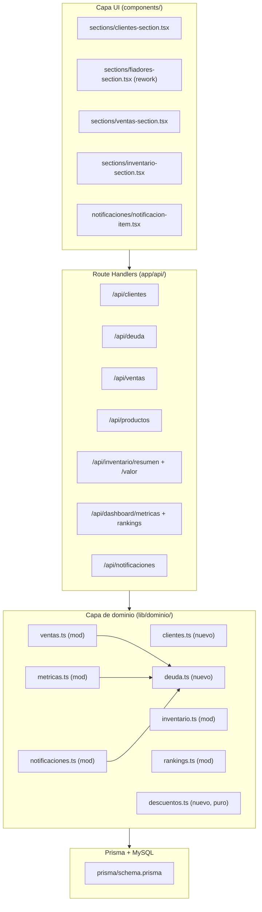

# Documento de Diseño

## Overview

Esta funcionalidad amplía **Dego** (inventario y ventas multi-tenant, Next.js 16 / React 19 / TypeScript) con la gestión de Clientes y el rework de Fiadores como historial de deuda, además de corregir tres defectos existentes y ajustar métricas, filtros y notificaciones. Todo el trabajo respeta el system design vigente: capa de dominio en `lib/dominio/`, Route Handlers en `app/api/`, validación con Zod en `lib/schemas/`, resolución de tenant con `resolverContexto`, redondeo bancario con `redondearBancario`, y UI en español con shadcn/ui + Tailwind CSS v4 + lucide-react + react-hook-form + sonner.

El diseño se organiza en tres grandes bloques:

1. **Correcciones (bug fixes)** — Requisitos 1, 3 y 9. Aislamiento multi-tenant de métricas y rankings (hoy las agregaciones en `metricas.ts` y `rankings.ts` NO filtran por `organizacion_id`), corrección del filtro por talla en `inventario.ts` (hoy solo mira `where.talla` del producto raíz e ignora `VarianteProducto`), y ajuste de `Ventas_Totales` para excluir fiadas no pagadas.
2. **Funcionalidad nueva** — Requisitos 2, 4, 5, 6, 7, 8, 10. Métrica de Valor de Inventario, CRUD de Clientes, sección Fiadores basada en `MovimientoDeuda`, cliente y plazo en ventas fiadas (con `Cargo_Deuda` transaccional), descuentos por producto y sobre el total, notificaciones accionables, y filtro de inventario por stock crítico y rango de stock.
3. **Migración aditiva y retrocompatible** — Requisito 11. Nuevas tablas `clientes` y `movimientos_deuda`, columnas nullable `cliente_id` y `plazo_deuda` en `ventas`, todas con `organizacion_id`, sin volver obligatorias columnas existentes ni perder datos.

### Principios de diseño

- **Aislamiento de tenant en cada agregación**: toda consulta Prisma que agregue datos de negocio DEBE filtrar por `organizacion_id`. El punto de resolución es `resolverContexto`, que ya devuelve `ctx.organizacionActiva`. Las funciones de dominio reciben `organizacion_id` como parámetro obligatorio.
- **Retrocompatibilidad**: `cliente_id` y `plazo_deuda` en `Venta` son opcionales; las ventas históricas sin cliente permanecen válidas.
- **Redondeo bancario centralizado**: todos los montos monetarios de salida pasan por `redondearBancario` (half-to-even, 2 decimales).
- **Transaccionalidad**: la venta fiada y su `Cargo_Deuda` se crean en la misma `$transaction`; si falla el cargo, se revierte toda la venta.

## Architecture

### Diagrama de capas



### Flujo de resolución multi-tenant

Cada Route Handler llama a `resolverContexto({ seccion, accion })`, que valida sesión, organización activa y permisos. El `organizacion_id` resuelto (`ctx.organizacionActiva.id`) se pasa como parámetro obligatorio a la función de dominio. Si no hay organización activa, `resolverContexto` ya devuelve `errorAuth("SIN_ORGANIZACION_ACTIVA", 409)`; los Requisitos 1.4, 2.7 se satisfacen reutilizando ese guard (no se ejecuta ninguna agregación sin tenant).

### Nueva sección de navegación

Se añade la sección **Clientes** siguiendo el patrón documentado en structure.md:
1. Nuevo `components/sections/clientes-section.tsx`.
2. Nuevo ítem en el array `menuItems` de `components/sidebar.tsx` (icono `lucide-react`, p. ej. `Users` o `IdCard`).
3. Nuevo `case "clientes"` en el `renderSection()` de `app/page.tsx`.

La sección **Fiadores** existente se reescribe para consumir datos reales de deuda en lugar de los datos mock actuales.

## Components and Interfaces

### Capa de dominio (nueva y modificada)

#### `lib/dominio/clientes.ts` (nuevo)

CRUD de Clientes con aislamiento por tenant.

```ts
export async function crearCliente(input: CrearClienteInput, organizacion_id: string): Promise<Cliente>
export async function editarCliente(id: string, input: EditarClienteInput, organizacion_id: string): Promise<Cliente>
export async function eliminarCliente(id: string, organizacion_id: string): Promise<void>
export async function listarClientes(params: {
  q?: string; take?: number; skip?: number; organizacion_id: string
}): Promise<{ items: Cliente[]; total: number }>
export async function obtenerCliente(id: string, organizacion_id: string): Promise<Cliente | null>
```

- `crearCliente`/`editarCliente`: la unicidad de `cedula` por organización se apoya en el índice `@@unique([organizacion_id, cedula])`; el `P2002` se mapea a un error de conflicto `CEDULA_DUPLICADA` (Req 4.3, 4.4).
- `eliminarCliente`: antes de borrar cuenta `Venta` y `MovimientoDeuda` asociados; si hay historial lanza `ClienteConHistorialError` (Req 4.8, 4.9). Si el cliente no pertenece al tenant, lanza `ClienteNoEncontradoError` (Req 4.7).
- `listarClientes`: paginación con `take` por defecto 50 y máximo 50 (Req 4.14), filtrado por `organizacion_id` (Req 4.5).

#### `lib/dominio/deuda.ts` (nuevo)

Historial de deuda por cliente, saldos y totales. `MovimientoDeuda` es la fuente de verdad; el saldo se deriva de los movimientos (no se materializa como columna para evitar inconsistencias).

```ts
export type TipoMovimientoDeuda = "cargo" | "abono"

// Saldo de un cliente = SUM(cargos) - SUM(abonos), con redondeo bancario.
export async function saldoCliente(cliente_id: string, organizacion_id: string): Promise<number>

// Crea un cargo (compra fiada). Se invoca DENTRO de la $transaction de la venta.
export async function crearCargoDeuda(
  tx: Prisma.TransactionClient,
  params: { cliente_id: string; organizacion_id: string; monto: number; venta_id: string; plazo?: Date }
): Promise<MovimientoDeuda>

// Registra un abono validando el rango [0.01, saldo_actual].
export async function registrarAbono(
  input: { cliente_id: string; monto: number }, organizacion_id: string
): Promise<{ movimiento: MovimientoDeuda; saldo: number }>

// Lista fiadores: clientes de la organización con saldo > 0.
export async function listarFiadores(organizacion_id: string): Promise<Array<{ cliente: Cliente; saldo: number }>>

// Historial cronológico de un cliente con saldo corrido por movimiento.
export async function historialDeuda(
  cliente_id: string, organizacion_id: string
): Promise<Array<{ movimiento: MovimientoDeuda; saldoResultante: number }>>

// Totales de la sección: cantidad de clientes con deuda y suma de saldos.
export async function totalesDeuda(organizacion_id: string): Promise<{
  totalClientesConDeuda: number; totalDeudaPendiente: number
}>
```

- `saldoCliente` y `totalesDeuda` agregan solo `MovimientoDeuda` con `organizacion_id` coincidente (Req 5.12).
- `registrarAbono`: valida que el cliente exista en el tenant (Req 5.11), que `monto >= 0.01` (Req 5.9) y `monto <= saldo_actual` (Req 5.8); recalcula el saldo (Req 5.7). Redondeo bancario en el saldo (Req 5.3).
- `historialDeuda`: orden cronológico ascendente por `fecha` con desempate por `creado_en`/orden de inserción; calcula el `Saldo_Deuda` corrido por movimiento (Req 5.2).
- `Total_Deuda_Pendiente` (Req 5.6) es la misma función que alimenta la métrica "Total de dinero en deuda" del dashboard/ventas (Req 9.4, 9.5), garantizando un único origen de cálculo.

#### `lib/dominio/descuentos.ts` (nuevo, funciones puras)

Cálculo de totales de venta con descuentos y redondeo bancario, aislado y testeable sin BD.

```ts
export type LineaVenta = { precio_unitario: number; cantidad: number; descuento_producto?: number }

export type ResultadoTotales = {
  subtotalesLinea: number[]   // por línea, ya con Descuento_Producto y redondeo bancario
  subtotal: number            // suma de subtotales de línea
  descuentoTotalAplicado: number
  baseImponible: number       // subtotal - descuento_total
  impuesto: number
  total: number
}

// Lanza DescuentoInvalidoError si algún descuento es negativo, un
// Descuento_Producto excede el subtotal de su línea, o el Descuento_Total
// excede la suma de subtotales de línea.
export function calcularTotalesVenta(
  lineas: LineaVenta[], descuentoTotal: number, porcentajeImpuesto: number
): ResultadoTotales
```

Reglas: subtotal de línea = `precio_unitario × cantidad − descuento_producto` (permite 0, Req 7.1); base imponible = `Σ subtotales_linea − descuento_total` (Req 7.2, 7.3); impuesto sobre la base; total = base + impuesto; redondeo bancario por línea y en el total (Req 7.7). Sin descuentos, el resultado coincide con el cálculo previo (Req 7.8, retrocompatibilidad). Validaciones: Req 7.4, 7.5, 7.6.

#### `lib/dominio/inventario.ts` (modificado)

1. **Corrección del filtro por talla (Req 3)**. Hoy `listarProductos` hace `if (talla) where.talla = talla`, lo que solo compara el campo raíz con igualdad exacta e ignora `VarianteProducto`. Nuevo comportamiento:
   - Normalizar el valor del filtro: `trim()` y comparación case-insensitive; validar que la longitud tras trim no exceda 20 caracteres, si no lanzar error de validación (Req 3.7).
   - Construir `where.OR = [{ talla: <insensitive> }, { variantes: { some: { talla: <insensitive> } } }]`, combinado con el resto de filtros mediante AND (Req 3.1, 3.4). MySQL con colación `_ci` ya es case-insensitive; para robustez se normaliza el valor de entrada con `trim().toLowerCase()` y se documenta la dependencia de colación.
   - `findMany` sobre `Producto` devuelve cada producto una sola vez (el `some` no multiplica filas), evitando duplicados (Req 3.2).
   - Filtro siempre acotado por `organizacion_id` (Req 3.5). Sin coincidencias → lista vacía sin error (Req 3.3). Sin filtro de talla → sin restricción (Req 3.6).

2. **Filtro por stock crítico y rango de stock (Req 10)**. Se reemplaza el filtro `stock_actual_min/max` etiquetado "Stock inicial" por un filtro "Stock" con `stock_min`/`stock_max` (enteros 0–999.999.999). Se añade `solo_critico?: boolean`:
   - Rango: `where.stock_actual = { gte?, lte? }` (Req 10.3–10.5). Validación de rango (mín ≤ máx, enteros, 0–999.999.999) en el schema Zod (Req 10.6, 10.7).
   - `solo_critico`: como el Estado_Stock depende de `stock_minimo`, se aplica con condición SQL `stock_actual = 0 OR stock_actual <= stock_minimo * 0.3`. Dado que Prisma no compara dos columnas directamente en `where`, se usa `stock_actual <= stock_minimo * 0.3` vía filtro compuesto: se resuelve con un predicado en dominio usando `prisma.$queryRaw` para el conteo o un post-filtro en memoria del subconjunto ya reducido por los demás filtros. El diseño elige un helper `esCritico(stock_actual, stock_minimo)` reutilizado y aplicado en el `where` mediante `OR: [{ stock_actual: 0 }, { AND: [{ stock_actual: { lte: <expr> } }] }]` complementado con post-filtro determinista para el término `stock_minimo * 0.3` (mismo criterio que `estadoStock`).
   - Todos los filtros se combinan con AND y se acotan por `organizacion_id` (Req 10.9, 10.10). Sin coincidencias → lista vacía (Req 10.8).

3. **Valor de Inventario (Req 2)**. Nueva función:

```ts
export async function calcularValorInventario(organizacion_id: string): Promise<{
  inversion: number; recaudacionPotencial: number
}>
```

   - Suma sobre `Producto` activos (`activo = true`) del tenant: `inversion += precio_compra × stock_actual`, `recaudacion += precio_venta × stock_actual` (Req 2.2, 2.3). Nulos tratados como 0.
   - El `stock_actual` del producto raíz ya se mantiene como la suma de variantes (ver `crearProducto`/`registrarVenta`), por lo que se usa directamente y se cuenta cada producto una sola vez, sin doble conteo (Req 2.4).
   - Redondeo bancario a 2 decimales antes de devolver (Req 2.8). Sin productos → 0,00 (Req 2.6). Solo tenant activo (Req 2.5).

#### `lib/dominio/metricas.ts` (modificado — bug fix Req 1 y Req 9)

`agregarMetricas` y `calcularMetricas` reciben ahora `organizacion_id` y lo propagan a **todas** las consultas:
- `prisma.venta.findMany({ where: { organizacion_id, estado: "completada", creado_en: enRango, ... } })`
- `prisma.ventaItem.findMany({ where: { organizacion_id, venta: { ... } } })`
- `prisma.movimientoStock.findMany({ where: { organizacion_id, tipo: "devolucion", creado_en: enRango } })`

Además, para `Ventas_Totales` (Req 9):
- Se excluye el monto de las `Venta` fiadas cuyo saldo asociado sea > 0. Como el saldo se deriva de `MovimientoDeuda`, una venta fiada contribuye a `Ventas_Totales` solo cuando el `Cargo_Deuda` de esa venta está totalmente saldado (saldo del cliente atribuible a esa venta = 0). Diseño elegido: marcar cada `Cargo_Deuda` con `venta_id`; una venta fiada se considera "pagada" cuando la deuda del cliente ha sido cubierta hasta cubrir ese cargo (política FIFO de imputación de abonos) o, de forma más simple y determinista, cuando el saldo total del cliente es 0. Para cumplir Req 9.1–9.3 sin ambigüedad, `Ventas_Totales` excluye toda venta fiada mientras el saldo del cliente asociado sea > 0, e incluye su total cuando el saldo llega a 0.
- La métrica "Total de dinero en deuda" se obtiene de `totalesDeuda(organizacion_id).totalDeudaPendiente` (Req 9.4–9.6), con redondeo bancario (Req 9.7).

#### `lib/dominio/rankings.ts` (modificado — bug fix Req 1)

`calcularRankings` recibe `organizacion_id` y lo aplica a **todas** las consultas que hoy no lo tienen:
- `prisma.ventaItem.findMany({ where: { organizacion_id, venta: { ... } } })`
- `prisma.producto.findMany({ where: { organizacion_id } })` (afecta `topMargin` y `lowRotation`)
- `prisma.movimientoStock.findMany({ where: { organizacion_id, creado_en: enRango, cantidad: { lt: 0 } } })`

Sin registros del tenant → rankings vacíos / `lowRotation` con productos activos del tenant y cero salidas (Req 1.6).

#### `lib/dominio/ventas.ts` (modificado — Req 6 y 7)

`registrarVenta` amplía su input con `cliente_id?`, `plazo_deuda?` y descuentos (`descuento_total?`, y `descuento_producto?` por ítem). Dentro de la `$transaction`:
1. Sustituye el cálculo inline de subtotal/impuesto/total por `calcularTotalesVenta` (Req 7).
2. Si `metodo_pago === "fiado"`: valida que `cliente_id` exista y pertenezca al tenant (Req 6.3, 6.8, 6.9) y que `plazo_deuda >= fecha de la venta` (Req 6.4). Si falta cliente/plazo o el plazo es anterior, lanza error de validación sin persistir (Req 6.5).
3. Persiste `Venta` con `cliente_id` y `plazo_deuda`.
4. Llama a `crearCargoDeuda(tx, { cliente_id, organizacion_id, monto: total, venta_id, plazo })` en la misma transacción (Req 6.6). Si falla, la `$transaction` revierte toda la venta (Req 6.10).
5. Para métodos no fiados, `cliente_id` es opcional (Req 6.1, 6.2); se conserva la retrocompatibilidad de ventas sin cliente (Req 6.7).

> El campo legacy `fiador_id` se mantiene por retrocompatibilidad, pero la relación de negocio pasa a `cliente_id`. El schema de venta desaconseja usar `fiador_id` para nuevos flujos.

#### `lib/dominio/notificaciones.ts` (modificado — Req 8)

- **Stock cero**: se añade generación de notificación de tipo `stock_cero` cuando `stock_actual` llega a 0, dentro de la misma transacción de `ajustarStock`/`registrarVenta` (Req 8.1). Clave de dedupe `stock_cero:{producto_id}` (Req 8.11, 8.12).
- **Stock crítico**: se mantiene la lógica existente `detectarStockCritico`, con clave `stock_critico:{producto_id}` (Req 8.5, 8.6).
- **Vencimiento de deuda**: nueva función `generarNotificacionesVencimiento(organizacion_id)` que, para `Venta` fiadas con `plazo_deuda <= now` y saldo del cliente > 0, crea notificación `vencimiento_deuda` con clave `vencimiento_deuda:{venta_id}` (Req 8.7, 8.11). Se invoca desde el endpoint de listado de notificaciones (evaluación perezosa) para no requerir un cron.
- **Acciones rápidas**: el tipo de notificación determina las acciones disponibles en el DTO. El dominio no ejecuta la acción; expone metadatos (`tipo`, `producto_id`, `venta_id`) para que la UI renderice los botones y abra los modales correspondientes. `extenderDeuda(venta_id, nuevaFecha, organizacion_id)` valida que `nuevaFecha > plazo_deuda` vigente (Req 8.8, 8.9).

### Route Handlers (endpoints)

Todos usan `resolverContexto`, `withValidation`/schemas Zod y los helpers de `respuestas.ts`.

| Método y ruta | Sección/acción | Descripción | Requisitos |
|---|---|---|---|
| `GET /api/clientes` | clientes/ver | Lista paginada (50) del tenant | 4.5, 4.14 |
| `POST /api/clientes` | clientes/crear | Crea cliente | 4.1–4.4, 4.10, 4.11, 4.13 |
| `GET /api/clientes/[id]` | clientes/ver | Detalle | 4.5, 4.7 |
| `PATCH /api/clientes/[id]` | clientes/editar | Edita | 4.6, 4.7, 4.10, 4.11, 4.13 |
| `DELETE /api/clientes/[id]` | clientes/eliminar | Borra si no tiene historial | 4.8, 4.9 |
| `GET /api/deuda/fiadores` | fiadores/ver | Clientes con saldo > 0 + totales | 5.1, 5.4–5.6, 5.13 |
| `GET /api/deuda/[cliente_id]` | fiadores/ver | Historial con saldo corrido | 5.2, 5.3 |
| `POST /api/deuda/[cliente_id]/abono` | fiadores/editar | Registra abono | 5.7–5.11 |
| `POST /api/ventas` (mod) | ventas/crear | Venta con cliente/plazo/descuentos + cargo | 6, 7 |
| `GET /api/inventario/valor` | inventario/ver | Valor de Inventario | 2 |
| `GET /api/productos` (mod) | inventario/ver | Filtro talla/stock/crítico corregido | 3, 10 |
| `GET /api/dashboard/metricas` (mod) | dashboard/ver | Métricas aisladas + dinero en deuda | 1, 9 |
| `GET /api/dashboard/rankings` (mod) | dashboard/ver | Rankings aislados | 1 |
| `POST /api/notificaciones/[id]/extender-deuda` | ventas/editar | Extiende plazo | 8.8, 8.9 |

### Componentes UI

#### Sección Clientes (`components/sections/clientes-section.tsx` + `components/clientes/`)
- `clientes-section.tsx`: tabla paginada (50/página con `components/ui/pagination`), buscador, botón "Nuevo cliente".
- `clientes/cliente-form-dialog.tsx`: formulario react-hook-form + zod (cédula, nombre, teléfono obligatorios; correo y dirección opcionales) con toasts `sonner`. Muestra errores de validación y conflicto de cédula.
- `clientes/eliminar-cliente-dialog.tsx`: `AlertDialog` de confirmación; deshabilita/avisa si el cliente tiene historial.

#### Rework de Fiadores (`components/sections/fiadores-section.tsx` + `components/fiadores/`)
- Reemplaza los datos mock por fetch a `/api/deuda/fiadores`.
- Dos recuadros superiores (`stat-card`): Total_Clientes_Con_Deuda y Total_Deuda_Pendiente (Req 5.4, 5.5).
- Tabla de clientes con deuda (nombre, teléfono, saldo). Acción "Ver" abre `fiadores/detalle-deuda-dialog.tsx` con el historial cronológico y saldo corrido.
- `fiadores/registrar-abono-dialog.tsx`: formulario de abono con validación de rango.

#### Cambios en Ventas (`components/ventas/`)
- `ventas/pago-form.tsx` / `nueva-venta-dialog.tsx`: selector de cliente (opcional en general; obligatorio si método = fiado) restringido al tenant; date picker de `Plazo_Deuda` visible solo para fiado (`react-day-picker`).
- `ventas/carrito-table.tsx`: campo de `Descuento_Producto` por línea; campo de `Descuento_Total`; recálculo en vivo con `calcularTotalesVenta` y feedback de validación.

#### Cambios en filtros de Inventario (`components/inventario/filtros-inventario.tsx`)
- Reemplaza el rango "Stock inicial" por "Stock" (min/max) y añade un toggle "Solo stock crítico" (`Switch`/`Checkbox`).
- Validación cliente: min ≤ máx, enteros 0–999.999.999; conserva el resultado previo si el filtro es inválido (Req 10.6, 10.7).
- Añade métrica Valor de Inventario en la cabecera de `inventario-section.tsx` con dos `stat-card` (Inversión y Recaudación potencial), formato de moneda en español (Req 2.1, 2.9).

#### Notificaciones accionables (`components/notificaciones/notificacion-item.tsx`)
- Según `tipo`, renderiza botones de `Accion_Rapida`:
  - `stock_cero`: "Ajustar stock" (abre `ajustar-stock-dialog`) y "Eliminar producto" (abre `eliminar-producto-dialog` con confirmación) (Req 8.2–8.4).
  - `stock_critico`: solo "Ajustar stock" (Req 8.5, 8.6).
  - `vencimiento_deuda`: "Extender deuda" (abre `fiadores/extender-deuda-dialog.tsx` con date picker; valida fecha posterior) (Req 8.7–8.9).

## Data Models

### Cambios al schema Prisma

Se añaden dos modelos nuevos y columnas nullable a `Venta`. Todos los cambios son aditivos (Req 11).

```prisma
enum TipoMovimientoDeuda {
  cargo
  abono
}

model Cliente {
  id              String       @id @default(uuid()) @db.Char(36)
  organizacion_id String       @db.Char(36)
  organizacion    Organizacion @relation(fields: [organizacion_id], references: [id])
  cedula          String       @db.VarChar(20)
  nombre          String       @db.VarChar(100)
  telefono        String       @db.VarChar(15)
  correo          String?      @db.VarChar(254)
  direccion       String?      @db.VarChar(240)
  creado_en       DateTime     @default(now())
  actualizado_en  DateTime     @updatedAt

  ventas             Venta[]
  movimientos_deuda  MovimientoDeuda[]

  @@unique([organizacion_id, cedula])   // Req 4.3, 4.4
  @@index([organizacion_id])
  @@map("clientes")
}

model MovimientoDeuda {
  id              String              @id @default(uuid()) @db.Char(36)
  organizacion_id String              @db.Char(36)
  organizacion    Organizacion        @relation(fields: [organizacion_id], references: [id])
  cliente_id      String              @db.Char(36)
  cliente         Cliente             @relation(fields: [cliente_id], references: [id])
  tipo            TipoMovimientoDeuda
  monto           Decimal             @db.Decimal(12, 2)
  // Sólo para cargos originados por una venta fiada (nullable para abonos).
  venta_id        String?             @db.Char(36)
  plazo_deuda     DateTime?
  fecha           DateTime            @default(now())
  creado_en       DateTime            @default(now())

  @@index([organizacion_id])
  @@index([cliente_id, fecha])
  @@index([venta_id])
  @@map("movimientos_deuda")
}

// --- Cambios aditivos en Venta ---
model Venta {
  // ... columnas existentes sin cambios ...
  cliente_id  String?   @db.Char(36)   // Req 11.2, 11.5 (nullable)
  cliente     Cliente?  @relation(fields: [cliente_id], references: [id])
  plazo_deuda DateTime?                 // Req 6.4 (nullable)

  @@index([cliente_id])
  // índices existentes se conservan
}

// Organizacion añade back-relations:
//   clientes           Cliente[]
//   movimientos_deuda  MovimientoDeuda[]
```

Notas de modelo:
- **Saldo derivado, no materializado**: `Saldo_Deuda = Σ cargos − Σ abonos` se calcula por agregación sobre `MovimientoDeuda`. Evita anomalías de sincronización y hace las propiedades de saldo verificables.
- **`venta_id` en el cargo**: permite trazar qué venta fiada generó cada cargo, base para Req 9.1–9.3 (excluir/incluir ventas fiadas en `Ventas_Totales`).
- **Longitudes**: `cedula` VarChar(20) (Req 4.11, 5–20 alfanum. validado en Zod), `nombre` VarChar(100), `telefono` VarChar(15) (7–15 dígitos en Zod), `correo` VarChar(254).

### Diseño de la migración (aditiva, retrocompatible, idempotente)

Se genera con `prisma migrate` (MySQL). El SQL efectivo es puramente aditivo:

```sql
-- Tablas nuevas
CREATE TABLE IF NOT EXISTS clientes ( ... UNIQUE KEY uq_org_cedula (organizacion_id, cedula), ... );
CREATE TABLE IF NOT EXISTS movimientos_deuda ( ... );

-- Columnas nullable en ventas (sin default obligatorio, sin backfill destructivo)
ALTER TABLE ventas ADD COLUMN cliente_id CHAR(36) NULL;
ALTER TABLE ventas ADD COLUMN plazo_deuda DATETIME NULL;
ALTER TABLE ventas ADD CONSTRAINT fk_ventas_cliente
  FOREIGN KEY (cliente_id) REFERENCES clientes(id);
```

- **Sin pérdida de datos (Req 11.1)**: no se eliminan ni alteran columnas existentes; el conteo de Productos, Ventas, VentaItem, MovimientoStock y Notificacion permanece igual.
- **Nullable (Req 11.2, 11.5)**: `ventas.cliente_id` y `ventas.plazo_deuda` son NULL; las ventas históricas (incluidas las "fiado" sin cliente) siguen válidas (Req 11.3).
- **Solo aditivo (Req 11.4)**: únicamente `CREATE TABLE` y `ADD COLUMN` nullable.
- **Aislamiento (Req 11.6)**: ambas tablas llevan `organizacion_id` indexado.
- **Atomicidad (Req 11.7)**: `prisma migrate deploy` aplica cada migración en el orden registrado; si una sentencia falla, la migración queda marcada como fallida y no se registra como aplicada, permitiendo corregir y reintentar sin dejar estado a medias percibido por Prisma. Para MySQL (DDL no transaccional), la migración se divide en pasos idempotentes (`IF NOT EXISTS`) para que el reintento no choque.
- **Idempotencia (Req 11.8)**: uso de `CREATE TABLE IF NOT EXISTS` y guardas de existencia de columna; reaplicar sobre una base ya migrada no duplica ni altera datos.

Se acompaña de un test de humo de migración (patrón existente `__tests__/integration/migracion-*-smoke.test.ts`).

### DTOs y serializadores (`lib/api/serializadores.ts`)

Se añaden `toClienteDTO`, `toMovimientoDeudaDTO`, `toFiadorDTO` (cliente + saldo), `toValorInventarioDTO`. Los `Decimal` de Prisma se convierten a `number` y los montos se presentan ya redondeados. Se extiende `toVentaDTO` con `cliente_id`, `plazo_deuda` y desgloses de descuento.

### Schemas Zod (`lib/schemas/cliente.ts`, `lib/schemas/deuda.ts`, extensiones)

```ts
// cliente.ts
export const crearClienteSchema = z.object({
  cedula: z.string().trim().regex(/^[a-zA-Z0-9]{5,20}$/, "La cédula debe tener 5–20 caracteres alfanuméricos"),
  nombre: z.string().trim().min(1).max(100),
  telefono: z.string().trim().regex(/^\d{7,15}$/, "El teléfono debe tener 7–15 dígitos"),
  correo: z.string().trim().email().max(254).optional().nullable(),
  direccion: z.string().trim().max(240).optional().nullable(),
})
export const editarClienteSchema = crearClienteSchema.partial()

// deuda.ts
export const registrarAbonoSchema = z.object({
  monto: z.number().positive().multipleOf(0.01),  // rango superior validado contra saldo en dominio
})
export const extenderDeudaSchema = z.object({ nueva_fecha: z.coerce.date() })

// venta.ts (extensión)
//  cliente_id opcional; obligatorio si metodo_pago === "fiado" (superRefine)
//  plazo_deuda obligatorio y >= hoy si fiado (superRefine)
//  descuento_total >= 0; descuento_producto por ítem >= 0

// producto listado (extensión): stock_min/stock_max enteros 0..999_999_999
//  con superRefine min<=max, y solo_critico boolean; talla trim <=20 (Req 3.7)
```

Nuevos errores de dominio en `lib/api/errores.ts`: `CedulaDuplicadaError` → 409 `CEDULA_DUPLICADA`; `ClienteNoEncontradoError` → 404; `ClienteConHistorialError` → 409 `CLIENTE_CON_HISTORIAL`; `AbonoInvalidoError` → 422; `DescuentoInvalidoError` → 422; `PlazoDeudaInvalidoError` → 422; `ClienteRequeridoError` → 422.

## Correctness Properties

*Una propiedad es una característica o comportamiento que debe cumplirse en todas las ejecuciones válidas de un sistema — esencialmente, una afirmación formal sobre lo que el sistema debe hacer. Las propiedades sirven de puente entre las especificaciones legibles por humanos y las garantías de correctitud verificables por máquina.*

La mayoría de estas propiedades se ejercitan sobre la capa de dominio (`lib/dominio/`) usando un cliente Prisma contra una base de datos de prueba o mocks, y sobre las funciones puras (`descuentos.ts`, `money.ts`, helpers de talla/estado de stock) sin BD.

### Property 1: Aislamiento multi-tenant de las agregaciones

*Para toda* colección de organizaciones con datos de negocio aleatorios (ventas, ítems, movimientos de stock, productos, clientes y movimientos de deuda), el resultado de cualquier agregación de una organización activa (métricas del dashboard, rankings, Valor de Inventario, listado de clientes, listado de fiadores, totales de deuda) depende únicamente de los registros cuyo `organizacion_id` coincide con esa organización, y no cambia al añadir o quitar registros de otras organizaciones.

**Validates: Requirements 1.1, 1.2, 1.3, 1.5, 1.6, 2.5, 3.5, 4.5, 4.7, 5.12, 8.10, 9.7, 10.10**

### Property 2: Redondeo bancario en todo monto de salida

*Para todo* monto monetario devuelto por el dominio (Inversión, Recaudación potencial, saldo de cliente, Total_Deuda_Pendiente, subtotales de línea, total de venta, Ventas_Totales, Total de dinero en deuda), el valor devuelto es igual a `redondearBancario` aplicado al valor crudo con 2 decimales.

**Validates: Requirements 2.8, 5.3, 5.6, 7.7, 9.7**

### Property 3: Valor de Inventario suma correctamente sin doble conteo

*Para todo* catálogo de productos activos aleatorio (con `precio_compra`, `precio_venta`, `stock_actual` posiblemente nulos, y con o sin variantes), la Inversión es igual a la suma de `precio_compra × stock_actual` y la Recaudación potencial a la suma de `precio_venta × stock_actual` sobre los productos activos del tenant, tratando los nulos como cero, usando la suma de stock de variantes como stock del producto y contando cada producto exactamente una vez.

**Validates: Requirements 2.2, 2.3, 2.4**

### Property 4: Filtro por talla devuelve el conjunto exacto sin duplicados

*Para todo* catálogo y valor de talla, el resultado del filtro por talla contiene exactamente los productos del tenant cuya `talla` de raíz o alguna de cuyas `VarianteProducto` coincide con el valor tras eliminar espacios iniciales/finales y sin distinguir mayúsculas, y cada producto aparece una sola vez (sin filas duplicadas).

**Validates: Requirements 3.1, 3.2, 3.3**

### Property 5: Combinación de filtros del listado es conjunción AND

*Para todo* conjunto de filtros aplicados simultáneamente al listado de inventario (talla, stock crítico, rango de stock y demás), cada producto del resultado satisface todos y cada uno de los filtros aplicados.

**Validates: Requirements 3.4, 10.9**

### Property 6: Round-trip de creación y edición de Cliente

*Para todo* cliente con datos válidos, crearlo y luego recuperarlo devuelve los mismos valores de negocio; y tras editarlo con nuevos valores válidos, recuperarlo devuelve los valores editados.

**Validates: Requirements 4.1, 4.6**

### Property 7: Unicidad de cédula acotada por organización

*Para toda* organización, no puede haber dos clientes con la misma cédula (el segundo intento se rechaza con conflicto); y la misma cédula sí puede existir en organizaciones distintas.

**Validates: Requirements 4.3, 4.4**

### Property 8: Validación de campos de Cliente

*Para todo* conjunto de campos de cliente, la operación de creación o edición es aceptada si y solo si la cédula tiene 5–20 caracteres alfanuméricos, el nombre no está vacío y tiene ≤100 caracteres, el teléfono tiene 7–15 dígitos, y el correo (cuando se proporciona) tiene formato `usuario@dominio.tld` y ≤254 caracteres; en cualquier otro caso se rechaza con error de validación.

**Validates: Requirements 4.2, 4.10, 4.11, 4.13**

### Property 9: Borrado de Cliente protegido por historial

*Para todo* cliente, la eliminación tiene éxito si y solo si el cliente no tiene ninguna Venta ni ningún Movimiento_Deuda asociado; si tiene historial, la eliminación se rechaza y el cliente permanece.

**Validates: Requirements 4.8, 4.9**

### Property 10: Paginación de clientes acotada a 50

*Para toda* organización con cualquier cantidad de clientes, cada página devuelta por el listado contiene a lo sumo 50 clientes.

**Validates: Requirements 4.14**

### Property 11: Definición de saldo y conjunto de fiadores

*Para todo* conjunto de Movimientos_Deuda de una organización, el Saldo_Deuda de cada cliente es igual a `redondearBancario(Σ cargos − Σ abonos)`, la lista de fiadores contiene exactamente los clientes con saldo mayor que cero, el Total_Clientes_Con_Deuda es su cardinalidad y el Total_Deuda_Pendiente es `redondearBancario` de la suma de esos saldos.

**Validates: Requirements 5.1, 5.3, 5.4, 5.5, 5.6, 5.10, 5.13**

### Property 12: Historial de deuda ordenado con saldo corrido

*Para todo* cliente con movimientos de deuda, el historial se devuelve en orden cronológico ascendente por fecha (con desempate por orden de registro) y el Saldo_Deuda resultante anotado en cada movimiento es igual al acumulado de cargos menos abonos hasta ese movimiento inclusive.

**Validates: Requirements 5.2**

### Property 13: Abono válido decrementa el saldo; inválido no altera nada

*Para todo* cliente con saldo positivo y todo monto de abono, si el monto está en el rango `[0.01, saldo_actual]` con ≤2 decimales, entonces se registra el abono y el nuevo saldo es exactamente `saldo_actual − monto`; en caso contrario (monto < 0.01 o monto > saldo_actual) se rechaza con error de validación y el saldo permanece sin cambios.

**Validates: Requirements 5.7, 5.8, 5.9**

### Property 14: Persistencia de venta fiada condicionada a cliente y plazo válidos

*Para toda* venta con método de pago "fiado", la venta se persiste si y solo si tiene un Cliente existente de la organización activa y un Plazo_Deuda igual o posterior a la fecha de registro; en cualquier otro caso (sin cliente, cliente de otra organización, sin plazo o plazo anterior) la operación se rechaza y no se persiste ninguna venta.

**Validates: Requirements 6.3, 6.4, 6.5, 6.8, 6.9**

### Property 15: Venta fiada válida genera un cargo por el total

*Para toda* venta fiada válida, al completarse existe exactamente un Cargo_Deuda asociado a esa venta y a su cliente cuyo monto es igual al total de la venta tras descuentos e impuestos, y el saldo del cliente aumenta en ese monto.

**Validates: Requirements 6.6**

### Property 16: Cálculo de totales de venta con descuentos

*Para todo* conjunto de líneas de venta y montos de descuento válidos (no negativos, cada Descuento_Producto ≤ subtotal de su línea, y Descuento_Total ≤ suma de subtotales de línea), el subtotal de cada línea es `redondearBancario(precio_unitario × cantidad − descuento_producto)` (pudiendo ser cero), y el total es `redondearBancario((Σ subtotales_linea − descuento_total) + impuesto)`.

**Validates: Requirements 7.1, 7.2, 7.3, 7.7**

### Property 17: Descuentos inválidos se rechazan

*Para todo* conjunto de líneas y descuentos donde algún descuento es negativo, o un Descuento_Producto excede el subtotal de su línea, o el Descuento_Total excede la suma de subtotales de línea, el cálculo se rechaza con error de validación y no se aplica ningún descuento.

**Validates: Requirements 7.4, 7.5, 7.6**

### Property 18: Ausencia de descuentos es retrocompatible

*Para todo* conjunto de líneas de venta, cuando Descuento_Producto y Descuento_Total están ausentes o son cero, el total calculado es igual a `redondearBancario(Σ (precio_unitario × cantidad) + impuesto)`, idéntico al cálculo previo a esta funcionalidad.

**Validates: Requirements 7.8**

### Property 19: Acciones rápidas por tipo de notificación

*Para toda* notificación, el conjunto de Acciones_Rapidas expuesto está determinado por su tipo: `stock_cero` expone exactamente {"Ajustar stock", "Eliminar producto"}, `stock_critico` expone exactamente {"Ajustar stock"}, y `vencimiento_deuda` expone exactamente {"Extender deuda"}.

**Validates: Requirements 8.2, 8.5, 8.6, 8.7**

### Property 20: Generación de notificaciones idempotente por clave de deduplicación

*Para toda* condición que dispara una notificación (stock cero, stock crítico o vencimiento de deuda), evaluarla repetidamente mientras exista una notificación no leída con la misma clave de deduplicación (`organizacion_id` + tipo + identificador de producto o deuda) no crea notificaciones duplicadas.

**Validates: Requirements 8.1, 8.11, 8.12**

### Property 21: Extender deuda valida fecha posterior

*Para toda* deuda con un Plazo_Deuda vigente y toda fecha propuesta, si la fecha es estrictamente posterior al plazo vigente entonces el plazo se actualiza a esa fecha; en caso contrario se rechaza con error de validación y el plazo vigente se conserva.

**Validates: Requirements 8.8, 8.9**

### Property 22: Ventas fiadas contribuyen a Ventas_Totales solo al saldarse

*Para toda* venta fiada, su contribución a las Ventas_Totales es cero mientras el Saldo_Deuda del cliente asociado sea mayor que cero (incluso con abonos parciales), y es igual al total de la venta cuando ese saldo llega a cero.

**Validates: Requirements 9.1, 9.2, 9.3**

### Property 23: Consistencia de "Total de dinero en deuda" con Total_Deuda_Pendiente

*Para toda* organización en un instante dado, el valor de la métrica "Total de dinero en deuda" es igual al Total_Deuda_Pendiente calculado para la sección Fiadores de esa misma organización.

**Validates: Requirements 9.4, 9.5, 9.6**

### Property 24: Filtro por rango de stock e igualdad de estado crítico

*Para todo* catálogo y rango de stock, el resultado del filtro de rango contiene exactamente los productos del tenant cuyo `stock_actual` está dentro del rango (inclusivo, con mínimo y/o máximo opcionales); y el resultado del filtro "solo stock crítico" contiene exactamente los productos del tenant cuyo Estado_Stock es "Crítico" según la definición del glosario.

**Validates: Requirements 10.1, 10.3, 10.4, 10.5**

## Error Handling

Se reutiliza el mapeo centralizado de `lib/api/errores.ts` y los helpers de `lib/api/respuestas.ts`. Nuevos errores de dominio y su mapeo HTTP:

| Error de dominio | Código | HTTP | Requisitos |
|---|---|---|---|
| `CedulaDuplicadaError` | `CEDULA_DUPLICADA` | 409 | 4.3 |
| `ClienteNoEncontradoError` | `CLIENTE_NO_ENCONTRADO` | 404 | 4.7, 6.9 |
| `ClienteConHistorialError` | `CLIENTE_CON_HISTORIAL` | 409 | 4.9 |
| `ClienteRequeridoError` | `CLIENTE_REQUERIDO` | 422 | 6.3, 6.5 |
| `PlazoDeudaInvalidoError` | `PLAZO_DEUDA_INVALIDO` | 422 | 6.4, 6.5 |
| `AbonoInvalidoError` | `ABONO_INVALIDO` | 422 | 5.8, 5.9 |
| `DescuentoInvalidoError` | `DESCUENTO_INVALIDO` | 422 | 7.4, 7.5, 7.6 |
| `PlazoExtensionInvalidoError` | `PLAZO_EXTENSION_INVALIDO` | 422 | 8.9 |

Reglas generales:
- **Validación de entrada (422)**: los schemas Zod en `lib/schemas/` capturan formatos y rangos (cédula, nombre, teléfono, correo, montos, rangos de stock, talla ≤20) y devuelven `errorValidacion` con detalle por campo. La UI muestra el error con `sonner` y conserva el estado previo del filtro/lista (Req 3.7, 10.6, 10.7).
- **Conflictos (409)**: la unicidad de cédula se apoya en `P2002` sobre `@@unique([organizacion_id, cedula])`, mapeado a `CEDULA_DUPLICADA`.
- **Aislamiento (404)**: acceder a un cliente/venta de otra organización devuelve "no encontrado", sin filtrar existencia entre tenants.
- **Sin organización activa (409/401)**: garantizado por `resolverContexto` antes de ejecutar cualquier agregación (Req 1.4, 2.7).
- **Atomicidad (Req 6.10)**: la venta fiada y su cargo comparten `$transaction`; cualquier excepción revierte todo. Los errores desconocidos se envuelven en `VentaFallidaError` (500) sin filtrar stack traces.
- **Migración (Req 11.7)**: los fallos de migración se gestionan con `prisma migrate deploy`, que no marca como aplicada una migración fallida.

## Testing Strategy

Se aplica un enfoque dual de pruebas, consistente con la estructura existente (`__tests__/property/` y `__tests__/integration/`) y las herramientas ya presentes en el proyecto (fast-check para property-based testing, Vitest/Jest como runner).

### Aplicabilidad de PBT

- **Aplica** a la lógica de dominio pura y a las agregaciones: aislamiento multi-tenant, Valor de Inventario, filtros de talla/stock, CRUD y validación de clientes, saldos y totales de deuda, abonos, reglas de venta fiada, descuentos, mapeo y dedupe de notificaciones, y contribución de ventas fiadas a las métricas. Estas propiedades están enumeradas arriba (Properties 1–24).
- **No aplica** a la migración (Req 11): es configuración declarativa de esquema, por lo que se verifica con tests de integración/humo (conteos antes/después, columnas nullable, idempotencia al reaplicar), siguiendo el patrón `__tests__/integration/migracion-*-smoke.test.ts`. Tampoco aplica a la presentación visual (Req 2.9, 4.12, 5.14), cubierta con render/smoke tests, ni a las interacciones puramente UI de apertura de modales (Req 8.3, 8.4), cubiertas con tests de componente.

### Pruebas unitarias y de ejemplo

- Guards sin organización activa (Req 1.4, 2.7) → 409/401.
- Venta no fiada con cliente del tenant se asocia (Req 6.2); ventas sin cliente permanecen válidas (Req 6.1, 6.7).
- Rollback de la venta fiada cuando falla el cargo (Req 6.10), con fallo inyectado.
- Movimiento de deuda para un no-cliente rechazado (Req 5.11).
- Limpiar filtro de talla devuelve todos los productos activos del tenant (Req 3.6).
- Casos límite (edge): catálogos/organizaciones vacíos (Req 1.6, 2.6, 5.13, 9.6, 10.8), talla > 20 (Req 3.7), rangos de stock inválidos (Req 10.7).

### Pruebas basadas en propiedades

- Se usa la librería de PBT ya presente en el proyecto (**fast-check**); no se implementa PBT desde cero.
- Cada propiedad se implementa con un único test de propiedad, con **mínimo 100 iteraciones**.
- Cada test se etiqueta con un comentario que referencia la propiedad del diseño, con el formato: **Feature: gestion-clientes-y-fiadores, Property {número}: {texto de la propiedad}**.
- Las propiedades de agregación multi-tenant usan generadores que producen varias organizaciones para verificar independencia; las propiedades de dominio puro (descuentos, saldo, redondeo) se ejecutan sin BD.

### Pruebas de integración y humo

- Migración aditiva/retrocompatible/idempotente (Req 11.1, 11.3, 11.7, 11.8): conteos de registros antes/después, ventas fiadas históricas sin cliente siguen válidas, reaplicar migración sin duplicar ni alterar.
- Verificación de esquema (Req 11.2, 11.4, 11.5, 11.6): columnas `cliente_id`/`plazo_deuda` nullable, solo cambios aditivos, `organizacion_id` e índices en las nuevas tablas.
- Endpoints nuevos (`/api/clientes`, `/api/deuda/*`, `/api/inventario/valor`) con 1–3 ejemplos representativos por handler.
