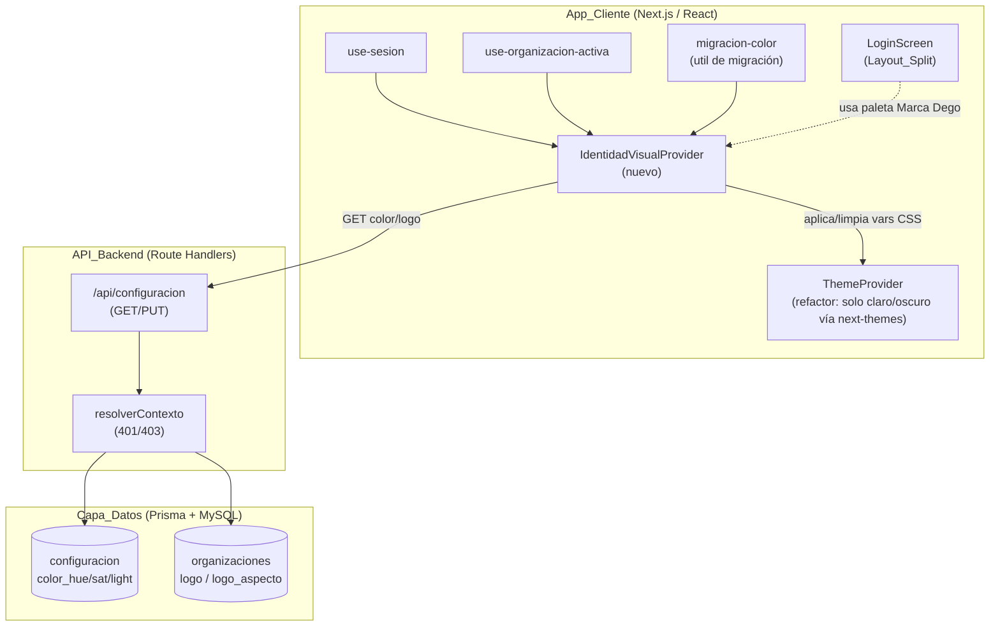
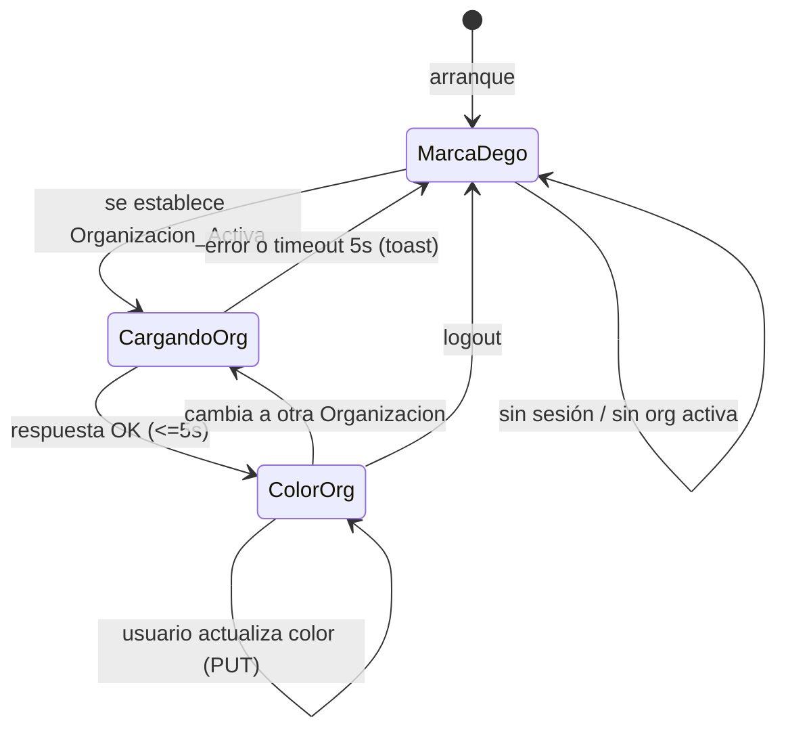
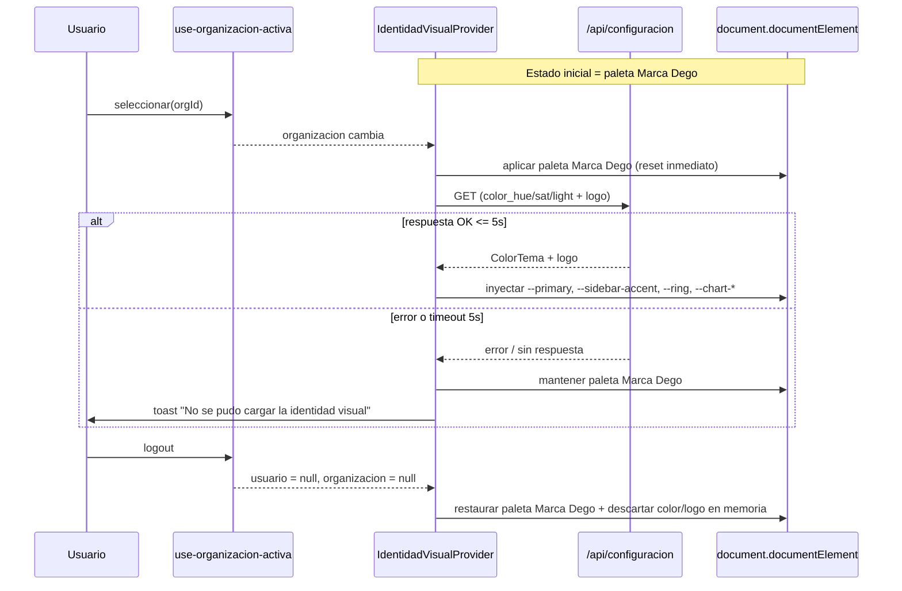

# Documento de Diseño — Identidad de Marca Dego

## Overview

Esta funcionalidad agrupa tres iniciativas con una raíz técnica común: la separación entre **identidad de marca de la aplicación** (Dego, visible antes y durante el login) y la **identidad visual de cada Organización** (color/tema y logo, visible solo tras seleccionar una `Organizacion_Activa`).

El defecto central que resuelve el diseño es que hoy `components/theme-provider.tsx` trata `localStorage` (claves `invenpro-color` / `invenpro-theme`) como **fuente de verdad** del color primario. Esto produce dos fallos:

- **(a) Filtración al login**: el color de la última Organización se inyecta en `document.documentElement` antes de autenticarse, contaminando la `Pantalla_Login`.
- **(b) Filtración entre inquilinos**: el color persiste entre Organizaciones distintas en el mismo navegador, rompiendo el aislamiento multi-tenant.

La solución reorganiza las responsabilidades en tres capas:

1. **Marca Dego (estática, sin sesión)**: una paleta negra/neutral por defecto, definida como tokens de tema, que se aplica siempre que no haya `Organizacion_Activa` (incluida la `Pantalla_Login`). El rebrand textual de "InvenPro" → "Dego" se cataloga y aplica solo sobre `Branding_Visible`.
2. **Identidad visual de Organización (dinámica, post-login)**: el `Color_Tema` se persiste como filas de la tabla `configuracion` atadas a `organizacion_id`, y el logo en los campos `logo` / `logo_aspecto` de la Organización. Se carga desde la API tras seleccionar `Organizacion_Activa` y se limpia en logout.
3. **Migración localStorage → BD**: detección única, idempotente y segura de valores heredados, con oferta de migración vía `sonner`.

El diseño reutiliza el stack y los subsistemas existentes (`resolverContexto`, `use-sesion`, `use-organizacion-activa`, `use-configuracion`, `loginSchema`, endpoints `app/api/configuracion`) sin introducir nuevas librerías.

### Mapeo de decisiones de diseño a requisitos

| Decisión de diseño | Requisitos cubiertos |
|---|---|
| 1. Color de Organización en BD (claves `color_*` en `configuracion`) | R6.1, R6.3, R6.4, R6.6, R8.1 |
| 2. Separar Marca Dego (sin sesión) del tema de Organización (post-login) | R5.1, R5.2, R5.3, R5.4, R7.4 |
| 3. Flujo carga/limpieza de identidad ligado a Sesión/Org Activa | R5.6, R6.3, R7.1, R7.2, R7.3, R7.5, R7.6 |
| 4. Rediseño del Login (Layout_Split, paleta, accesibilidad) | R3.1–R3.9, R4.1–R4.5 |
| 5. Migración localStorage → BD | R9.1–R9.7 |
| 6. Aislamiento multi-tenant en GET/PUT configuración | R8.1–R8.7 |
| 7. Rebrand visible vs. infraestructura | R1.1–R1.7, R2.1–R2.6 |

## Architecture

### Componentes y flujo general



### Separación de responsabilidades del tema

Hoy `ThemeProvider` mezcla dos preocupaciones: el modo claro/oscuro y el color primario. El diseño las separa:

- **Modo claro/oscuro** → delegado a `next-themes` (`ThemeProvider` se reduce a un wrapper de `next-themes` con `attribute="class"`). Es una preferencia del navegador, independiente de la Organización (R9.7).
- **Color primario (`Color_Tema`)** → gestionado por un nuevo **`IdentidadVisualProvider`**, que es la única autoridad que inyecta `--primary`, `--sidebar-accent`, `--ring`, `--chart-*`. Su fuente de verdad es la API; nunca `localStorage` (R9.1).

El `IdentidadVisualProvider` observa el estado combinado de `use-sesion` (`usuario`) y `use-organizacion-activa` (`organizacion`) y decide qué paleta aplicar:



**Invariante de arranque (R5.1, R5.3)**: el estado inicial del `IdentidadVisualProvider` es siempre `MarcaDego`. Las variables CSS de color por defecto (paleta negra/neutral) se establecen de forma síncrona antes del primer render visible mediante un script de inicialización en `<head>` (patrón anti-flash, equivalente al de `next-themes`), de modo que nunca se observe transitoriamente el color de una Organización.

### Flujo de carga y limpieza de identidad visual



## Components and Interfaces

### 1. Esquema Zod del Color_Tema (`lib/schemas/configuracion.ts`)

Se extiende el esquema existente. El `Color_Tema` se modela como triada `hue` / `saturation` / `lightness`, coherente con la estructura `ThemeColors` actual del `ThemeProvider`.

```typescript
// Rangos: hue 0–360 (grados), saturation 0–1, lightness 0–1 (compatible con oklch)
export const colorTemaSchema = z.object({
  color_hue: z.number().min(0).max(360),
  color_saturation: z.number().min(0).max(1),
  color_lightness: z.number().min(0).max(1),
})

export const actualizarConfiguracionSchema = z.object({
  porcentaje_impuesto: z.number().min(0).max(100).optional(),
  etiqueta_ancho_mm: z.number().int().min(20).max(200).optional(),
  etiqueta_alto_mm: z.number().int().min(10).max(150).optional(),
  ticket_ancho_mm: z.number().int().min(40).max(200).optional(),
  imprimir_automaticamente: z.boolean().optional(),
  permitir_sobreventa: z.boolean().optional(),
  // Nuevas claves de Identidad_Visual (R6.4)
  color_hue: z.number().min(0).max(360).optional(),
  color_saturation: z.number().min(0).max(1).optional(),
  color_lightness: z.number().min(0).max(1).optional(),
})

export type ColorTema = z.infer<typeof colorTemaSchema>
export type ActualizarConfiguracionInput = z.infer<typeof actualizarConfiguracionSchema>

export type ConfiguracionMap = {
  porcentaje_impuesto: number
  etiqueta_ancho_mm: number
  etiqueta_alto_mm: number
  ticket_ancho_mm: number
  imprimir_automaticamente: boolean
  permitir_sobreventa: boolean
  color_hue: number
  color_saturation: number
  color_lightness: number
}

// Color_Tema por defecto de la Marca_Dego: negro/neutral (saturación 0 = sin tinte)
export const COLOR_TEMA_DEGO: ColorTema = {
  color_hue: 0,
  color_saturation: 0,
  color_lightness: 0.18, // negro suave, no plano (#0…)
}

export const CONFIG_DEFAULTS: ConfiguracionMap = {
  porcentaje_impuesto: 0,
  etiqueta_ancho_mm: 57,
  etiqueta_alto_mm: 40,
  ticket_ancho_mm: 80,
  imprimir_automaticamente: false,
  permitir_sobreventa: false,
  ...COLOR_TEMA_DEGO, // R6.6: default no persistido hasta actualización explícita
}
```

**Decisión: tres claves escalares vs. JSON.** Se eligen **tres claves escalares** (`color_hue`, `color_saturation`, `color_lightness`) en lugar de una clave JSON `color_tema`, por tres razones:

1. La columna `valor` es `VARCHAR(255)` y el patrón actual (`leerConfiguracion`) ya parsea claves escalares con `parseFloat`/`parseInt`. Mantener escalares evita parseo JSON frágil dentro de una celda de texto.
2. El upsert por clave (`organizacion_id_clave`) permite actualizar el color de forma granular e idempotente, igual que el resto de claves operativas.
3. La validación Zod por campo produce errores 422 por campo (R6.5) sin necesidad de validar la forma interna de un blob JSON.

### 2. `IdentidadVisualProvider` (nuevo, `hooks/use-identidad-visual.tsx`)

Única autoridad para inyectar las variables CSS de color. Reemplaza la lógica de color de `ThemeProvider`.

```typescript
export type IdentidadVisual = {
  color: ColorTema
  logo: string | null
  logoAspecto: string | null
}

export type IdentidadVisualState = {
  identidad: IdentidadVisual          // color/logo aplicados actualmente
  cargando: boolean                   // true mientras se carga la org recién seleccionada
  error: string | null
  /** Persiste un nuevo Color_Tema en la BD y lo aplica (R6.4, R6.7) */
  actualizarColor: (color: ColorTema) => Promise<void>
}

export function IdentidadVisualProvider(props: { children: React.ReactNode }): JSX.Element
export function useIdentidadVisual(): IdentidadVisualState
```

Comportamiento (derivado de `use-sesion` + `use-organizacion-activa`):

- **Sin `usuario` o sin `organizacion`** → aplica `COLOR_TEMA_DEGO` y `logo = null` (logo Dego por defecto). No lee `localStorage` (R5.2, R5.4, R7.3).
- **`organizacion` cambia a un id no nulo** → resetea a Marca Dego, dispara `GET /api/configuracion` con `AbortController` y timeout de 5 s (R7.1, R7.4); al resolver, inyecta el color; ante error/timeout mantiene Marca Dego y emite toast (R7.5).
- **`organizacion.logo` ausente** → usa logo Dego por defecto (R7.6).
- **`actualizarColor`** → `PUT /api/configuracion`, y solo tras persistencia exitosa inyecta las variables CSS (R6.7).

Función pura de inyección (reutiliza la lógica oklch existente), extraída a `lib/tema/aplicar-color.ts` para poder testearla:

```typescript
export function aplicarColorTema(
  root: { style: { setProperty(name: string, value: string): void } },
  color: ColorTema,
  isDark: boolean
): void
```

### 3. Migración localStorage → BD (`lib/tema/migracion-color.ts`)

```typescript
/** Resultado de interpretar un valor heredado de localStorage */
export type ResultadoMigracion =
  | { tipo: "valido"; color: ColorTema }
  | { tipo: "ausente" }
  | { tipo: "invalido" }   // presente pero no interpretable (R9.3)

/** Lee y valida invenpro-color/invenpro-theme sin mutar nada (función pura) */
export function leerColorHeredado(
  getItem: (clave: string) => string | null
): ResultadoMigracion

/** Elimina las claves heredadas; devuelve true si ambas quedaron ausentes (R9.4) */
export function limpiarClavesHeredadas(
  removeItem: (clave: string) => void,
  getItem: (clave: string) => string | null
): boolean

export const CLAVES_HEREDADAS = ["invenpro-color", "invenpro-theme"] as const
```

Orquestación en `IdentidadVisualProvider` (R9.2–R9.6): si hay `Organizacion_Activa` **sin** `Color_Tema` persistido y `leerColorHeredado` devuelve `valido`, se ofrece migrar vía `sonner` (acción "Aplicar") dentro de los 2 s posteriores a la inicialización. Al aceptar: `PUT`; si OK → `limpiarClavesHeredadas`; si la persistencia falla → conservar claves + toast de error (R9.5); si la limpieza falla tras persistir → se conserva el color persistido como verdad y no se vuelve a ofrecer (R9.6, usando una marca en memoria/sesión por `organizacion_id`).

### 4. `LoginScreen` rediseñado (`components/auth/login-screen.tsx`)

`Layout_Split` con dos paneles construidos solo con primitivos de `components/ui/` (`Card`, `Form`, `Input`, `Button`, `Label`). Reutiliza `loginSchema` (correo ≤254, contraseña ≤128) y el manejo de errores existente.

```tsx
// Estructura (responsive): grid de 2 columnas en >=768px, 1 columna en <768px
<div className="grid min-h-svh lg:grid-cols-2">
  {/* Panel de marca: oculto/colapsado en móvil, visible arriba si cabe */}
  <section className="hidden bg-primary text-primary-foreground lg:flex ...">
    <BrandMark />                         {/* nombre "Dego" + logo Marca Dego */}
    <h1>Sistema de Inventario</h1>        {/* R3.2 */}
    <p>{SUBTITULO_LOGIN}</p>              {/* R3.3: 20–160 chars */}
  </section>
  {/* Panel de formulario */}
  <section className="flex items-center justify-center p-6">
    <LoginForm />                         {/* correo+contraseña, sin Google */}
  </section>
</div>
```

```typescript
// Subtítulo profesional en español (R3.3: 20–160 chars, menciona inventario y ventas)
export const SUBTITULO_LOGIN =
  "Gestiona el inventario y las ventas de tu organización desde un solo lugar, de forma simple y segura."
```

- **R3.8**: en `<768px` el panel de marca se reduce a un encabezado compacto sobre el formulario en una sola columna; título, subtítulo y formulario permanecen visibles.
- **R4.1**: ningún color literal; todo vía tokens (`bg-primary`, `text-primary-foreground`, `bg-background`, `text-foreground`, `border-input`).
- **R4.2**: `Color_Acento` con `hue` fuera de 210–270° aplicado a elementos destacados del panel de marca, contraste ≥3:1.
- **R4.3/R4.4/R4.5**: tokens de tema responden a `next-themes`; sin colores fijos; en arranque sin tema resuelto se usan tokens por defecto.

### 5. Catálogo de rebrand (`Branding_Visible` vs `Identificador_Infraestructura`)

Constante de marca central para evitar literales dispersos:

```typescript
// lib/marca.ts
export const MARCA = {
  nombre: "Dego",
  fallback: "Sistema de Inventario", // R1.7
  remitenteCorreo: "Dego",           // R1.4
  prefijoLog: "[dego]",              // R1.6
} as const
```

**Catálogo (R2.1):**

| Aparición | Archivo | Clasificación | Acción |
|---|---|---|---|
| `metadata.title` | `app/layout.tsx` | Branding_Visible | "Dego - Sistema de Inventario y Ventas" (R1.2) |
| Título login | `components/auth/login-screen.tsx` | Branding_Visible | "Dego" / "Sistema de Inventario" (R1.3) |
| Encabezado sidebar fallback | `components/sidebar.tsx` | Branding_Visible | `MARCA.nombre` (R1.1) |
| Pantallas registro/verificación/invitación/selección org | `components/auth/*`, `components/organizaciones/*` | Branding_Visible | "Dego" |
| `SMTP_FROM` | `.env`, `.env.example` | Branding_Visible | "Dego <…>" (R1.4) |
| Plantillas de correo | `lib/correo/plantillas.ts` | Branding_Visible | "Dego" |
| Prefijo logger `[invenpro]` | `lib/log.ts` | Branding_Visible (observable en logs) | `[dego]` (R1.6) |
| Comentarios de código | varios | Branding_Visible (si observable) | "Dego" donde aplique |
| `product.md` | `.kiro/steering/product.md` | Branding_Visible | "Dego" (R1.5) |
| `DATABASE_URL` (usuario/base) | `.env` | Identificador_Infraestructura | **Diferido** (R2.2–R2.5) |
| `MYSQL_DATABASE/USER/PASSWORD` | `.env` | Identificador_Infraestructura | **Diferido** |
| Volumen `invenpro_mysql_data` | `docker-compose.yml` | Identificador_Infraestructura | **Diferido** |
| Servicio systemd / `invenpro-fix-service.sh` | script | Identificador_Infraestructura | **Diferido** |
| Cookie `sesion_invenpro` | `lib/auth/sesion.ts` | Identificador_Infraestructura (no visible) | **Diferido** (renombrar invalida sesiones) |
| `id` iframe `invenpro-print-frame` | `imprimir-etiqueta-dialog.tsx` | Identificador_Infraestructura (no visible) | **Diferido** |

**Política de infraestructura (R2.2–R2.5):** los `Identificador_Infraestructura` se conservan sin cambios por defecto. Cualquier renombrado requiere, antes de aplicarse: (1) procedimiento de migración documentado con advertencia de pérdida de datos, y (2) respaldo verificado. Si la migración falla, se restaura desde el respaldo y se conserva el identificador original. El `Branding_Visible` muestra "Dego" con independencia del valor de estos identificadores (R2.6).

## Data Models

### Tabla `configuracion` (sin cambio de esquema Prisma)

El modelo clave-valor existente soporta las nuevas claves sin migración estructural. Se añaden tres claves por Organización:

| clave | valor (texto en BD) | parseo de lectura | default (Marca Dego) |
|---|---|---|---|
| `color_hue` | `"0"`–`"360"` | `parseFloat` | `0` |
| `color_saturation` | `"0"`–`"1"` | `parseFloat` | `0` |
| `color_lightness` | `"0"`–`"1"` | `parseFloat` | `0.18` |

```prisma
model Configuracion {
  organizacion_id String       @db.Char(36)
  organizacion    Organizacion @relation(fields: [organizacion_id], references: [id])
  clave           String       @db.VarChar(64)   // admite color_hue/color_saturation/color_lightness
  valor           String       @db.VarChar(255)
  actualizado_en  DateTime     @updatedAt
  @@id([organizacion_id, clave])
  @@map("configuracion")
}
```

`leerConfiguracion(organizacion_id)` se amplía para mapear las tres claves nuevas aplicando `COLOR_TEMA_DEGO` cuando falten (R6.6: el default **no** se persiste hasta una actualización explícita). El upsert por `organizacion_id_clave` garantiza que escribir el color de una Organización no toca filas de otra (R8.3, R8.7).

### Logo (sin cambios)

`Organizacion.logo` (`MEDIUMTEXT`) y `Organizacion.logo_aspecto` (`VARCHAR(16)`) ya existen y están atados a `organizacion_id` (R6.2). El logo se sirve junto a la Organización vía `OrganizacionDTO` y se actualiza con el `PATCH /api/organizaciones/{id}` existente.

### Modelo de estado del cliente

```typescript
type IdentidadVisual = {
  color: ColorTema          // aplicado a vars CSS
  logo: string | null       // null => logo Marca Dego
  logoAspecto: string | null
}
```

## Correctness Properties

*Una propiedad es una característica o comportamiento que debe cumplirse en todas las ejecuciones válidas del sistema — esencialmente, una afirmación formal sobre lo que el sistema debe hacer. Las propiedades sirven de puente entre las especificaciones legibles por humanos y las garantías de corrección verificables por máquina.*

Tras el análisis de prework y la reflexión de consolidación, se identificaron las siguientes propiedades. Varios criterios de aceptación se fusionaron por implicación lógica (p. ej., R5.1–R5.4 → P1; R8.1–R8.7 → P5; R6.1/R6.3/R6.4/R7.1 → P3).

### Property 1: Aislamiento del color respecto del Login

*Para cualquier* `Color_Tema` de Organización y *cualquier* estado de `localStorage` (incluidas claves `invenpro-color`/`invenpro-theme` con valores válidos, vacíos o corruptos), cuando no existe `Sesion` válida o no hay `Organizacion_Activa`, el color que el `IdentidadVisualProvider` aplica a las variables CSS es exactamente `COLOR_TEMA_DEGO`, sin estado transitorio de ninguna Organización.

**Validates: Requirements 5.1, 5.2, 5.3, 5.4, 5.5**

### Property 2: Limpieza de identidad visual en cierre de sesión

*Para cualquier* `Color_Tema` y logo de Organización aplicados, tras un cierre de sesión el color aplicado vuelve a ser exactamente `COLOR_TEMA_DEGO` y el color/logo de la Organización previa quedan descartados de la memoria de sesión.

**Validates: Requirements 5.6, 7.3**

### Property 3: Round-trip de persistencia y carga del Color_Tema

*Para cualquier* `Color_Tema` válido (hue ∈ [0,360], saturation ∈ [0,1], lightness ∈ [0,1]), persistirlo en la `Configuracion_Organizacion` de una Organización y luego cargarlo (o recibirlo como respuesta del endpoint de actualización) produce un `Color_Tema` igual al enviado.

**Validates: Requirements 6.1, 6.3, 6.4, 7.1**

### Property 4: Derivación determinista de variables CSS

*Para cualquier* `Color_Tema` válido y *cualquier* modo (claro/oscuro), `aplicarColorTema` establece las variables `--primary`, `--sidebar-accent`, `--ring` y `--chart-1..5` con valores derivados de ese color, y nunca con valores de color literales fijos.

**Validates: Requirements 6.7, 4.1**

### Property 5: Aislamiento multi-inquilino de la configuración

*Para todo* par de Organizaciones distintas A y B con sus respectivas `Configuracion_Organizacion`, actualizar la configuración de A (incluido `Color_Tema` y logo) con cualquier payload válido preserva inalterados todos los valores de configuración de B, y una lectura de la configuración de A nunca incluye ningún valor perteneciente a B.

**Validates: Requirements 8.1, 8.2, 8.3, 8.7**

### Property 6: Rechazo y no-mutación ante payload inválido

*Para cualquier* payload de actualización que no cumpla `actualizarConfiguracionSchema` (valores fuera de rango o de tipo incorrecto en `color_hue`/`color_saturation`/`color_lightness`), la validación falla (HTTP 422 con detalle por campo) y el `Color_Tema` persistido de la Organización permanece sin cambios.

**Validates: Requirements 6.5**

### Property 7: Reemplazo total al cambiar de Organización en el cliente

*Para cualquier* par de `Color_Tema` de Organizaciones A y B, tras cambiar la `Organizacion_Activa` de A a B el color aplicado coincide exactamente con el de B, sin conservar ningún componente del color de A.

**Validates: Requirements 7.2**

### Property 8: Clasificación correcta del color heredado (round-trip de parseo)

*Para cualquier* `Color_Tema` válido serializado en el formato heredado, `leerColorHeredado` lo clasifica como `valido` y reconstruye un `Color_Tema` equivalente; *para cualquier* cadena no interpretable o ausente, lo clasifica como `invalido`/`ausente` sin mutar las claves heredadas.

**Validates: Requirements 9.2, 9.3**

### Property 9: Seguridad e idempotencia de la migración

*Para cualquier* `Color_Tema` heredado válido: si la persistencia en BD tiene éxito, las claves heredadas quedan ausentes y repetir la migración no produce efectos adicionales; si la persistencia falla, las claves heredadas permanecen intactas y la Organización queda sin `Color_Tema` persistido; si la persistencia tiene éxito pero la limpieza de claves falla, el color persistido se conserva como fuente de verdad y la migración no se vuelve a ofrecer para esa Organización.

**Validates: Requirements 9.4, 9.5, 9.6**

### Property 10: El branding visible nunca expone "InvenPro"

*Para cualquier* nombre de Organización (incluido `null`, vacío o solo espacios), la resolución de marca visible devuelve "Dego" o el texto de respaldo "Sistema de Inventario", y nunca una cadena que contenga ninguna variante de mayúsculas/minúsculas de "InvenPro"; lo mismo aplica al prefijo del logger (`[dego]`).

**Validates: Requirements 1.1, 1.6, 1.7, 2.6**

### Property 11: Límites y formato del esquema de login

*Para cualquier* par (correo, contraseña), `loginSchema.safeParse` tiene éxito si y solo si el correo tiene formato válido y longitud ≤ 254 y la contraseña no está vacía y tiene longitud ≤ 128; cualquier correo malformado, campo vacío o longitud excedida produce un fallo de validación.

**Validates: Requirements 3.5, 3.6**

### Property 12: Ortogonalidad del modo claro/oscuro respecto al color

*Para cualquier* secuencia de operaciones de color (cargar, actualizar o limpiar el `Color_Tema` de una Organización), la preferencia de modo claro/oscuro de `next-themes` permanece inalterada, y el `IdentidadVisualProvider` nunca escribe el `Color_Tema` en las claves `invenpro-color`/`invenpro-theme` como fuente de verdad.

**Validates: Requirements 9.1, 9.7**

## Error Handling

### Capa de API (`/api/configuracion`)

| Condición | Respuesta | Requisito |
|---|---|---|
| Sin `Sesion` válida | HTTP 401 `NO_AUTENTICADO`, sin leer/modificar | R8.4 |
| `Sesion` válida sin `Organizacion_Activa` | HTTP 403 `SIN_ORGANIZACION_ACTIVA` (alinear `resolverContexto`, hoy 409) | R8.5 |
| Referencia a otra Organización distinta a la activa | HTTP 403 — el alcance se deriva siempre de la sesión, nunca del payload, por lo que una org ajena no surte efecto | R8.6 |
| Payload de color fuera de esquema | HTTP 422 con detalle por campo vía `withValidation`, sin mutar estado | R6.5 |
| Error de Prisma | `mapPrismaError` | — |

**Decisión de alineación (R8.5):** el requisito exige **403** cuando hay sesión pero no `Organizacion_Activa`, mientras que `resolverContexto` devuelve hoy **409** (`SIN_ORGANIZACION_ACTIVA`). Para no romper otros consumidores del guard, se introduce una variante de resolución para configuración que mapea la ausencia de organización activa a 403 en este endpoint (o se ajusta el status del código `SIN_ORGANIZACION_ACTIVA` a 403 si se confirma que es seguro para todos los consumidores). Esta decisión se marca para revisión en la fase de tareas.

### Capa de cliente (`IdentidadVisualProvider`)

| Condición | Manejo | Requisito |
|---|---|---|
| Carga de identidad falla o excede 5 s | Conservar `COLOR_TEMA_DEGO`; toast en español "No se pudo cargar la identidad visual" | R7.5 |
| Organización sin `Color_Tema` | Aplicar `COLOR_TEMA_DEGO` sin persistirlo | R6.6 |
| Organización sin logo | Logo Marca Dego por defecto | R7.6 |
| `localStorage` corrupto/vacío | `leerColorHeredado` → `invalido`/`ausente`; aplicar Dego sin lanzar excepción | R5.5, R9.3 |
| Persistencia de migración falla | Conservar claves heredadas; toast de error; org sin color | R9.5 |
| Limpieza de claves falla tras persistir | Conservar color persistido; no reofrecer | R9.6 |
| Recurso de marca no disponible | Fallback "Sistema de Inventario" | R1.7 |

### Infraestructura (diferida)

Toda operación sobre `Identificador_Infraestructura` exige respaldo verificado y procedimiento documentado; ante fallo, restauración desde respaldo conservando el identificador original (R2.2–R2.5).

## Testing Strategy

### Enfoque dual

- **Pruebas unitarias / de ejemplo**: render del `Layout_Split`, textos de marca, ausencia de botón de Google, contraste WCAG en claro/oscuro, metadata, remitente de correo, respuestas 401/403, conservación de valores del formulario en error.
- **Pruebas de propiedades (PBT)**: las 12 propiedades anteriores. El proyecto ya usa `fast-check` + `vitest` (ver `__tests__/property/`), por lo que se reutiliza esa infraestructura; **no** se implementa PBT desde cero.

### Configuración de PBT

- Mínimo **100 iteraciones** por prueba de propiedad (`fc.assert(..., { numRuns: 100 })`).
- Cada prueba etiquetada con un comentario que referencia la propiedad del diseño:
  `// Feature: identidad-marca-dego, Property {n}: {texto}`
- Generadores clave:
  - `arbColorTema`: `{ color_hue: 0–360, color_saturation: 0–1, color_lightness: 0–1 }`.
  - `arbColorHeredado`: mezcla de serializaciones válidas y cadenas corruptas/vacías para P8.
  - `arbConfigOrg` y `arbParOrgs`: configuraciones independientes por `organizacion_id` para P5 (usar capa de datos in-memory/mock para evitar costo de BD real).
  - `arbPayloadInvalido`: valores fuera de rango/tipos erróneos para P6.

### Mapa propiedad → archivo de prueba sugerido

| Propiedad | Archivo | Tipo de capa |
|---|---|---|
| P1, P2, P7, P12 | `__tests__/property/identidad-visual-aislamiento.test.tsx` | provider (mock sesión/org) |
| P3, P4 | `__tests__/property/color-tema-roundtrip.test.ts` | función pura + capa datos mock |
| P5 | `__tests__/property/config-aislamiento-multitenant.test.ts` | capa datos in-memory |
| P6 | `__tests__/property/config-color-validacion.test.ts` | Zod |
| P8, P9 | `__tests__/property/migracion-color.test.ts` | funciones puras + mocks |
| P10 | `__tests__/property/marca-rebrand.test.ts` | resolver de marca + logger |
| P11 | `__tests__/property/login-schema.test.ts` | Zod |

### Pruebas de ejemplo / integración (no PBT)

- **Login**: render `Layout_Split`, título "Sistema de Inventario", subtítulo (20–160 chars, menciona inventario y ventas), sin Google, una columna a <768px, sin literales de color (escaneo del archivo), contraste AA claro/oscuro (R3.x, R4.x).
- **Aislamiento de acceso**: GET/PUT sin sesión → 401; con sesión sin org activa → 403; estado sin cambios (R8.4–R8.6).
- **Logo**: round-trip de persistencia y fallback de logo Dego (R6.2, R7.6).
- **Rebrand**: metadata.title (R1.2), remitente de correo (R1.4), `product.md` (R1.5).
- **Migración (integración)**: smoke de migración de `Identificador_Infraestructura` en entorno controlado (R2.4, R2.5).

### Cobertura de criterios no testeables automáticamente

R2.1–R2.3 (catálogo, documentación, respaldo), R3.9 (idioma) y R4.4 (tiempo de re-render) se cubren con revisión y smoke tests; quedan documentados en este diseño y se trasladan como tareas de verificación manual.
