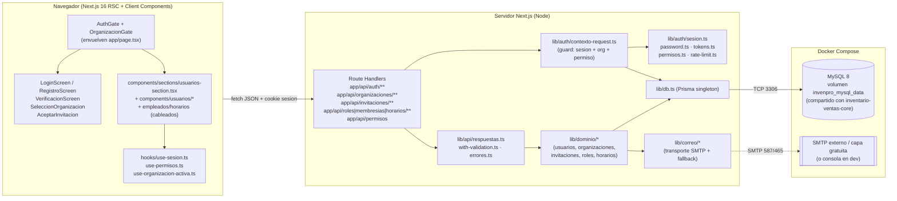
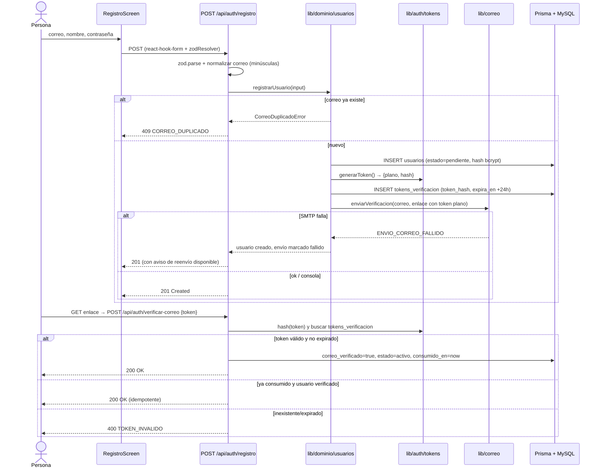
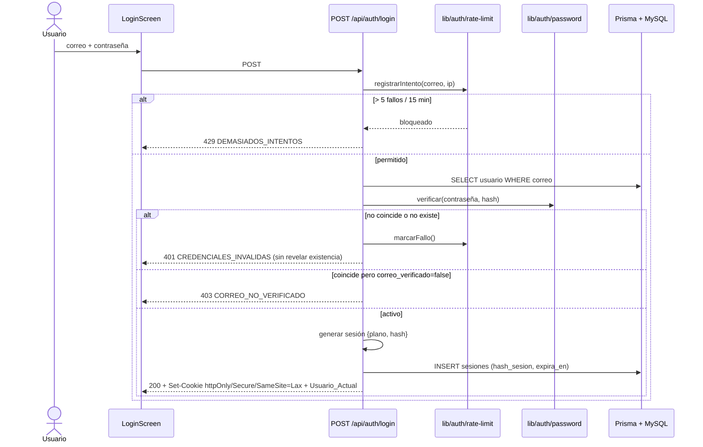
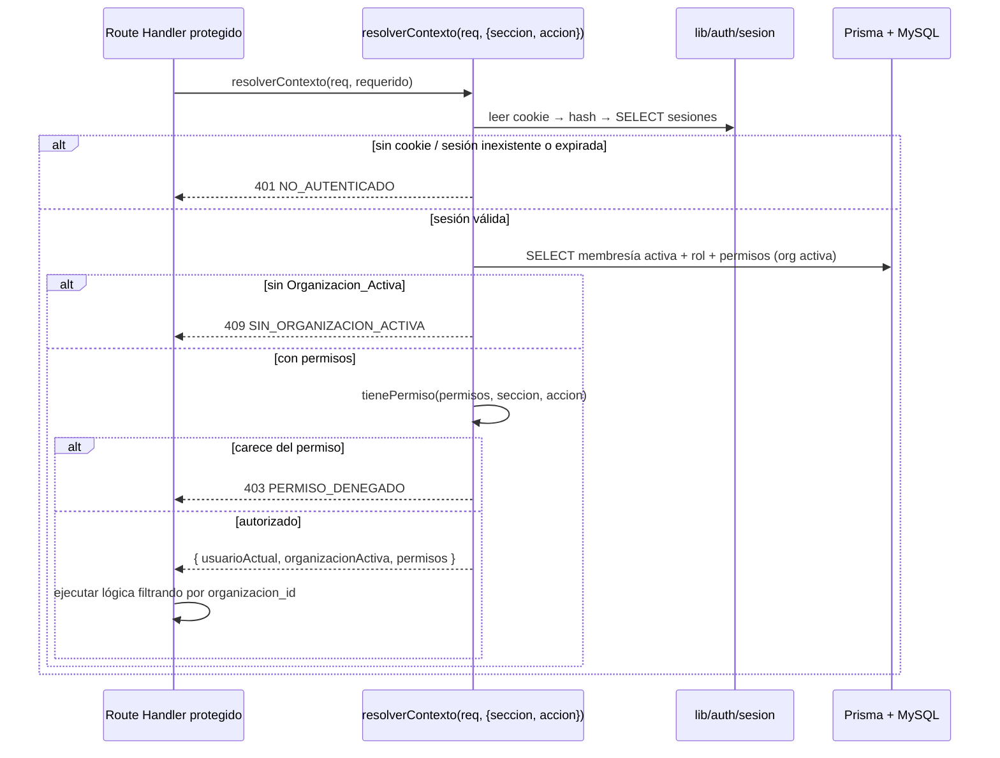
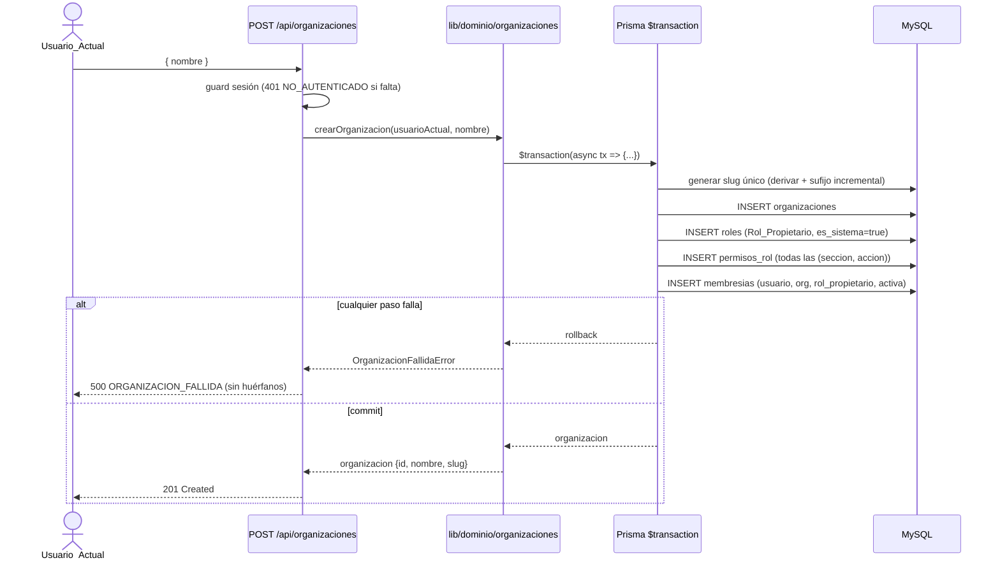
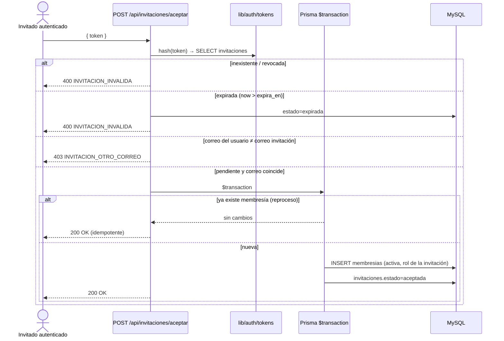
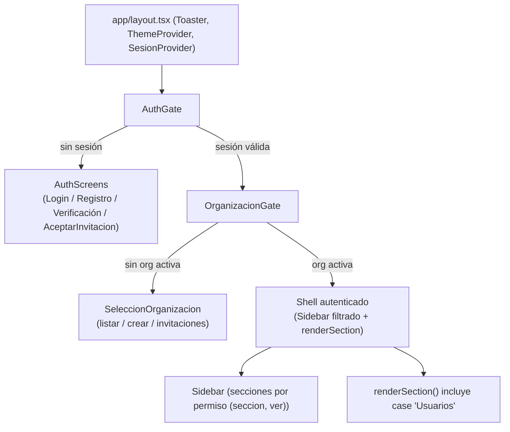

# Design Document

> Documento de diseño técnico de la feature `usuarios-y-accesos`.
> El encabezado raíz se mantiene en inglés por requisito del validador del spec.
> El cuerpo de la guía está en español, igual que la app InvenPro.

## Overview

`usuarios-y-accesos` añade a InvenPro la capa de **identidad, organizaciones
multi-inquilino y control de acceso** que hoy no existe. La app actual es un
shell de página única (`app/page.tsx` con estado `activeSection`) donde las
secciones renderizan datos mock o consumen la API de `inventario-ventas-core`
sin ningún concepto de usuario, sesión ni tenant. Esta feature transforma esa
cáscara en un sistema multi-organización con autenticación real, conservando
intactos el shell de navegación, el sistema de diseño shadcn/ui (style
new-york, base neutral) y la convención `components/sections/*`.

Lo que se construye:

- **Autenticación y sesiones**: registro con verificación de correo, login con
  cookie de sesión `httpOnly`/`Secure`/`SameSite=Lax`, logout idempotente y un
  helper de servidor (`lib/auth/sesion.ts`) que resuelve `Usuario_Actual` +
  `Organizacion_Activa` + `permisos` en cada request.
- **Hashing de contraseñas** con `bcryptjs` (JS puro, sin binarios nativos) y
  **tokens** (verificación e invitación) generados con `crypto.randomBytes` y
  persistidos solo como hash SHA-256.
- **Multi-tenancy** por `organizacion_id` en las tablas de negocio existentes,
  con migración aditiva en dos pasos (columna nullable → backfill → NOT NULL) y
  derivación de la `Organizacion_Activa` desde la sesión del servidor.
- **Modelo de roles y permisos granulares** `(seccion, accion)`, con
  `Rol_Propietario` de sistema que concentra todos los permisos, y un helper
  puro `lib/auth/permisos.ts` (`tienePermiso`).
- **Invitaciones por correo** con enlace tokenizado, aceptación transaccional e
  idempotente, y revocación.
- **Servicio de correo de costo cero** (`lib/correo/*`): transporte SMTP por
  `nodemailer` configurable por env, con *fallback* a consola cuando faltan
  credenciales; plantillas en español para verificación e invitación.
- **Asignación de horarios** a las membresías, conectando las secciones
  Empleados y Horarios (hoy mock) al backend real.
- **Pantallas previas al shell**: Login, Registro, Verificación, selección/
  creación de Organizacion y aceptación de Invitacion, integradas como estados
  previos a `activeSection` mediante un `AuthGate` + `OrganizacionGate`.
- **Sección `usuarios`** nueva (gestión de miembros, roles e invitaciones) en
  `components/sections/usuarios-section.tsx` + diálogos en `components/usuarios/*`.
- **Testing por propiedades** con `fast-check` sobre la lógica pura crítica
  (tokens, hashing, permisos, slug) y pruebas ejemplares/integración para el
  resto.

Cómo encaja: el shell `app/page.tsx` se envuelve con compuertas de sesión y
organización, pero la mecánica `activeSection` no cambia. El `Sidebar` filtra
secciones por permiso. Las tablas de `inventario-ventas-core` ganan
`organizacion_id` y sus handlers pasan a filtrar por `Organizacion_Activa`
(actualización reconocida y planificada más abajo). Las nuevas dependencias
(`bcryptjs`, `nodemailer`) se añaden vía pnpm respetando el lockfile; `prisma`,
`@prisma/client`, `zod`, `@hookform/resolvers`, `date-fns`, `fast-check` y
`sonner` ya están presentes por el módulo previo.

### Decisiones de diseño y su justificación

| Decisión | Alternativas consideradas | Razón |
| --- | --- | --- |
| **bcryptjs** para hashing | `bcrypt` (nativo), `argon2` (nativo), `@node-rs/argon2` | `bcryptjs` es JS puro: sin compilación de binarios nativos, sin fallas en build de Vercel ni en Docker. Costo cero, portable. `cost=12` por defecto. argon2 es teóricamente más fuerte pero exige binarios; el riesgo de despliegue no compensa para este alcance. |
| **Sesión opaca en BD** (no JWT) | JWT *stateless*, NextAuth, Clerk | Permite **invalidación inmediata** (logout, cambio de contraseña — R16.6) y revocación. El identificador se guarda solo como hash. Evita dependencias de pago (Clerk) o de mayor superficie (NextAuth) y mantiene el control en `app/api/**`. |
| **Token en claro en el enlace, hash en BD** | Guardar token plano, cifrado simétrico | Un robo de la BD no expone tokens usables. SHA-256 basta porque el token ya tiene ≥128 bits de entropía (no necesita *salting* lento como una contraseña). |
| **Rate limiting en memoria** (`Map` + ventana deslizante) | Redis, Upstash, base de datos | Costo cero y suficiente para single-instance. Se documenta su limitación (no compartido entre réplicas) como deuda técnica explícita. |
| **Migración multi-tenant en dos pasos** | Recrear tablas, columna NOT NULL directa | Preserva los datos existentes de `inventario-ventas-core` (R1.10, R13.4): nullable → organización por defecto + backfill → NOT NULL. |
| **CHAR(36) UUID v4** | CUID, autoincrement | Coherencia total con el schema existente (`@db.Char(36)`), depuración simple, sin colisiones entre tenants. |

## Architecture

### Diagrama de capas



Capas:

1. **UI client** (React 19, Client Components). El `AuthGate` decide entre
   mostrar Login/Registro/Verificación o el shell autenticado; el
   `OrganizacionGate` decide entre selección de Organizacion o las secciones del
   producto. Las pantallas y diálogos nuevos reutilizan shadcn/ui.
2. **Hooks de cliente** (`useSesion`, `usePermisos`, `useOrganizacionActiva`)
   encapsulan el estado de identidad y el conjunto de permisos.
3. **Route Handlers** validan con Zod, aplican el *guard* de acceso y delegan al
   dominio. No contienen reglas de negocio.
4. **Guard de request** (`lib/auth/contexto-request.ts`) lee la cookie, resuelve
   la sesión, la organización activa y los permisos, y verifica el permiso
   requerido por el endpoint.
5. **Librería de auth** (`lib/auth/*`) contiene la lógica pura y los efectos de
   sesión: hashing, tokens, permisos, rate-limit.
6. **Capa de dominio** (`lib/dominio/*`) implementa transacciones y reglas
   (creación de organización con propietario único, aceptación de invitación,
   etc.). Es la única que llama a Prisma para escrituras de negocio.
7. **Servicio de correo** (`lib/correo/*`) envía o registra en consola.
8. **Prisma + MySQL 8** en Docker, **la misma instancia** que
   `inventario-ventas-core` (mismo `DATABASE_URL`, mismo volumen).

### Flujos de datos clave

#### Flujo A — Registro y verificación



#### Flujo B — Login y resolución de contexto



#### Flujo C — Guard de endpoint protegido



#### Flujo D — Creación de organización (propietario único)



#### Flujo E — Aceptación de invitación




## Components and Interfaces

### Integración con el shell `app/page.tsx`

El shell no pierde su mecánica `activeSection`. Se envuelve con dos compuertas
que viven **antes** del render del `Sidebar` + secciones:



`app/page.tsx` se refactoriza para extraer el shell a un componente
`AppShell` y anteponer las compuertas. El estado `activeSection` y
`renderSection()` permanecen; se añade `case "Usuarios"` y la inicialización de
`activeSection` pasa a calcularse como la primera sección con permiso
`(seccion, ver)` (R12.6), en lugar de `"Dashboard"` fijo.

```tsx
// app/page.tsx (esqueleto tras refactor)
"use client"
export default function HomePage() {
  return (
    <ThemeProvider>
      <SesionProvider>
        <AuthGate>
          <OrganizacionGate>
            <AppShell />
          </OrganizacionGate>
        </AuthGate>
      </SesionProvider>
    </ThemeProvider>
  )
}
```

### Pantallas previas a la app (`components/auth/`)

| Archivo | Responsabilidad | shadcn/ui que reutiliza | Requisitos |
| --- | --- | --- | --- |
| `auth/auth-gate.tsx` | Cliente. Usa `useSesion()`. Mientras carga muestra *skeleton*; sin sesión válida monta `AuthScreens`; con sesión renderiza `children`. Cubre la condición "mostrar Login en lugar de secciones". | — | R5.6, R5.7 |
| `auth/auth-screens.tsx` | Conmutador de pantalla (login \| registro \| verificación \| aceptar-invitación) por estado local, sin cambiar URL. Detecta `?token=` para verificación/invitación. | `Card` | R5, R10.6 |
| `auth/login-screen.tsx` | Formulario de login (`react-hook-form` + `zodResolver`). Marca negra vía token de tema. | `Card`, `Form`, `Input`, `Label`, `Button` | R4.1, R5.1–R5.5, R5.8 |
| `auth/registro-screen.tsx` | Formulario de registro con los tres campos. | `Card`, `Form`, `Input`, `Label`, `Button` | R2.1, R5.8 |
| `auth/verificacion-screen.tsx` | Procesa `?token=`, muestra estado (verificando / éxito / token inválido) y opción de reenviar. | `Card`, `Button`, `Alert` | R3.4–R3.9 |
| `auth/aceptar-invitacion-screen.tsx` | Muestra nombre de Organizacion y Rol ofrecido; si el invitado no tiene cuenta, redirige a Registro conservando el token. | `Card`, `Button`, `Alert` | R10.1, R10.6 |

La marca negra (R5.2) se aplica con la variable de tema `--primary` ya existente
(base `neutral` cuyo primario es casi negro en claro). No se codifican valores
hex en los componentes; el logotipo y los botones usan `bg-primary`,
`text-primary-foreground`. El contraste AA (R5.5, R17.6) se garantiza por los
tokens de tema neutral en ambos modos.

### Selección y creación de organización (`components/organizaciones/`)

| Archivo | Responsabilidad | shadcn/ui | Requisitos |
| --- | --- | --- | --- |
| `organizaciones/organizacion-gate.tsx` | Cliente. Usa `useOrganizacionActiva()`. Sin org activa monta `SeleccionOrganizacion`; con org activa renderiza `children`. | — | R7.5 |
| `organizaciones/seleccion-organizacion.tsx` | Lista organizaciones con membresía activa (orden A-Z), su Rol, botón seleccionar. Estado de error con reintento. Si no hay ninguna, muestra solo crear + invitaciones pendientes. | `Card`, `Button`, `Badge`, `Alert`, `Skeleton` | R7.1–R7.7 |
| `organizaciones/crear-organizacion-dialog.tsx` | Diálogo de alta de Organizacion (`nombre`). | `Dialog`, `Form`, `Input`, `Button` | R8.1, R8.6 |

### Sección Usuarios (`components/sections/usuarios-section.tsx` + `components/usuarios/`)

Nueva sección raíz, montada en el `switch` de `renderSection()` y en el
`Sidebar` (visible solo con `(usuarios, ver)`).

| Archivo | Responsabilidad | shadcn/ui | Requisitos |
| --- | --- | --- | --- |
| `sections/usuarios-section.tsx` | Contenedor con pestañas Miembros / Roles / Invitaciones. Usa `usePermisos()` para ocultar acciones sin permiso. | `Tabs`, `Card`, `Button` | R18.5, R12.3 |
| `usuarios/miembros-table.tsx` | Tabla de membresías de la Organizacion_Activa (Miembro, Rol, estado). Acción "Asignar Rol". | `Table`, `Badge`, `Button`, `DropdownMenu` | R11.8, R14.7 |
| `usuarios/asignar-rol-dialog.tsx` | Cambia el Rol de una Membresia. | `Dialog`, `Form`, `Select`, `Button` | R11.8, R11.9 |
| `usuarios/roles-table.tsx` | Lista Roles, marca `Rol_Propietario` como protegido. Acciones crear/editar/eliminar (ocultas sin `(usuarios, administrar)`). | `Table`, `Badge`, `Button` | R11.3, R11.6 |
| `usuarios/rol-form-dialog.tsx` | Alta/edición de Rol: nombre + matriz de checkboxes `(seccion × accion)`. | `Dialog`, `Form`, `Input`, `Checkbox`, `Button` | R11.3, R11.5 |
| `usuarios/invitaciones-table.tsx` | Lista invitaciones con `Estado_Invitacion` (Badge), acción revocar. | `Table`, `Badge`, `Button` | R9.7, R9.10 |
| `usuarios/invitar-miembro-dialog.tsx` | Formulario de invitación (correo + rol). Visible solo con `(usuarios, administrar)`. | `Dialog`, `Form`, `Input`, `Select`, `Button` | R9.1, R9.2 |

### Conexión de Empleados y Horarios al backend (R14.6, R14.7)

- `components/sections/empleados-section.tsx`: se elimina el array mock; pasa a
  consumir `GET /api/organizaciones/{id}/miembros`, mostrando cada Miembro con
  su Rol y estado.
- `components/sections/horarios-section.tsx`: se elimina el mock; consume
  `GET /api/organizaciones/{id}/horarios`. Se conserva la leyenda de tipos
  (`normal`, `vacaciones`, `incapacidad`, `descanso`).
- `components/horarios/asignar-horario-dialog.tsx` (nuevo): captura `dia`,
  `tipo`, `hora_inicio`, `hora_fin` para una Membresia. `Dialog` + `Form` +
  `Select` + `Input type=time`.

### Hooks de cliente (`hooks/`)

```ts
// hooks/use-sesion.ts — Context global montado en SesionProvider
export type SesionState = {
  usuario: UsuarioDTO | null
  cargando: boolean
  refetch: () => Promise<void>
  logout: () => Promise<void>
}
export function useSesion(): SesionState
```

`SesionProvider` hace `GET /api/auth/sesion` al montar y cachea el resultado.
`login`/`registro` llaman a `refetch()`. `logout()` hace `POST /api/auth/logout`
y limpia el estado.

```ts
// hooks/use-organizacion-activa.ts
export type OrganizacionActivaState = {
  organizacion: OrganizacionDTO | null
  organizaciones: OrganizacionConRolDTO[]
  cargando: boolean
  error: string | null
  seleccionar: (id: string) => Promise<void>   // POST /api/auth/organizacion-activa
  recargar: () => Promise<void>
}
export function useOrganizacionActiva(): OrganizacionActivaState
```

La `Organizacion_Activa` se conserva en la **sesión del servidor** (columna
`organizacion_activa_id` en `sesiones`), no en el cliente, para que el guard la
derive de forma autoritativa (R13.5). `seleccionar()` la persiste vía endpoint.

```ts
// hooks/use-permisos.ts
export type PermisosState = {
  permisos: Array<{ seccion: string; accion: string }>
  cargando: boolean
  puede: (seccion: Seccion, accion: Accion) => boolean
}
export function usePermisos(): PermisosState
```

`usePermisos` hace `GET /api/permisos` al cambiar la `Organizacion_Activa` y
expone `puede()` que envuelve el mismo `tienePermiso()` puro del servidor
(importado de `lib/auth/permisos.ts`, sin efectos). Esto mantiene una sola
fuente de verdad para la lógica de permisos en cliente y servidor.

### Sidebar filtrado por permisos

`components/sidebar.tsx` se modifica para:

- Aceptar la sección `Usuarios` en `menuItems` (icono `lucide-react` `Users` o
  `ShieldCheck`).
- Filtrar `menuItems` por `usePermisos().puede(seccion, "ver")` (R12.1).
- Cablear el botón `LogOut` del footer a `useSesion().logout()`.
- Mostrar el nombre real del `Usuario_Actual` y su Rol en lugar del "Admin"
  hardcoded.

El mapeo `label` del Sidebar → `seccion` de permisos se centraliza:

```ts
// lib/auth/secciones.ts
export const SECCIONES = [
  "dashboard", "inventario", "ventas", "fiadores",
  "empleados", "horarios", "configuracion", "usuarios",
] as const
export type Seccion = (typeof SECCIONES)[number]

export const ACCIONES = ["ver", "crear", "editar", "eliminar", "administrar"] as const
export type Accion = (typeof ACCIONES)[number]

// label del Sidebar ↔ seccion de permiso
export const LABEL_A_SECCION: Record<string, Seccion> = {
  Dashboard: "dashboard", Inventario: "inventario", Ventas: "ventas",
  Fiadores: "fiadores", Empleados: "empleados", Horarios: "horarios",
  Configuracion: "configuracion", Usuarios: "usuarios",
}
```


## Data Models

### Esquema Prisma (fusión con el schema existente)

Este bloque se **fusiona** dentro del `prisma/schema.prisma` ya creado por
`inventario-ventas-core` (mismo `generator`, mismo `datasource` MySQL). Se
añaden los enums y modelos de identidad/organizaciones y se agrega
`organizacion_id` a los modelos de negocio existentes (ver más abajo). Se
mantiene la convención `@db.Char(36)` UUID v4 y `@@map` a nombres en plural.

```prisma
// ---------- Enums nuevos ----------

enum EstadoUsuario {
  pendiente
  activo
  suspendido
}

enum EstadoMembresia {
  activa
  suspendida
}

enum EstadoInvitacion {
  pendiente
  aceptada
  expirada
  revocada
}

enum TipoHorario {
  normal
  vacaciones
  incapacidad
  descanso
}

// ---------- Identidad ----------

model Usuario {
  id               String        @id @default(uuid()) @db.Char(36)
  correo           String        @unique @db.VarChar(255)
  nombre           String        @db.VarChar(160)
  hash_contrasena  String        @db.VarChar(255)
  correo_verificado Boolean      @default(false)
  estado           EstadoUsuario @default(pendiente)
  creado_en        DateTime      @default(now())
  actualizado_en   DateTime      @updatedAt

  sesiones         Sesion[]
  tokens           TokenVerificacion[]
  membresias       Membresia[]
  organizaciones_creadas Organizacion[] @relation("OrganizacionCreador")
  invitaciones_enviadas  Invitacion[]   @relation("InvitacionAutor")

  @@map("usuarios")
}

model Sesion {
  id                    String   @id @default(uuid()) @db.Char(36)
  usuario_id            String   @db.Char(36)
  usuario               Usuario  @relation(fields: [usuario_id], references: [id], onDelete: Cascade)
  hash_sesion           String   @unique @db.VarChar(255)
  organizacion_activa_id String? @db.Char(36)
  expira_en             DateTime
  creado_en             DateTime @default(now())

  @@index([usuario_id])
  @@index([expira_en])
  @@map("sesiones")
}

model TokenVerificacion {
  id           String    @id @default(uuid()) @db.Char(36)
  usuario_id   String    @db.Char(36)
  usuario      Usuario   @relation(fields: [usuario_id], references: [id], onDelete: Cascade)
  token_hash   String    @unique @db.VarChar(255)
  expira_en    DateTime
  consumido_en DateTime?
  creado_en    DateTime  @default(now())

  @@index([usuario_id])
  @@map("tokens_verificacion")
}

// ---------- Organizaciones ----------

model Organizacion {
  id             String   @id @default(uuid()) @db.Char(36)
  nombre         String   @db.VarChar(160)
  slug           String   @unique @db.VarChar(80)
  creado_por     String   @db.Char(36)
  creador        Usuario  @relation("OrganizacionCreador", fields: [creado_por], references: [id])
  creado_en      DateTime @default(now())
  actualizado_en DateTime @updatedAt

  membresias     Membresia[]
  roles          Rol[]
  invitaciones   Invitacion[]

  @@index([creado_por])
  @@map("organizaciones")
}

model Membresia {
  id              String          @id @default(uuid()) @db.Char(36)
  usuario_id      String          @db.Char(36)
  usuario         Usuario         @relation(fields: [usuario_id], references: [id], onDelete: Cascade)
  organizacion_id String          @db.Char(36)
  organizacion    Organizacion    @relation(fields: [organizacion_id], references: [id], onDelete: Cascade)
  rol_id          String          @db.Char(36)
  rol             Rol             @relation(fields: [rol_id], references: [id])
  estado          EstadoMembresia @default(activa)
  creado_en       DateTime        @default(now())

  horarios        HorarioMiembro[]

  @@unique([usuario_id, organizacion_id])
  @@index([organizacion_id])
  @@index([rol_id])
  @@map("membresias")
}

model Rol {
  id              String       @id @default(uuid()) @db.Char(36)
  organizacion_id String       @db.Char(36)
  organizacion    Organizacion @relation(fields: [organizacion_id], references: [id], onDelete: Cascade)
  nombre          String       @db.VarChar(80)
  es_sistema      Boolean      @default(false)
  creado_en       DateTime     @default(now())

  permisos        PermisoRol[]
  membresias      Membresia[]

  @@unique([organizacion_id, nombre])
  @@map("roles")
}

model PermisoRol {
  id      String @id @default(uuid()) @db.Char(36)
  rol_id  String @db.Char(36)
  rol     Rol    @relation(fields: [rol_id], references: [id], onDelete: Cascade)
  seccion String @db.VarChar(32)
  accion  String @db.VarChar(32)

  @@unique([rol_id, seccion, accion])
  @@index([rol_id])
  @@map("permisos_rol")
}

model Invitacion {
  id              String           @id @default(uuid()) @db.Char(36)
  organizacion_id String           @db.Char(36)
  organizacion    Organizacion     @relation(fields: [organizacion_id], references: [id], onDelete: Cascade)
  correo          String           @db.VarChar(255)
  rol_id          String           @db.Char(36)
  rol             Rol              @relation(fields: [rol_id], references: [id])
  estado          EstadoInvitacion @default(pendiente)
  token_hash      String           @unique @db.VarChar(255)
  expira_en       DateTime
  invitado_por    String           @db.Char(36)
  autor           Usuario          @relation("InvitacionAutor", fields: [invitado_por], references: [id])
  creado_en       DateTime         @default(now())

  @@index([organizacion_id, estado])
  @@index([correo])
  @@map("invitaciones")
}

model HorarioMiembro {
  id           String      @id @default(uuid()) @db.Char(36)
  membresia_id String      @db.Char(36)
  membresia    Membresia   @relation(fields: [membresia_id], references: [id], onDelete: Cascade)
  dia          Int         @db.TinyInt          // 0..6 validado en Zod/dominio
  hora_inicio  String?     @db.VarChar(5)       // "HH:MM" 24h
  hora_fin     String?     @db.VarChar(5)
  tipo         TipoHorario
  creado_en    DateTime    @default(now())

  @@index([membresia_id])
  @@map("horarios_miembro")
}
```

> Nota: `Rol` también declara la relación inversa `invitaciones Invitacion[]` y
> `Membresia.rol` referencia `Rol`. Prisma exige nombrar ambas direcciones; se
> añaden los campos inversos en `Rol` (`invitaciones`, `membresias`) según el
> bloque anterior. El índice único `(rol_id, seccion, accion)` materializa
> R1.7 y R1.12.

### Multi-tenancy: `organizacion_id` en las tablas de negocio (R13)

Los modelos existentes de `inventario-ventas-core` (`Producto`, `Categoria`,
`MovimientoStock`, `Venta`, `VentaItem`, `Configuracion`) ganan
`organizacion_id` NOT NULL con FK e índice. Ejemplo del cambio aditivo sobre
`Producto` (los demás siguen el mismo patrón):

```prisma
model Producto {
  // ... campos existentes sin cambios ...
  organizacion_id String       @db.Char(36)
  organizacion    Organizacion @relation(fields: [organizacion_id], references: [id])

  // los índices únicos pasan a ser compuestos por tenant:
  // de  sku @unique  →  @@unique([organizacion_id, sku])
  // de  codigo_barras @unique  →  @@unique([organizacion_id, codigo_barras])
  @@index([organizacion_id])
  @@map("productos")
}
```

Para `Configuracion` (cuya PK era `clave`), la PK pasa a compuesta
`@@id([organizacion_id, clave])` para que cada tenant tenga su propio juego de
parámetros y su contador de folio (`folio_seq:AAAAMMDD`). El folio diario de
ventas queda aislado por organización de forma natural.

> Impacto en `inventario-ventas-core`: la unicidad global de `sku`,
> `codigo_barras`, `folio` y `categorias.nombre` se reinterpreta como **única por
> organización**. Los handlers de ese módulo deben pasar a filtrar y escribir por
> `Organizacion_Activa` (ver "Impacto en endpoints existentes").

### Estrategia de migración aditiva en dos pasos

El requisito R1.10/R13.4 prohíbe operaciones destructivas sobre datos
existentes. Se usan **tres migraciones** versionadas en `prisma/migrations/`:

1. **`add_identidad_organizaciones`** — crea todas las tablas nuevas
   (`usuarios`, `sesiones`, ... `horarios_miembro`). No toca las tablas de
   negocio. Reversible y segura.
2. **`add_organizacion_id_nullable`** — agrega `organizacion_id` **NULL** a las
   tablas de negocio, crea su índice, y ejecuta un *backfill* en SQL crudo
   dentro de la propia migración:
   - Crea una **Organizacion por defecto** (`slug = "principal"`) y un usuario
     semilla "propietario del sistema" si la BD ya tenía datos de negocio.
   - `UPDATE productos SET organizacion_id = @org_default WHERE organizacion_id IS NULL;`
     (y equivalente para cada tabla de negocio).
3. **`set_organizacion_id_not_null`** — altera las columnas a **NOT NULL**,
   añade las FKs y convierte los índices únicos a compuestos por
   `organizacion_id`. Como el paso 2 garantizó que no quedan NULLs, esta
   migración no falla ni pierde datos.

```sql
-- prisma/migrations/<ts>_add_organizacion_id_nullable/migration.sql (extracto)
ALTER TABLE productos ADD COLUMN organizacion_id CHAR(36) NULL;
CREATE INDEX idx_productos_org ON productos (organizacion_id);

-- backfill solo si hay filas previas sin tenant
INSERT INTO organizaciones (id, nombre, slug, creado_por, creado_en, actualizado_en)
SELECT '00000000-0000-4000-8000-000000000001', 'Organización Principal', 'principal',
       (SELECT id FROM usuarios LIMIT 1), NOW(), NOW()
WHERE EXISTS (SELECT 1 FROM productos WHERE organizacion_id IS NULL)
  AND NOT EXISTS (SELECT 1 FROM organizaciones WHERE slug = 'principal');

UPDATE productos       SET organizacion_id = '00000000-0000-4000-8000-000000000001' WHERE organizacion_id IS NULL;
UPDATE categorias      SET organizacion_id = '00000000-0000-4000-8000-000000000001' WHERE organizacion_id IS NULL;
UPDATE movimientos_stock SET organizacion_id = '00000000-0000-4000-8000-000000000001' WHERE organizacion_id IS NULL;
UPDATE ventas          SET organizacion_id = '00000000-0000-4000-8000-000000000001' WHERE organizacion_id IS NULL;
UPDATE venta_items     SET organizacion_id = '00000000-0000-4000-8000-000000000001' WHERE organizacion_id IS NULL;
UPDATE configuracion   SET organizacion_id = '00000000-0000-4000-8000-000000000001' WHERE organizacion_id IS NULL;
```

> En una BD limpia (sin datos previos) el backfill no inserta la organización
> por defecto; los datos se crean ya con `organizacion_id` desde el primer uso.

### Mapeo a DTOs TypeScript

Los DTOs **nunca** exponen `hash_contrasena`, `hash_sesion` ni `token_hash`
(R2.6, R16.1). Se centralizan en `lib/api/serializadores-auth.ts`:

```ts
// lib/api/serializadores-auth.ts
export type UsuarioDTO = {
  id: string
  correo: string
  nombre: string
  correo_verificado: boolean
  estado: "pendiente" | "activo" | "suspendido"
  creado_en: string   // ISO 8601
}

export type OrganizacionDTO = { id: string; nombre: string; slug: string }
export type OrganizacionConRolDTO = OrganizacionDTO & { rol: { id: string; nombre: string } }

export type MiembroDTO = {
  membresia_id: string
  usuario: { id: string; nombre: string; correo: string }
  rol: { id: string; nombre: string; es_sistema: boolean }
  estado: "activa" | "suspendida"
}

export type InvitacionDTO = {
  id: string; correo: string; estado: EstadoInvitacion
  rol: { id: string; nombre: string }; expira_en: string; creado_en: string
  // token nunca se serializa
}

export type HorarioMiembroDTO = {
  id: string; membresia_id: string; dia: number
  hora_inicio: string | null; hora_fin: string | null
  tipo: "normal" | "vacaciones" | "incapacidad" | "descanso"
}

export function toUsuarioDTO(u: Usuario): UsuarioDTO { /* omite campos sensibles */ }
```

### Variables de entorno nuevas (`.env.example`)

Se **extiende** el `.env.example` existente (no se reemplaza) con el bloque de
auth y correo:

```dotenv
# --- Sesiones y tokens (usuarios-y-accesos) ---
# Vida de la sesión por inactividad. Rango 1h..30d. Default 7d.
SESION_INACTIVIDAD_HORAS=168
# Vigencia del token de verificación de correo. Rango 1..168h. Default 24h.
VERIFICACION_TOKEN_HORAS=24
# Vigencia del token de invitación. Default 72h.
INVITACION_TOKEN_HORAS=72
# Coste de bcrypt (rondas). Default 12.
BCRYPT_COST=12

# Origen público de la app, usado para construir enlaces de correo.
APP_URL=http://localhost:3000

# --- Servicio de correo (SMTP de costo cero) ---
# Si SMTP_HOST/SMTP_USER/SMTP_PASSWORD faltan, los correos se imprimen en consola.
# Ejemplo con Brevo (capa gratuita): smtp-relay.brevo.com:587
SMTP_HOST=
SMTP_PORT=587
SMTP_USER=
SMTP_PASSWORD=
SMTP_FROM="InvenPro <no-reply@invenpro.local>"
SMTP_SECURE=false
```


## Auth & Security Modules

### `lib/auth/password.ts` — Hashing de contraseñas

Se elige **bcryptjs** (JS puro, sin binarios nativos → costo cero, despliegue
portable en Vercel/Docker). Coste 12 por defecto, configurable por env.

```ts
// lib/auth/password.ts
import bcrypt from "bcryptjs"

const COST = clampInt(process.env.BCRYPT_COST, 12, 4, 15)

export async function hashContrasena(plano: string): Promise<string> {
  return bcrypt.hash(plano, COST)
}

export async function verificarContrasena(plano: string, hash: string): Promise<boolean> {
  try {
    return await bcrypt.compare(plano, hash)
  } catch {
    return false   // hash corrupto → no autenticar
  }
}
```

**Propiedad de round-trip** (P2): `verificarContrasena(p, hashContrasena(p))`
siempre `true`; para `q ≠ p`, siempre `false`.

### `lib/auth/tokens.ts` — Generación y verificación de tokens

Cadena aleatoria de **32 bytes (256 bits ≥ 128 bits requeridos)** vía
`crypto.randomBytes`, codificada base64url, entregada **en claro** en el enlace;
se persiste **solo el hash SHA-256**. La verificación es un round-trip
determinista: `hashToken(plano)` reproduce el hash guardado.

```ts
// lib/auth/tokens.ts
import { randomBytes, createHash } from "node:crypto"

export type TokenEmitido = { plano: string; hash: string }

export function generarToken(): TokenEmitido {
  const plano = randomBytes(32).toString("base64url")  // 256 bits
  return { plano, hash: hashToken(plano) }
}

export function hashToken(plano: string): string {
  return createHash("sha256").update(plano).digest("hex")  // 64 hex chars
}

// Verificación: busca por hash. Determinista e inyectiva en la práctica.
export function coincideToken(plano: string, hashGuardado: string): boolean {
  return timingSafeEqualHex(hashToken(plano), hashGuardado)
}
```

El mismo `hashToken` se usa para el identificador de sesión: en login se genera
`{plano, hash}`, se guarda `hash` en `sesiones.hash_sesion` y se envía `plano`
en la cookie.

**Propiedad de round-trip** (P1): para todo token generado, `hashToken(plano)`
resuelve a la entidad cuyo `token_hash`/`hash_sesion` lo originó y a ninguna
otra (inyectividad práctica de SHA-256). Tokens distintos producen hashes
distintos con probabilidad abrumadora.

### `lib/auth/sesion.ts` — Lectura y validación de sesión

```ts
// lib/auth/sesion.ts
import { cookies } from "next/headers"
import { prisma } from "@/lib/db"
import { hashToken } from "./tokens"

export const COOKIE_SESION = "invenpro_sesion"

export type ContextoSesion = {
  usuarioActual: UsuarioDTO
  organizacionActivaId: string | null
}

// Devuelve null si no hay cookie o la sesión es inexistente/expirada.
export async function leerSesion(): Promise<ContextoSesion | null> {
  const cookie = (await cookies()).get(COOKIE_SESION)?.value
  if (!cookie) return null
  const sesion = await prisma.sesion.findUnique({
    where: { hash_sesion: hashToken(cookie) },
    include: { usuario: true },
  })
  if (!sesion) return null
  if (sesion.expira_en.getTime() <= Date.now()) {
    await prisma.sesion.delete({ where: { id: sesion.id } }).catch(() => {})
    return null
  }
  // sliding expiration: renovar expira_en por inactividad (R4.2)
  await prisma.sesion.update({
    where: { id: sesion.id },
    data: { expira_en: nuevaExpiracion() },
  })
  return {
    usuarioActual: toUsuarioDTO(sesion.usuario),
    organizacionActivaId: sesion.organizacion_activa_id,
  }
}

export async function crearSesion(usuarioId: string): Promise<string> {
  const { plano, hash } = generarToken()
  await prisma.sesion.create({
    data: { usuario_id: usuarioId, hash_sesion: hash, expira_en: nuevaExpiracion() },
  })
  return plano   // se coloca en la cookie httpOnly/Secure/SameSite=Lax
}

export async function invalidarSesionPorCookie(cookiePlano: string | undefined): Promise<void> {
  if (!cookiePlano) return
  await prisma.sesion.deleteMany({ where: { hash_sesion: hashToken(cookiePlano) } })
}
```

La cookie se emite con `Set-Cookie` desde el handler de login:
`HttpOnly; Secure; SameSite=Lax; Path=/; Max-Age=<inactividad>`. **Invalidación
masiva** al cambiar contraseña (R16.6): `deleteMany({ where: { usuario_id } })`.

### `lib/auth/permisos.ts` — Evaluación de permisos (pura)

```ts
// lib/auth/permisos.ts
import { SECCIONES, ACCIONES, type Seccion, type Accion } from "./secciones"

export type Permiso = { seccion: Seccion; accion: Accion }

// Catálogo completo del Rol_Propietario: producto cartesiano (R11.2).
export const PERMISOS_PROPIETARIO: Permiso[] =
  SECCIONES.flatMap(seccion => ACCIONES.map(accion => ({ seccion, accion })))

// Helper puro, idéntico en cliente y servidor.
export function tienePermiso(
  permisos: ReadonlyArray<Permiso>,
  seccion: Seccion,
  accion: Accion,
): boolean {
  return permisos.some(p => p.seccion === seccion && p.accion === accion)
}

// Secciones visibles en el Sidebar = aquellas con (seccion, "ver").
export function seccionesVisibles(permisos: ReadonlyArray<Permiso>): Seccion[] {
  return SECCIONES.filter(s => tienePermiso(permisos, s, "ver"))
}
```

`tienePermiso` es la pieza central del **invariante de control de acceso** (P5):
si `(seccion, "ver")` no está en el conjunto, ni el Sidebar lo muestra (R12.1)
ni el guard del endpoint lo autoriza (R12.4).

### `lib/auth/contexto-request.ts` — Guard de endpoints

Resuelve y autoriza en un solo lugar. Devuelve un `Response` de error o el
contexto autorizado.

```ts
// lib/auth/contexto-request.ts
import { leerSesion } from "./sesion"
import { tienePermiso, type Permiso } from "./permisos"
import { errorAuth } from "@/lib/api/respuestas"

export type ContextoRequest = {
  usuarioActual: UsuarioDTO
  organizacionActiva: { id: string; nombre: string; slug: string }
  rol: { id: string; nombre: string; es_sistema: boolean }
  permisos: Permiso[]
}

type Requerido = { seccion: Seccion; accion: Accion } | "solo-sesion"

export async function resolverContexto(
  requerido: Requerido,
): Promise<{ ctx: ContextoRequest } | { error: Response }> {
  const sesion = await leerSesion()
  if (!sesion) return { error: errorAuth("NO_AUTENTICADO", 401) }

  if (requerido === "solo-sesion") {
    // endpoints que solo exigen autenticación (crear org, listar orgs)
    return { ctx: contextoSinOrg(sesion) }
  }

  const orgId = sesion.organizacionActivaId
  if (!orgId) return { error: errorAuth("SIN_ORGANIZACION_ACTIVA", 409) }

  const membresia = await prisma.membresia.findFirst({
    where: { usuario_id: sesion.usuarioActual.id, organizacion_id: orgId, estado: "activa" },
    include: { organizacion: true, rol: { include: { permisos: true } } },
  })
  if (!membresia) return { error: errorAuth("SIN_ORGANIZACION_ACTIVA", 409) }

  const permisos = membresia.rol.permisos.map(p => ({ seccion: p.seccion, accion: p.accion }))
  if (!tienePermiso(permisos, requerido.seccion, requerido.accion)) {
    return { error: errorAuth("PERMISO_DENEGADO", 403) }
  }
  return { ctx: { usuarioActual: sesion.usuarioActual, organizacionActiva: membresia.organizacion, rol: membresia.rol, permisos } }
}
```

Uso en un handler protegido de negocio (también aplica a los de
`inventario-ventas-core` tras su actualización):

```ts
// app/api/organizaciones/[id]/invitaciones/route.ts
export async function POST(req: Request) {
  const r = await resolverContexto({ seccion: "usuarios", accion: "administrar" })
  if ("error" in r) return r.error
  return withValidation(invitarSchema, req, async (input) =>
    dominio.invitar(r.ctx.organizacionActiva.id, r.ctx.usuarioActual, input))
}
```

### `lib/auth/rate-limit.ts` — Límite de tasa en memoria

Ventana deslizante por clave (`login:<correo>`, `login-ip:<ip>`,
`reenvio:<usuario_id>`, `registro-ip:<ip>`). En memoria con `Map`; suficiente
para single-instance.

```ts
// lib/auth/rate-limit.ts
type Registro = { timestamps: number[] }
const almacen = new Map<string, Registro>()

export function consumir(clave: string, limite: number, ventanaMs: number): boolean {
  const ahora = Date.now()
  const reg = almacen.get(clave) ?? { timestamps: [] }
  reg.timestamps = reg.timestamps.filter(t => ahora - t < ventanaMs)  // ventana deslizante
  if (reg.timestamps.length >= limite) { almacen.set(clave, reg); return false }
  reg.timestamps.push(ahora)
  almacen.set(clave, reg)
  return true
}

// Login: 5 fallos / 15 min (R4.8). Reenvío verificación: 5 / hora (R3.10).
export const LIMITE_LOGIN = { limite: 5, ventanaMs: 15 * 60_000 }
export const LIMITE_REENVIO = { limite: 5, ventanaMs: 60 * 60_000 }
```

> **Limitación documentada**: el estado vive en el proceso. Con múltiples
> réplicas o serverless *cold starts* (Vercel), el conteo no es compartido ni
> persistente. Es aceptable para el alcance single-instance actual; migrar a
> Redis/Upstash si se escala horizontalmente. Se registra como deuda técnica en
> *Open Questions*.

### `lib/auth/slug.ts` — Generación de slug único (R8.4)

```ts
// lib/auth/slug.ts
export function slugificar(nombre: string): string {
  return nombre.normalize("NFD").replace(/[\u0300-\u036f]/g, "")  // quitar acentos
    .toLowerCase().trim()
    .replace(/[^a-z0-9]+/g, "-").replace(/^-+|-+$/g, "")
    .slice(0, 80) || "org"
}

// Anexa sufijo -2, -3, ... hasta encontrar libre, respetando 80 chars.
export async function slugUnico(tx: Prisma.TransactionClient, nombre: string): Promise<string> {
  const base = slugificar(nombre)
  if (!(await existeSlug(tx, base))) return base
  for (let n = 2; ; n++) {
    const sufijo = `-${n}`
    const candidato = base.slice(0, 80 - sufijo.length) + sufijo
    if (!(await existeSlug(tx, candidato))) return candidato
  }
}
```

## Servicio de correo (`lib/correo/`)

### Transporte y fallback (R6)

```ts
// lib/correo/transporte.ts
import nodemailer from "nodemailer"

export function configurado(): boolean {
  return Boolean(process.env.SMTP_HOST && process.env.SMTP_USER && process.env.SMTP_PASSWORD)
}

export function crearTransporte() {
  return nodemailer.createTransport({
    host: process.env.SMTP_HOST,
    port: Number(process.env.SMTP_PORT ?? 587),
    secure: process.env.SMTP_SECURE === "true",
    auth: { user: process.env.SMTP_USER, pass: process.env.SMTP_PASSWORD },
  })
}

// lib/correo/enviar.ts
import { ErrorEnvioCorreo, ErrorAppUrl } from "./errores"

export async function enviarCorreo(msg: { para: string; asunto: string; html: string; texto: string }) {
  if (!process.env.APP_URL) throw new ErrorAppUrl()   // R6.6 → APP_URL_NO_CONFIGURADA
  if (!configurado()) {
    // R6.3 — fallback de desarrollo: registrar en consola y reportar éxito.
    console.info("[correo:consola]", { para: msg.para, asunto: msg.asunto, texto: msg.texto })
    return { entregado: true, modo: "consola" as const }
  }
  const transporte = crearTransporte()
  try {
    await Promise.race([
      transporte.sendMail({ from: process.env.SMTP_FROM, to: msg.para, subject: msg.asunto, html: msg.html, text: msg.texto }),
      rechazarEn(15_000),   // R6.4 — timeout 15s
    ])
    return { entregado: true, modo: "smtp" as const }
  } catch (e) {
    throw new ErrorEnvioCorreo()   // → 502 ENVIO_CORREO_FALLIDO, no revela credenciales
  }
}
```

### Plantillas en español (`lib/correo/plantillas.ts`)

```ts
export function plantillaVerificacion(nombre: string, enlace: string) {
  return {
    asunto: "Verifica tu correo en InvenPro",
    texto: `Hola ${nombre}, confirma tu correo: ${enlace} (válido por 24 horas).`,
    html: `<p>Hola ${escHtml(nombre)},</p><p>Confirma tu correo:</p>
           <p><a href="${enlace}">Verificar mi cuenta</a></p>
           <p>El enlace es válido por 24 horas.</p>`,
  }
}

export function plantillaInvitacion(org: string, rol: string, enlace: string) {
  return {
    asunto: `Invitación para unirte a ${org} en InvenPro`,
    texto: `Te invitaron a ${org} con el rol ${rol}. Acepta aquí: ${enlace}`,
    html: `<p>Te invitaron a unirte a <strong>${escHtml(org)}</strong> con el rol
           <strong>${escHtml(rol)}</strong>.</p><p><a href="${enlace}">Aceptar invitación</a></p>`,
  }
}
```

Los enlaces se construyen siempre a partir de `process.env.APP_URL`:
`${APP_URL}/?token=<plano>&accion=verificar` y
`${APP_URL}/?token=<plano>&accion=invitacion`, leídos por `AuthScreens` en el
cliente.


## API Design

### Envoltorio de respuesta

Reutiliza el mismo contrato de `inventario-ventas-core` (`lib/api/respuestas.ts`),
con `Content-Type: application/json; charset=utf-8` en todos los endpoints
(R15.8) y el shape de error uniforme:

```ts
type Ok<T> = T                                  // 200 / 201
type ApiError = { error: { codigo: string; mensaje: string; detalles?: unknown } }
// 422 (Zod): detalles = { errores: Array<{ campo: string; mensaje: string }> }  (R15.7)
```

Se añade un helper `errorAuth(codigo, status)` para los códigos de
autenticación/autorización (`NO_AUTENTICADO`, `PERMISO_DENEGADO`,
`SIN_ORGANIZACION_ACTIVA`, `SESION_INVALIDA`).

### Catálogo completo de endpoints

| Método | Path | Request (Zod) | Respuesta éxito | Errores | Guard | Requisitos |
| --- | --- | --- | --- | --- | --- | --- |
| `POST` | `/api/auth/registro` | `registroSchema` | `201 UsuarioDTO` | `CORREO_DUPLICADO` 409, `VALIDACION` 422, `DEMASIADOS_INTENTOS` 429, `APP_URL_NO_CONFIGURADA`, `ENVIO_CORREO_FALLIDO` 502 | público + rate-limit IP | R2, R15.1, R16.3 |
| `POST` | `/api/auth/login` | `loginSchema` | `200 UsuarioDTO` + Set-Cookie | `CREDENCIALES_INVALIDAS` 401, `CORREO_NO_VERIFICADO` 403, `DEMASIADOS_INTENTOS` 429, `VALIDACION` 422 | público + rate-limit | R4.1–R4.4, R4.8, R16.3, R16.5 |
| `POST` | `/api/auth/logout` | — | `200 { ok: true }` + cookie borrada | — (idempotente) | cookie opcional | R4.5 |
| `GET` | `/api/auth/sesion` | — | `200 UsuarioDTO` | `SESION_INVALIDA` 401 | cookie | R4.6, R4.7 |
| `POST` | `/api/auth/verificar-correo` | `{ token: string }` | `200 { ok: true }` | `TOKEN_INVALIDO` 400 | público | R3.4–R3.6 |
| `POST` | `/api/auth/reenviar-verificacion` | `{ correo }` | `200 { ok: true }` | `LIMITE_REENVIO_EXCEDIDO` 429, `ENVIO_CORREO_FALLIDO` 502 | público + rate-limit | R3.8–R3.10 |
| `GET` | `/api/auth/organizacion-activa` | — | `200 OrganizacionDTO \| null` | `NO_AUTENTICADO` 401 | sesión | R7.3 |
| `POST` | `/api/auth/organizacion-activa` | `{ organizacion_id: uuid }` | `200 OrganizacionDTO` | `NO_AUTENTICADO` 401, `MEMBRESIA_NO_ACTIVA` 409 | sesión | R7.3, R7.7 |
| `GET` | `/api/organizaciones` | — | `200 OrganizacionConRolDTO[]` (A-Z) | `NO_AUTENTICADO` 401 | sesión | R7.1, R7.2 |
| `POST` | `/api/organizaciones` | `crearOrganizacionSchema` | `201 OrganizacionDTO` | `ORGANIZACION_FALLIDA` 500, `VALIDACION` 422, `NO_AUTENTICADO` 401 | sesión | R8 |
| `GET` | `/api/organizaciones/{id}/miembros` | path `id: uuid` | `200 MiembroDTO[]` | `PERMISO_DENEGADO` 403, `SIN_ORGANIZACION_ACTIVA` 409 | `(usuarios, ver)` | R14.7, R15.2 |
| `POST` | `/api/organizaciones/{id}/invitaciones` | `invitarSchema` | `201 InvitacionDTO` \| `200` (regenera) | `MIEMBRO_EXISTENTE` 409, `ROL_FUERA_DE_ORGANIZACION` 400, `VALIDACION` 422, `PERMISO_DENEGADO` 403 | `(usuarios, administrar)` | R9.1–R9.9 |
| `GET` | `/api/organizaciones/{id}/invitaciones` | — | `200 InvitacionDTO[]` | `PERMISO_DENEGADO` 403 | `(usuarios, ver)` | R9, R15.3 |
| `POST` | `/api/invitaciones/aceptar` | `{ token }` | `200 { organizacion, rol }` | `INVITACION_INVALIDA` 400, `INVITACION_OTRO_CORREO` 403, `ACEPTACION_FALLIDA` 500 | sesión | R10.2–R10.8 |
| `DELETE` | `/api/invitaciones/{id}` | path `id: uuid` | `200 { id, estado: "revocada" }` | `INVITACION_NO_PENDIENTE` 409, `PERMISO_DENEGADO` 403 | `(usuarios, administrar)` | R9.7, R9.10 |
| `GET` | `/api/organizaciones/{id}/roles` | — | `200 RolDTO[]` | `PERMISO_DENEGADO` 403 | `(usuarios, ver)` | R11, R15.4 |
| `POST` | `/api/organizaciones/{id}/roles` | `rolSchema` | `201 RolDTO` | `ROL_INVALIDO` 400, `PERMISO_DENEGADO` 403 | `(usuarios, administrar)` | R11.3, R11.5 |
| `PATCH` | `/api/roles/{id}` | `rolSchema.partial()` | `200 RolDTO` | `ROL_INVALIDO` 400, `ROL_PROPIETARIO_PROTEGIDO` 409, `PERMISO_DENEGADO` 403 | `(usuarios, administrar)` | R11.3, R11.5, R11.6 |
| `DELETE` | `/api/roles/{id}` | path `id: uuid` | `200 { id }` | `ROL_PROPIETARIO_PROTEGIDO` 409, `PROPIETARIO_REQUERIDO` 409, `PERMISO_DENEGADO` 403 | `(usuarios, administrar)` | R11.6, R11.7 |
| `PATCH` | `/api/membresias/{id}` | `{ rol_id: uuid }` | `200 MiembroDTO` | `ROL_FUERA_DE_ORGANIZACION` 400, `PROPIETARIO_REQUERIDO` 409, `PERMISO_DENEGADO` 403 | `(usuarios, administrar)` | R11.8, R11.9, R11.7 |
| `GET` | `/api/organizaciones/{id}/horarios` | — | `200 HorarioMiembroDTO[]` | `PERMISO_DENEGADO` 403 | `(horarios, ver)` | R14.6, R15.5 |
| `POST` | `/api/organizaciones/{id}/horarios` | `horarioSchema` | `201 HorarioMiembroDTO` | `MEMBRESIA_FUERA_DE_ORGANIZACION` 400, `VALIDACION` 422, `PERMISO_DENEGADO` 403 | `(horarios, crear)` | R14.1–R14.5, R14.8, R14.9 |
| `PATCH` | `/api/horarios/{id}` | `horarioSchema.partial()` | `200 HorarioMiembroDTO` | `VALIDACION` 422, `PERMISO_DENEGADO` 403 | `(horarios, editar)` | R14.10 |
| `DELETE` | `/api/horarios/{id}` | path `id: uuid` | `200 { id }` | `PERMISO_DENEGADO` 403 | `(horarios, editar)` | R14.1 |
| `GET` | `/api/permisos` | — | `200 { permisos: Permiso[] }` | `NO_AUTENTICADO` 401, `SIN_ORGANIZACION_ACTIVA` 409 | sesión + org | R11.10, R12.5, R15.6 |

### Esquemas Zod representativos

```ts
// lib/schemas/auth.ts
import { z } from "zod"

const correoSchema = z.string().trim().toLowerCase().email().max(254)   // R2.9 normaliza

export const registroSchema = z.object({
  correo: correoSchema,
  nombre: z.string().trim().min(1).max(160),
  contrasena: z.string().min(8).max(128),
})

export const loginSchema = z.object({
  correo: correoSchema,
  contrasena: z.string().min(1).max(128),
})

// lib/schemas/organizaciones.ts
export const crearOrganizacionSchema = z.object({
  nombre: z.string().trim().min(1).max(160),    // R8.6 trim antes de validar
})

export const invitarSchema = z.object({
  correo: correoSchema,
  rol_id: z.string().uuid(),
})

// lib/schemas/roles.ts
import { SECCIONES, ACCIONES } from "@/lib/auth/secciones"
export const rolSchema = z.object({
  nombre: z.string().trim().min(1).max(80),
  permisos: z.array(z.object({
    seccion: z.enum(SECCIONES),
    accion: z.enum(ACCIONES),
  })).max(SECCIONES.length * ACCIONES.length),
})

// lib/schemas/horarios.ts
const HHMM = /^([01]\d|2[0-3]):[0-5]\d$/        // 00:00..23:59
export const horarioSchema = z.object({
  membresia_id: z.string().uuid(),
  dia: z.number().int().min(0).max(6),
  tipo: z.enum(["normal", "vacaciones", "incapacidad", "descanso"]),
  hora_inicio: z.string().regex(HHMM).nullable().optional(),
  hora_fin: z.string().regex(HHMM).nullable().optional(),
}).superRefine((v, ctx) => {
  if (v.tipo === "normal") {
    if (!v.hora_inicio || !v.hora_fin) {                       // R14.9
      ctx.addIssue({ code: "custom", path: ["hora_inicio"], message: "Requerido para tipo normal" })
    } else if (v.hora_fin <= v.hora_inicio) {                  // R14.5 (orden lexicográfico == temporal en HH:MM)
      ctx.addIssue({ code: "custom", path: ["hora_fin"], message: "hora_fin debe ser posterior a hora_inicio" })
    }
  }
})
```

### Impacto en endpoints existentes de `inventario-ventas-core`

Los handlers de productos, categorías, ventas, movimientos, inventario/resumen y
configuración **deben actualizarse** para ser multi-tenant (R13.2, R13.6,
R13.7). El patrón de cambio es uniforme y mínimo:

1. Anteponer `const r = await resolverContexto({ seccion, accion })` con la
   sección correspondiente (`inventario`, `ventas`, `configuracion`).
2. En lecturas, añadir `where: { organizacion_id: r.ctx.organizacionActiva.id, ... }`.
3. En escrituras, fijar `organizacion_id: r.ctx.organizacionActiva.id`
   **ignorando** cualquier `organizacion_id` del cliente (R13.7).
4. En accesos por `{id}`, si el recurso existe pero su `organizacion_id` ≠ activa,
   responder `404 RECURSO_NO_ENCONTRADO` (R13.3, sin filtrar existencia).
5. El generador de folio (`lib/dominio/folio.ts`) usa la clave
   `folio_seq:<org>:AAAAMMDD` para aislar contadores por tenant.

Esta actualización se enumera como trabajo explícito en `tasks.md`; el diseño la
reconoce como parte del alcance de esta feature porque sin ella el aislamiento
multi-inquilino (R13) no se cumple.

### Reglas de dominio destacadas

- **`crearOrganizacion`** (R8.2, R8.3): dentro de `$transaction` crea org + rol
  propietario con `PERMISOS_PROPIETARIO` + membresía activa. Garantiza **exactamente
  un** propietario.
- **`invitar`** (R9.5, R9.6): si ya hay membresía activa → `409 MIEMBRO_EXISTENTE`;
  si ya hay invitación `pendiente` para el mismo correo+org → regenera token,
  renueva `expira_en`, reenvía y responde `200` (sin duplicar).
- **`aceptarInvitacion`** (R10.2, R10.3): transacción que crea membresía y marca
  invitación `aceptada`; si ya existe la membresía, no crea otra (idempotente).
- **`eliminarRol` / `asignarRol`** (R11.7): antes de aplicar, verifica que la
  organización conserve al menos un miembro con `Rol_Propietario`; si no,
  `409 PROPIETARIO_REQUERIDO`.
- **`asignarRol`** (R11.9): valida que el `Rol` pertenezca a la misma
  organización que la `Membresia` (`ROL_FUERA_DE_ORGANIZACION`).


## Error Handling

### Catálogo de códigos de error

| Código | HTTP | Origen | Mensaje toast (es) |
| --- | --- | --- | --- |
| `VALIDACION` | 422 | Zod en cualquier endpoint | "Revise los campos marcados." |
| `CORREO_DUPLICADO` | 409 | `usuarios.correo` único en registro | "Ya existe una cuenta con ese correo." |
| `CREDENCIALES_INVALIDAS` | 401 | Login sin match (no revela existencia) | "Correo o contraseña incorrectos." |
| `CORREO_NO_VERIFICADO` | 403 | Login con `estado=pendiente` | "Verifica tu correo antes de iniciar sesión." |
| `TOKEN_INVALIDO` | 400 | Token de verificación inexistente/expirado | "El enlace de verificación no es válido o expiró." |
| `LIMITE_REENVIO_EXCEDIDO` | 429 | > 5 reenvíos/hora (R3.10) | "Demasiados reenvíos. Espera una hora." |
| `DEMASIADOS_INTENTOS` | 429 | Rate-limit login/registro (R4.8, R16.3) | "Demasiados intentos. Inténtalo más tarde." |
| `SESION_INVALIDA` | 401 | `GET /api/auth/sesion` sin sesión válida | "Tu sesión expiró. Inicia sesión de nuevo." |
| `NO_AUTENTICADO` | 401 | Guard sin cookie/sesión (R8.8, R16.4) | "Debes iniciar sesión." |
| `PERMISO_DENEGADO` | 403 | Guard sin el permiso requerido (R11.4, R12.4) | "No tienes permiso para esta acción." |
| `SIN_ORGANIZACION_ACTIVA` | 409 | Guard sin membresía activa / org (R13.8) | "Selecciona una organización para continuar." |
| `MEMBRESIA_NO_ACTIVA` | 409 | Seleccionar org sin membresía activa (R7.7) | "Tu membresía en esa organización no está activa." |
| `ORGANIZACION_FALLIDA` | 500 | Rollback de creación de org (R8.5) | "No se pudo crear la organización. Intenta de nuevo." |
| `MIEMBRO_EXISTENTE` | 409 | Invitar a correo con membresía activa (R9.5) | "Esa persona ya es miembro de la organización." |
| `ROL_FUERA_DE_ORGANIZACION` | 400 | `rol_id` ajeno a la org (R9.9, R11.9) | "El rol no pertenece a esta organización." |
| `INVITACION_NO_PENDIENTE` | 409 | Revocar invitación no pendiente (R9.10) | "La invitación ya no está pendiente." |
| `INVITACION_INVALIDA` | 400 | Token de invitación inexistente/expirado/revocado (R10.4, R10.5) | "La invitación no es válida o expiró." |
| `INVITACION_OTRO_CORREO` | 403 | Correo del usuario ≠ correo de invitación (R10.7) | "Esta invitación es para otro correo." |
| `ACEPTACION_FALLIDA` | 500 | Rollback al aceptar invitación (R10.8) | "No se pudo aceptar la invitación. Intenta de nuevo." |
| `ROL_INVALIDO` | 400 | Nombre/permiso de rol inválido o duplicado (R11.5) | "Los datos del rol no son válidos." |
| `ROL_PROPIETARIO_PROTEGIDO` | 409 | Editar/eliminar Rol_Propietario (R11.6) | "El rol de propietario no se puede modificar." |
| `PROPIETARIO_REQUERIDO` | 409 | Dejar la org sin propietario (R11.7) | "La organización debe conservar un propietario." |
| `MEMBRESIA_FUERA_DE_ORGANIZACION` | 400 | Horario a membresía de otra org (R14.3) | "La membresía no pertenece a esta organización." |
| `RECURSO_NO_ENCONTRADO` | 404 | Recurso de negocio de otra org (R13.3) | "Recurso no encontrado." |
| `ENVIO_CORREO_FALLIDO` | 502 | SMTP error o timeout 15s (R6.4) | "No se pudo enviar el correo. Intenta más tarde." |
| `APP_URL_NO_CONFIGURADA` | 500 | `APP_URL` ausente al construir enlace (R6.6) | "Configuración del servidor incompleta." |
| `RED` | n/a (cliente) | `fetch` rechazado | "Error de conexión. Revisa el servidor." |

El mapa cliente → toast se añade a `lib/mensajes-error.ts` (mismo archivo que el
módulo previo, extendido con estos códigos).

### Reglas de manejo

- **No enumeración de cuentas** (R4.3, R16.5): login y reenvío responden de forma
  uniforme sin distinguir "correo no existe" de "contraseña incorrecta". El
  `CREDENCIALES_INVALIDAS` es idéntico en ambos casos; el reenvío responde `200`
  aunque el correo no exista (sin revelar). El rate-limit usa un mensaje genérico.
- **Errores de dominio** (`OrganizacionFallidaError`, `InvitacionInvalidaError`,
  etc.) se traducen a su código HTTP en el handler; nunca se filtran stack traces.
- **Errores Prisma** reutilizan `mapPrismaError` de `inventario-ventas-core`,
  ampliado para mapear violaciones `P2002` de los nuevos índices únicos
  (`usuarios.correo` → `CORREO_DUPLICADO`, `(organizacion_id, nombre)` →
  `ROL_INVALIDO`, etc.).
- **Correo fallido no pierde el token** (R2.8, R6.4): el `Usuario`/`Invitacion`
  y su token se conservan; el envío se marca fallido y se habilita reenvío.
- **Persistencia del token en texto**: jamás. Solo el hash se guarda; el plano
  vive solo en el enlace enviado y en la cookie (sesión).
- **Tiempo constante**: la comparación de hashes de token usa
  `timingSafeEqual`; bcrypt ya es resistente a *timing* por diseño.


## Correctness Properties

*Una propiedad es una característica o comportamiento que debe mantenerse a través de
todas las ejecuciones válidas del sistema; en esencia, una declaración formal de qué
debe hacer el software. Las propiedades sirven como puente entre las especificaciones
legibles para humanos y las garantías de corrección verificables por máquina.*

Estas propiedades se ejercen sobre la **lógica propia del código** (hashing,
tokens, permisos, slug, validación, invariantes de dominio) con dependencias en
memoria o simuladas. La integración real con SMTP y MySQL se valida aparte con
pruebas de integración de 1 a 3 ejemplos (ver Testing Strategy). Se eliminó la
redundancia siguiendo la reflexión del prework: la visibilidad del Sidebar y la
negación del guard se unifican en la propiedad de control de acceso; las
validaciones de registro y horarios y la forma de error 422 se unifican en la
propiedad de condiciones de entrada; unicidad de propietario y "nunca sin
propietario" se unifican en el invariante de propietario.

### Property 1: Round-trip de tokens y no fuga de secretos

*For any* token emitido por `generarToken()` (verificación, invitación o sesión),
`hashToken(plano)` reproduce exactamente el `hash` persistido, y una búsqueda por
ese hash resuelve a la entidad que originó el token y a **ninguna otra**; además,
para todo par de tokens distintos sus hashes difieren, y para todo `Usuario`
generado, su DTO serializado **nunca** contiene `hash_contrasena`, `hash_sesion`
ni `token_hash`.

**Validates: Requirements 2.6, 3.1, 9.4, 16.1**

### Property 2: Round-trip de hashing de contraseñas

*For any* contraseña válida `p` (8 a 128 caracteres), `verificarContrasena(p, hashContrasena(p))`
es `true`, y para toda contraseña `q ≠ p`, `verificarContrasena(q, hashContrasena(p))`
es `false`.

**Validates: Requirements 2.4, 2.5**

### Property 3: Invariante de expiración de tokens y sesiones

*For any* token o Sesion con marca `expira_en` y toda fecha `ahora`, la validación
es `true` si y solo si `ahora ≤ expira_en` (y, para tokens de un solo uso, no han
sido consumidos); para toda `ahora > expira_en` la validación es siempre `false` y
la operación asociada se rechaza.

**Validates: Requirements 16.2**

### Property 4: Saneamiento de la vigencia configurable por entorno

*For any* valor de la variable de entorno que define la vigencia del Token_Verificacion
(numérico dentro de rango, numérico fuera del rango 1–168, vacío, ausente o no
numérico), `vigenciaTokenHoras(env)` devuelve un entero dentro de `[1, 168]`,
aplicando el valor predeterminado de 24 cuando la entrada es inválida o está fuera
de rango.

**Validates: Requirements 3.2, 3.3**

### Property 5: Idempotencia de la verificación de correo

*For any* Usuario que se verifica con un Token_Verificacion válido, tras la primera
verificación queda `correo_verificado = true` y `estado = activo`; aplicar de nuevo
la verificación con un token ya consumido sobre ese Usuario deja su estado
**sin cambios** (idempotencia: el segundo resultado es igual al primero).

**Validates: Requirements 3.4, 3.5**

### Property 6: Idempotencia de la aceptación de invitación

*For any* Invitacion pendiente cuyo Correo coincide con el del invitado, aceptarla
una o más veces produce **como máximo una** Membresia activa para el par
(usuario, organización) y deja la Invitacion en `estado = aceptada`.

**Validates: Requirements 10.2, 10.3**

### Property 7: Invariante de control de acceso

*For any* conjunto de Permisos `P` y todo par objetivo `(seccion, accion)`,
`tienePermiso(P, seccion, accion)` es `true` si y solo si ese par pertenece a `P`;
el guard del servidor autoriza una operación protegida si y solo si
`tienePermiso` lo concede; y el conjunto de secciones visibles en el `Sidebar`
es exactamente `{ s : tienePermiso(P, s, "ver") }`. En consecuencia, para todo `P`
que no contenga `(seccion, "ver")`, el Usuario_Actual nunca obtiene acceso a esa
sección ni a sus endpoints.

**Validates: Requirements 11.4, 11.10, 12.1, 12.2, 12.4, 12.6, 12.7**

### Property 8: Catálogo completo de permisos del Rol_Propietario

*For any* Organizacion creada, el conjunto de Permisos del Rol_Propietario es
exactamente el producto cartesiano de todas las secciones por todas las acciones
(`|SECCIONES| × |ACCIONES|` pares, sin omisiones ni duplicados).

**Validates: Requirements 11.2**

### Property 9: Invariante de propietario único de la organización

*For any* Organizacion, inmediatamente después de su creación existe **exactamente
un** Rol_Propietario asignado a **exactamente un** Miembro; y *for any* secuencia
de operaciones posteriores sobre roles y membresías (editar, eliminar, reasignar),
toda operación que dejaría a la Organizacion con cero miembros con el
Rol_Propietario es rechazada con `PROPIETARIO_REQUERIDO`, y todo intento de editar
o eliminar el Rol_Propietario es rechazado con `ROL_PROPIETARIO_PROTEGIDO`,
preservando el invariante "siempre exactamente un propietario".

**Validates: Requirements 8.2, 8.3, 11.6, 11.7**

### Property 10: Generación de slug válido y único

*For any* `nombre` de Organizacion, el `slug` generado se compone únicamente de
caracteres `[a-z0-9-]`, tiene longitud `1 ≤ |slug| ≤ 80`, y cuando el slug base ya
existe se anexa un sufijo numérico incremental (a partir de `2`) hasta obtener un
valor no utilizado, garantizando unicidad sin exceder los 80 caracteres.

**Validates: Requirements 8.4**

### Property 11: Coherencia rol-organización en la asignación

*For any* asignación de un Rol a una Membresia, la operación tiene éxito si y solo
si el Rol y la Membresia pertenecen a la **misma** Organizacion; en caso contrario
se rechaza con `ROL_FUERA_DE_ORGANIZACION` sin alterar la Membresia.

**Validates: Requirements 11.9**

### Property 12: Invariante de aislamiento multi-inquilino

*For any* Usuario_Actual con una Organizacion_Activa y toda consulta de datos de
negocio, el conjunto de resultados está **contenido** en los registros cuyo
`organizacion_id` es el de la Organizacion_Activa y nunca incluye recursos de otra
Organizacion; un acceso por identificador a un recurso de otra Organizacion
responde `RECURSO_NO_ENCONTRADO`, y todo `organizacion_id` provisto por el cliente
es ignorado en favor del derivado de la Sesion.

**Validates: Requirements 13.2, 13.3, 13.6, 13.7**

### Property 13: Límite de tasa por ventana deslizante

*For any* secuencia de intentos con marcas de tiempo y un límite `L` sobre una
ventana `W`, `consumir(clave, L, W)` permite a lo sumo `L` intentos dentro de
cualquier ventana de duración `W` y rechaza el intento `L+1`; una vez que los
intentos previos envejecen fuera de `W`, vuelve a permitir nuevos intentos.

**Validates: Requirements 3.10, 4.8, 16.3**

### Property 14: Idempotencia de invitación pendiente

*For any* par (Correo, Organizacion), invitar repetidamente nunca produce más de
una Invitacion en `estado = pendiente`: la segunda y posteriores invocaciones
regeneran el token y renuevan la expiración del registro existente en lugar de
crear duplicados; y si el Correo ya posee una Membresia activa, la operación se
rechaza con `MIEMBRO_EXISTENTE` sin crear Invitacion.

**Validates: Requirements 9.5, 9.6**

### Property 15: Condiciones de error de entrada y normalización

*For any* entrada a un endpoint validado con Zod (registro, invitación, rol,
horario), la solicitud se acepta si y solo si cumple todas las restricciones del
esquema; cuando no las cumple, la API responde con el estado y código definidos
(`422 VALIDACION` con `{ errores: [{ campo, mensaje }] }` no vacío, o el código
específico como `ROL_INVALIDO`) **sin persistir** ningún cambio. En particular:
para todo correo, su forma normalizada es su versión en minúsculas y la unicidad
se evalúa sobre ella; y para todo Horario_Miembro de tipo `normal`, se acepta si y
solo si `hora_inicio` y `hora_fin` están presentes en formato `HH:MM` y
`hora_fin > hora_inicio`.

**Validates: Requirements 2.2, 2.3, 2.9, 14.5, 14.8, 14.9, 15.7**


## Testing Strategy

### Resumen del enfoque dual

- **Pruebas por propiedades** (`fast-check`) para toda la lógica pura crítica:
  tokens, hashing, permisos, slug, saneamiento de configuración, rate-limit,
  validación de esquemas, y los invariantes de dominio (propietario único,
  aislamiento, idempotencias) ejercidos con repositorios en memoria o una BD de
  prueba.
- **Pruebas ejemplares** (Vitest + Testing Library + MSW) para flujos de UI
  (AuthGate, OrganizacionGate, formularios), logout idempotente, cambio de
  contraseña que invalida sesiones, y selección de organización.
- **Pruebas de integración** contra una instancia MySQL de prueba (la misma
  imagen Docker que el módulo previo, base `invenpro_test`) para atomicidad real
  (creación de org, aceptación de invitación), envío de correo con transporte
  mockeado, y la migración aditiva multi-tenant.
- **Smoke tests** para la presencia/forma de los endpoints (Content-Type JSON),
  la aplicación de migraciones, la estética/tema (snapshots) y los requisitos de
  accesibilidad/UI (revisión asistida).

### Aplicabilidad de PBT

PBT **sí** aplica para esta feature porque hay abundante lógica pura con espacio
de entrada amplio (cadenas de token, contraseñas, conjuntos de permisos, nombres
para slug, horarios) y varios invariantes universales (expiración, aislamiento,
unicidad de propietario, idempotencia). PBT **no** aplica para el render de las
pantallas (Login, diálogos), el contraste AA, la integración SMTP/MySQL ni la
configuración del esquema/migraciones; esos se cubren con unit/ejemplo,
integración y smoke según la tabla siguiente.

### Stack de testing

- `fast-check` para PBT (ya en `devDependencies` por el módulo previo).
- `vitest` como runner; `@testing-library/react` + `@testing-library/user-event`
  para UI; `msw` para mockear `fetch` en cliente.
- BD de integración: MySQL ephemeral de Docker, esquema `invenpro_test`,
  reseteado con `prisma migrate reset --force` entre suites.
- `bcryptjs` en tests usa `BCRYPT_COST=4` para acelerar; `nodemailer` se mockea.

### Convenciones

- Cada propiedad de diseño se implementa con **un único** `test()` usando
  `fc.assert(fc.property(...), { numRuns: 100 })`. 100 es el mínimo; las
  propiedades que invocan bcrypt usan un coste reducido para mantener el
  rendimiento (no se baja de 100 iteraciones).
- Cada test PBT lleva un comentario de cabecera con la etiqueta:
  `// Feature: usuarios-y-accesos, Property N: <título>`
- Los tests viven en `__tests__/property/*.test.ts` (PBT),
  `__tests__/unit/*.test.ts` y `__tests__/integration/*.test.ts`.

### Tabla de propiedades vs. archivo de test

| Propiedad | Archivo |
| --- | --- |
| P1 Round-trip de tokens y no fuga | `__tests__/property/tokens.test.ts` |
| P2 Round-trip de hashing | `__tests__/property/password.test.ts` |
| P3 Expiración de tokens/sesiones | `__tests__/property/expiracion.test.ts` |
| P4 Saneamiento de vigencia (env) | `__tests__/property/config-vigencia.test.ts` |
| P5 Idempotencia de verificación | `__tests__/property/verificacion-idempotente.test.ts` |
| P6 Idempotencia de aceptación | `__tests__/property/aceptacion-idempotente.test.ts` |
| P7 Invariante de control de acceso | `__tests__/property/permisos.test.ts` |
| P8 Catálogo de permisos del propietario | `__tests__/property/permisos-propietario.test.ts` |
| P9 Propietario único de la organización | `__tests__/property/propietario-unico.test.ts` |
| P10 Slug válido y único | `__tests__/property/slug.test.ts` |
| P11 Coherencia rol-organización | `__tests__/property/coherencia-rol.test.ts` |
| P12 Aislamiento multi-inquilino | `__tests__/property/aislamiento-tenant.test.ts` |
| P13 Límite de tasa | `__tests__/property/rate-limit.test.ts` |
| P14 Idempotencia de invitación pendiente | `__tests__/property/invitacion-idempotente.test.ts` |
| P15 Condiciones de error de entrada | `__tests__/property/validacion-entrada.test.ts` |

### Pruebas no-PBT (ejemplares, integración, smoke)

| Cobertura | Tipo | Requisitos |
| --- | --- | --- |
| Pantalla Login/Registro: tokens de tema, español, claro/oscuro | Snapshot + ejemplo | R5.1–R5.4 |
| Contraste AA de Login/Registro y badges | Smoke (revisión asistida) | R5.5, R17.6 |
| AuthGate muestra Login sin sesión / shell con sesión | Ejemplo (Testing Library) | R5.6, R5.7 |
| Login emite cookie httpOnly/Secure/SameSite=Lax + sliding expiration | Integración | R4.1, R4.2 |
| Logout idempotente; doble logout | Ejemplo | R4.5 |
| Cambio de contraseña invalida todas las sesiones | Ejemplo (repos) | R16.6 |
| Envío de verificación: éxito / fallo SMTP / timeout / fallback consola | Integración (mock) | R2.7, R2.8, R6.1, R6.3, R6.4 |
| APP_URL ausente ⇒ APP_URL_NO_CONFIGURADA | Ejemplo | R6.6 |
| Rollback de creación de org (sin huérfanos) | Integración (inyección de fallo) | R8.5 |
| Rollback de aceptación de invitación | Integración | R10.8 |
| Selección de org persiste en sesión; sin org ⇒ gate de selección | Ejemplo | R7.3, R7.5 |
| Seleccionar org con membresía no activa ⇒ MEMBRESIA_NO_ACTIVA | Edge | R7.7 |
| Token de verificación/invitación inválido/expirado/revocado | Edge (generadores) | R3.6, R10.4, R10.5, R10.7 |
| Empleados/Horarios renderizan datos reales (no mock) | Ejemplo | R14.6, R14.7 |
| Migración aditiva en dos pasos preserva datos existentes | Integración | R1.10, R13.1, R13.4 |
| Cada endpoint existe y responde `application/json; charset=utf-8` | Smoke | R15.1–R15.8 |
| Toasts y aria-labels en flujos clave | Ejemplo | R17.1, R17.2, R17.5 |
| Solo shadcn/ui, sin hex, `case "Usuarios"`, menú por permiso | Smoke (estático) | R18.1–R18.5 |

### Generadores fast-check representativos

```ts
// Permisos: subconjuntos arbitrarios del catálogo completo (P7, P8)
const arbPermiso = fc.record({
  seccion: fc.constantFrom(...SECCIONES),
  accion: fc.constantFrom(...ACCIONES),
})
const arbPermisos = fc.uniqueArray(arbPermiso, { maxLength: SECCIONES.length * ACCIONES.length })

// Contraseñas válidas e inválidas (P2, P15)
const arbPwdValida = fc.string({ minLength: 8, maxLength: 128 })
const arbPwdInvalida = fc.oneof(
  fc.string({ maxLength: 7 }),
  fc.string({ minLength: 129, maxLength: 200 }),
)

// Nombres para slug, con acentos y símbolos (P10)
const arbNombreOrg = fc.string({ minLength: 1, maxLength: 200 })

// Horarios (P15)
const HHMM = fc.tuple(fc.integer({ min: 0, max: 23 }), fc.integer({ min: 0, max: 59 }))
  .map(([h, m]) => `${String(h).padStart(2,"0")}:${String(m).padStart(2,"0")}`)
const arbHorario = fc.record({
  membresia_id: fc.uuid(),
  dia: fc.integer({ min: -3, max: 9 }),                 // incluye fuera de rango
  tipo: fc.constantFrom("normal","vacaciones","incapacidad","descanso","invalido"),
  hora_inicio: fc.option(HHMM, { nil: undefined }),
  hora_fin: fc.option(HHMM, { nil: undefined }),
})

// Intentos de rate-limit con timestamps (P13)
const arbIntentos = fc.array(fc.integer({ min: 0, max: 3_600_000 }), { maxLength: 50 })

// Membresías mixtas para listado y aislamiento (P12)
const arbMembresia = fc.record({
  organizacion: fc.record({ id: fc.uuid(), nombre: fc.string({ minLength: 1, maxLength: 160 }) }),
  estado: fc.constantFrom("activa", "suspendida"),
})
```

## Trazabilidad Requisitos → Diseño

| Requisito | Sección(es) de diseño que lo cubren |
| --- | --- |
| **R1** Modelo de datos identidad/orgs | Data Models > schema Prisma, migración aditiva en dos pasos |
| **R2** Registro de usuario | Architecture > Flujo A, API Design `POST /api/auth/registro`, Auth Modules > password, Property 2, Property 15 |
| **R3** Verificación de correo | Architecture > Flujo A, Auth Modules > tokens, API `verificar-correo`/`reenviar-verificacion`, Property 1, Property 4, Property 5, Property 13 |
| **R4** Login y sesión | Architecture > Flujo B, Auth Modules > sesion, API `login`/`logout`/`sesion`, Property 3, Property 13 |
| **R5** Pantalla Login con marca negra | Components and Interfaces > `components/auth/*`, Testing (snapshot/contraste) |
| **R6** Correo de costo cero | Servicio de correo (`lib/correo/*`), Error Handling (`ENVIO_CORREO_FALLIDO`, `APP_URL_NO_CONFIGURADA`) |
| **R7** Listado/selección de orgs | Components > `organizaciones/*`, Hooks > `useOrganizacionActiva`, API `organizaciones`/`organizacion-activa` |
| **R8** Creación de org y propietario | Architecture > Flujo D, dominio `crearOrganizacion`, Auth Modules > slug, Property 8, Property 9, Property 10 |
| **R9** Invitación de miembros | dominio `invitar`, API invitaciones, Property 14, Servicio de correo |
| **R10** Aceptación de invitación | Architecture > Flujo E, dominio `aceptarInvitacion`, Property 6 |
| **R11** Roles y permisos granulares | Auth Modules > permisos, API roles/membresias, Property 7, Property 8, Property 9, Property 11 |
| **R12** Control de acceso en la UI | Hooks > `usePermisos`, Sidebar filtrado, `app/page.tsx` (sección inicial), Property 7 |
| **R13** Aislamiento multi-inquilino | Data Models > `organizacion_id` + migración, Guard > `resolverContexto`, Impacto en endpoints existentes, Property 12 |
| **R14** Horarios de miembros | Components > `horarios/*`, API horarios, esquema Zod `horarioSchema`, Property 15 |
| **R15** Endpoints de la API | API Design (catálogo completo), Testing (smoke Content-Type) |
| **R16** Seguridad de tokens/sesiones/tasa | Auth Modules > tokens, sesion, rate-limit, Property 1, Property 3, Property 13; invalidación masiva (R16.6) |
| **R17** Notificaciones/accesibilidad/i18n | Components (aria-labels, Ventana_Flotante), Error Handling (toasts en español), Testing (smoke) |
| **R18** Coherencia con el sistema de diseño | Components and Interfaces (shadcn/ui, tokens), integración con `app/page.tsx` y `Sidebar` |

## Open Questions / Assumptions

1. **Rate limiting en memoria**: el estado vive en el proceso (`Map`). Con
   múltiples réplicas o serverless (Vercel) el conteo no es compartido ni
   persistente. Aceptable para single-instance; migrar a Redis/Upstash si se
   escala. Deuda técnica explícita.
2. **`Organizacion_Activa` en la sesión del servidor**: se persiste en
   `sesiones.organizacion_activa_id` para que el guard la derive de forma
   autoritativa (R13.5) y no dependa del cliente. Cerrar sesión la limpia.
3. **bcryptjs vs. argon2**: se prioriza portabilidad y costo cero (sin binarios
   nativos). Si en el futuro se exige argon2, se sustituye `lib/auth/password.ts`
   sin afectar al resto (la interfaz `hash`/`verificar` se mantiene).
4. **Organización por defecto en backfill**: solo se crea si la BD ya tenía datos
   de negocio sin tenant. Su `creado_por` apunta al primer usuario existente; si
   no hay usuarios, la migración crea un usuario semilla "propietario del
   sistema" en estado `suspendido` que el operador puede reclamar. Se documenta
   en el README de migración.
5. **Verificación obligatoria antes de aceptar invitación** (R10.6): un invitado
   sin cuenta se registra y verifica primero; el token de invitación se conserva
   en la URL (`?token=...&accion=invitacion`) y se reaplica tras el login.
6. **Sliding expiration**: cada request autenticado renueva `expira_en`. Esto
   implica una escritura por request; dado el volumen esperado (mostrador), el
   costo es despreciable. Si fuese alto, se puede renovar solo cuando reste menos
   del 50% de la ventana.
7. **Correo en claro en logs (fallback de consola)**: en desarrollo el enlace con
   el token plano se imprime en consola (R6.3). Es intencional y solo aplica
   cuando faltan credenciales SMTP; en producción con SMTP configurado no se
   registra el token.
8. **Migración de unicidad**: convertir `sku`/`codigo_barras`/`categorias.nombre`
   de únicos globales a únicos por organización podría, en teoría, chocar si dos
   filas preexistentes comparten valor; como antes de la feature todo pertenece a
   la "Organización Principal", la unicidad por tenant se mantiene idéntica a la
   global previa, así que no hay conflicto en el backfill.
