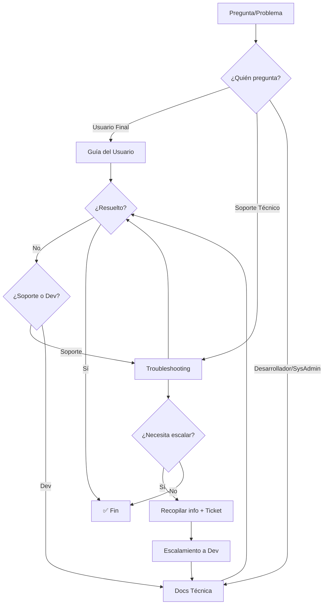

# Documentación de Dego

Esta carpeta contiene la documentación técnica y de usuario del sistema **Dego** (Sistema de Inventario y Ventas).

## Documentos Disponibles

### Migración de Identidad Visual

Documentación relacionada con la migración de la persistencia del color de tema desde `localStorage` hacia la base de datos:

| Documento | Audiencia | Descripción |
|---|---|---|
| **[migracion-identidad-visual.md](./migracion-identidad-visual.md)** | Desarrolladores, Administradores de Sistema | Documentación técnica completa del procedimiento de migración localStorage → BD, incluyendo arquitectura, flujos, edge cases, procedimientos de rollback y respaldo de datos. |
| **[guia-usuario-migracion-color.md](./guia-usuario-migracion-color.md)** | Usuarios Finales | Guía amigable que explica qué es la migración automática, cómo funciona desde la perspectiva del usuario y responde preguntas frecuentes. |
| **[troubleshooting-migracion-color.md](./troubleshooting-migracion-color.md)** | Soporte Técnico, Desarrolladores | Guía de resolución de problemas con síntomas comunes, diagnóstico paso a paso, herramientas de inspección y scripts de recuperación. |

## Guía Rápida por Rol

### Soy un Usuario Final

**Lee**: [Guía del Usuario: Migración de Color Personalizado](./guia-usuario-migracion-color.md)

**Qué encontrarás**:
- ¿Qué cambió en Dego?
- ¿Qué es la migración automática?
- Preguntas frecuentes (FAQ)

### Soy Soporte Técnico de Primera o Segunda Línea

**Lee**: [Guía de Resolución de Problemas](./troubleshooting-migracion-color.md)

**Qué encontrarás**:
- Síntomas comunes y soluciones rápidas
- Diagnóstico paso a paso
- Herramientas de inspección (consola del navegador, SQL)
- Plantilla para escalar a desarrollo

### Soy Desarrollador o Administrador de Sistema

**Lee**: [Documentación de Migración y Respaldo](./migracion-identidad-visual.md)

**Qué encontrarás**:
- Arquitectura antes/después
- Flujo completo de orquestación de la migración
- Condiciones de activación y detección
- Manejo de edge cases (persistencia falla, limpieza falla, etc.)
- Procedimientos de rollback (por organización, completo)
- Respaldo de datos (localStorage, base de datos)
- Monitoreo y validación (métricas, consultas SQL)
- Referencias técnicas (archivos, requisitos validados, propiedades)

**Luego consulta** (si encuentras problemas): [Guía de Resolución de Problemas](./troubleshooting-migracion-color.md)

## Estructura de la Documentación Técnica

```
docs/
├── README.md (este archivo)
│
├── migracion-identidad-visual.md (técnica, completa)
│   ├── Resumen Ejecutivo
│   ├── Contexto Técnico (arquitectura antes/después)
│   ├── Procedimiento de Migración localStorage → BD
│   │   ├── Flujo de Orquestación (diagrama mermaid)
│   │   ├── Condiciones de Activación
│   │   ├── Detección del Color Heredado
│   │   ├── Presentación de la Oferta
│   │   └── Aplicación de la Migración
│   ├── Casos Especiales (persistencia falla, limpieza falla, etc.)
│   ├── Manejo de Edge Cases
│   ├── Procedimientos de Rollback
│   ├── Respaldo de Datos (localStorage, BD)
│   ├── Monitoreo y Validación (métricas, SQL)
│   ├── Documentación para Usuarios Finales (resumen)
│   └── Referencias Técnicas (archivos, requisitos, propiedades)
│
├── guia-usuario-migracion-color.md (usuario final, amigable)
│   ├── ¿Qué cambió en Dego?
│   ├── ¿Qué es la Migración Automática?
│   │   ├── ¿Cómo funciona?
│   │   └── ¿Qué pasa si el proceso falla?
│   ├── Preguntas Frecuentes (11 FAQs)
│   ├── Ventajas del Nuevo Sistema (tabla comparativa)
│   └── ¿Necesitas Ayuda?
│
└── troubleshooting-migracion-color.md (soporte, diagnóstico)
    ├── Síntomas Comunes y Soluciones (5 problemas típicos)
    ├── Diagnóstico Paso a Paso (por nivel de soporte)
    ├── Herramientas de Inspección
    │   ├── DevTools (Chrome/Edge)
    │   ├── Console Snippets (3 snippets útiles)
    │   └── Consultas SQL (4 queries útiles)
    ├── Scripts de Recuperación (3 scripts)
    └── Escalamiento a Desarrollo (plantilla de ticket)
```

## Flujo de Consulta Recomendado



## Versionado de Documentos

- **Versión actual**: 1.0
- **Última actualización**: 2025-01-XX
- **Compatibilidad**: Dego (identidad-marca-dego spec implementado completo)

**Historial de cambios**:
- `1.0 (2025-01-XX)`: Documentación inicial de la migración localStorage → BD.

## Contribuir a la Documentación

Si encuentras errores, ambigüedades o áreas de mejora en la documentación:

1. **Usuarios finales**: reporta al soporte técnico.
2. **Soporte técnico**: crea un ticket interno con la etiqueta `docs`.
3. **Desarrolladores**: abre un PR con las correcciones y actualiza el versionado.

### Estilo de Documentación

- **Técnica**: precisa, estructurada, con diagramas y código.
- **Usuario**: amigable, en español claro, con ejemplos visuales.
- **Troubleshooting**: orientada a la acción, con diagnóstico y soluciones concretas.

## Contacto

Para preguntas sobre la documentación o la funcionalidad:

- **Soporte técnico**: [soporte@dego.com](mailto:soporte@dego.com)
- **Equipo de desarrollo**: [dev@dego.com](mailto:dev@dego.com)

---

**Mantenedor**: Equipo de desarrollo Dego  
**Última revisión**: 2025-01-XX
