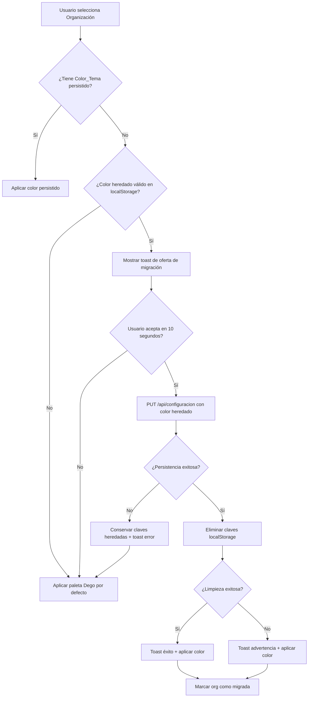

# Documentación de Migración y Respaldo — Identidad Visual

## Resumen Ejecutivo

Este documento describe el procedimiento de migración automática de la persistencia del color de tema desde `localStorage` hacia la base de datos, implementado como parte de la funcionalidad **Identidad de Marca Dego**. La migración es:

- **Automática y única por organización**: se ofrece una sola vez cuando se detecta un color heredado válido.
- **Segura y reversible**: si la persistencia falla, se conservan los datos heredados.
- **Idempotente**: repetir la migración no produce efectos adicionales.
- **No destructiva**: no afecta a otras organizaciones ni a la preferencia de modo claro/oscuro.

## Contexto Técnico

### Arquitectura Anterior (Pre-Migración)

El sistema anterior persistía el color primario (`Color_Tema`) en dos claves de `localStorage`:

- **`invenpro-color`**: JSON serializado con forma `{ hue, saturation, lightness, name }`.
- **`invenpro-theme`**: cadena de modo (`"light"` | `"dark"`).

Esta arquitectura provocaba dos defectos:

1. **Filtración al login**: el color de la última organización se aplicaba antes de autenticarse, contaminando la pantalla de login.
2. **Filtración entre inquilinos**: el color persistía entre organizaciones distintas en el mismo navegador, rompiendo el aislamiento multi-tenant.

### Arquitectura Nueva (Post-Migración)

El color primario se persiste ahora en la tabla `configuracion` de la base de datos, atado a `organizacion_id`, mediante tres claves escalares:

- `color_hue` (0–360)
- `color_saturation` (0–1)
- `color_lightness` (0–1)

La fuente de verdad única es la API (`GET/PUT /api/configuracion`). Las claves de `localStorage` ya no se leen ni escriben como fuente de verdad, y solo se procesan una vez para ofrecer la migración.

## Procedimiento de Migración localStorage → BD

### Flujo de Orquestación

La migración está implementada en `hooks/use-identidad-visual.tsx` dentro del `IdentidadVisualProvider` y se ejecuta automáticamente según las siguientes condiciones:



### Condiciones de Activación

La migración se ofrece **una sola vez por organización** cuando se cumplen todas estas condiciones:

1. **Existe una sesión válida** (`usuario` autenticado).
2. **Existe una organización activa** (`organizacion_id` no nulo).
3. **La organización NO tiene un `Color_Tema` persistido** (el color devuelto por la API coincide con `COLOR_TEMA_DEGO`, el default).
4. **Existe un color heredado válido en `localStorage`** (`invenpro-color` contiene JSON interpretable).
5. **No se ha ofrecido la migración previamente** para esta organización en la sesión actual del navegador (marca en memoria).

### Detección del Color Heredado

La función `leerColorHeredado(getItem)` en `lib/tema/migracion-color.ts` implementa la detección:

```typescript
export type ResultadoMigracion =
  | { tipo: "valido"; color: ColorTema }
  | { tipo: "ausente" }
  | { tipo: "invalido" }

export function leerColorHeredado(
  getItem: (clave: string) => string | null
): ResultadoMigracion
```

**Comportamiento:**

- **`ausente`**: la clave `invenpro-color` no existe o está vacía → no se ofrece migración.
- **`invalido`**: la clave existe pero no es JSON válido o no cumple el esquema `colorTemaSchema` → no se ofrece migración.
- **`valido`**: la clave contiene un `ColorTema` interpretable → se ofrece la migración.

### Presentación de la Oferta

Cuando se detecta un color heredado válido, el sistema muestra un toast de `sonner` con:

- **Título**: "Color heredado detectado"
- **Descripción**: "Se detectó un color personalizado guardado localmente. ¿Deseas aplicarlo a esta organización?"
- **Acción**: botón "Aplicar"
- **Duración**: 10 segundos (permite al usuario leer y decidir)
- **Plazo de aparición**: 2 segundos tras completar la carga de la identidad visual

### Aplicación de la Migración

Cuando el usuario acepta (clic en "Aplicar"), se ejecuta la siguiente secuencia:

1. **Persistencia en BD**: `PUT /api/configuracion` con el color heredado como payload.
2. **Validación de persistencia**:
   - **Éxito (200)**: continuar al paso 3.
   - **Fallo (4xx/5xx)**: mostrar toast de error, **conservar las claves heredadas** intactas, desmarcar la organización para permitir reintentar más tarde.
3. **Limpieza de claves heredadas**: invocar `limpiarClavesHeredadas(removeItem, getItem)`.
4. **Validación de limpieza**:
   - **Éxito**: ambas claves (`invenpro-color`, `invenpro-theme`) ausentes → toast "Color aplicado correctamente".
   - **Fallo parcial**: alguna clave permanece → toast "Color aplicado. No se pudieron limpiar las claves heredadas.".
5. **Aplicación del color**: inyectar el color persistido en las variables CSS.
6. **Marca en memoria**: registrar `organizacion_id` como "migrada" para no volver a ofrecer la migración en esta sesión.

### Casos Especiales

#### Caso 1: Persistencia falla (R9.5)

**Escenario**: el `PUT /api/configuracion` devuelve error (401, 403, 422, 500, timeout).

**Comportamiento**:
- Las claves heredadas **permanecen intactas** en `localStorage`.
- Se muestra toast de error: "No se pudo completar la migración del color. Inténtalo de nuevo."
- La organización se **desmarca** como ofrecida, permitiendo reintentar la migración más tarde.
- Se aplica la paleta por defecto de Dego.

**Recuperación**: el usuario puede:
- Reintentar la migración recargando la página o volviendo a seleccionar la organización.
- Actualizar manualmente el color desde la configuración de la organización.

#### Caso 2: Limpieza falla tras persistir (R9.6)

**Escenario**: el `PUT` tiene éxito, pero `limpiarClavesHeredadas` devuelve `false` (alguna clave no pudo eliminarse, posiblemente por una excepción de `localStorage` o permisos de navegador).

**Comportamiento**:
- El color **ya está persistido en la BD** y es la fuente de verdad.
- Las claves heredadas **permanecen en `localStorage`** pero ya no se leen como fuente de verdad.
- Se muestra toast: "Color aplicado. No se pudieron limpiar las claves heredadas."
- Se aplica el color persistido correctamente.
- La organización se **marca como migrada** para no volver a ofrecer la migración (evita bucles de oferta).

**Recuperación**: el usuario puede:
- Eliminar manualmente las claves heredadas desde las herramientas de desarrollo del navegador (opcional, no afecta la funcionalidad).
- Continuar usando la aplicación normalmente (el color persistido en BD es la verdad).

#### Caso 3: Color heredado inválido (R9.3)

**Escenario**: `invenpro-color` contiene un valor no interpretable (JSON malformado, tipo erróneo, valores fuera de rango).

**Comportamiento**:
- `leerColorHeredado` devuelve `{ tipo: "invalido" }`.
- **No se ofrece la migración**.
- Las claves heredadas **permanecen sin modificarse**.
- Se aplica la paleta por defecto de Dego.

**Recuperación**: el usuario puede:
- Actualizar manualmente el color desde la configuración de la organización.
- Eliminar las claves heredadas manualmente si lo desea.

#### Caso 4: Color heredado ausente

**Escenario**: `invenpro-color` no existe o está vacío.

**Comportamiento**:
- `leerColorHeredado` devuelve `{ tipo: "ausente" }`.
- **No se ofrece la migración**.
- Se aplica la paleta por defecto de Dego.

## Manejo de Edge Cases

### Edge Case 1: Organización con Color_Tema = COLOR_TEMA_DEGO persistido explícitamente

**Limitación técnica**: el endpoint `GET /api/configuracion` no distingue entre "ausente" y "explícitamente Dego" (ambas devuelven `COLOR_TEMA_DEGO` por la regla de defaults R6.6).

**Comportamiento**: si una organización persiste explícitamente el color por defecto, se la considera "sin color persistido" a efectos de ofrecer la migración heredada.

**Impacto**: si existe un color heredado válido, se ofrecerá la migración y sobrescribirá el color explícito.

**Mitigación**: es un caso de borde extremadamente improbable (requiere que un usuario persista manualmente el color negro neutral exacto).

### Edge Case 2: Múltiples organizaciones con color heredado

**Comportamiento**: la migración se ofrece **independientemente para cada organización** que cumpla las condiciones. El color heredado de `localStorage` se ofrece a la primera organización sin color persistido que el usuario seleccione.

**Ejemplo**:
- Usuario tiene organizaciones A, B y C.
- Ninguna tiene color persistido.
- `localStorage` contiene un color heredado válido.
- Usuario selecciona A → se ofrece la migración.
- Usuario acepta → el color se persiste en A y se limpian las claves heredadas.
- Usuario selecciona B → ya no hay color heredado, no se ofrece migración.
- Usuario selecciona C → ya no hay color heredado, no se ofrece migración.

### Edge Case 3: Usuario rechaza la migración (ignora el toast)

**Comportamiento**:
- El toast desaparece tras 10 segundos.
- Las claves heredadas **permanecen intactas**.
- Se aplica la paleta por defecto de Dego.
- La organización se **marca como ofrecida** para no volver a mostrar el toast en esta sesión.

**Recuperación**: si el usuario recarga la página o vuelve a seleccionar la organización en una nueva sesión del navegador, se volverá a ofrecer la migración (la marca en memoria se pierde al recargar).

### Edge Case 4: localStorage bloqueado o inaccesible

**Escenario**: el navegador bloquea el acceso a `localStorage` (configuración de privacidad, modo incógnito estricto).

**Comportamiento**:
- `obtenerAccesoresLocalStorage()` devuelve `null`.
- **No se ofrece la migración**.
- Se aplica la paleta por defecto de Dego.

**Impacto**: la migración no se ejecuta, pero la funcionalidad de identidad visual basada en BD funciona normalmente.

## Procedimientos de Rollback

### Rollback de Migración Individual (por Organización)

Si una organización requiere revertir el color migrado y restaurar el color heredado:

1. **Identificar el color heredado original**: inspeccionar `localStorage` antes de que se limpie, o recuperar desde un respaldo del navegador.
2. **Actualizar manualmente el color**: usar la interfaz de configuración de la organización o invocar directamente el endpoint:
   ```bash
   curl -X PUT https://app.example.com/api/configuracion \
     -H "Content-Type: application/json" \
     -b "sesion_invenpro=..." \
     -d '{"color_hue":210,"color_saturation":0.65,"color_lightness":0.55}'
   ```
3. **Verificar**: recargar la aplicación y confirmar que el color se aplica correctamente.

**Nota**: no es posible "deshacer" la migración automáticamente. El rollback es manual y requiere conocer el color heredado original.

### Rollback Completo a localStorage (Arquitectura Anterior)

**ADVERTENCIA**: este procedimiento es **destructivo** y **no recomendado** en producción. Solo para entornos de desarrollo/testing.

1. **Revertir el código**:
   ```bash
   git revert <commit-sha-de-migracion>
   # o
   git checkout <commit-antes-de-migracion>
   ```
2. **Desplegar la versión anterior**: revertir a una versión del código que use `localStorage` como fuente de verdad.
3. **Limpiar la caché del navegador**: instruir a los usuarios a limpiar la caché y `localStorage` (los colores persistidos en BD se ignorarán).
4. **Restaurar claves heredadas manualmente** (si se conservaron):
   - Desde las herramientas de desarrollo del navegador, restaurar las claves `invenpro-color` e `invenpro-theme`.

**Consecuencias**:
- Se pierden todos los colores persistidos en la BD durante el período post-migración.
- Se restaura el defecto de filtración al login y entre inquilinos.

**Recomendación**: en lugar de revertir completamente, corregir el problema específico con un hotfix sobre la arquitectura nueva.

## Respaldo de Datos

### Respaldo de localStorage (Pre-Migración)

**Objetivo**: conservar los colores heredados antes de la migración para permitir rollback o auditoría.

**Procedimiento manual** (por usuario):
1. Abrir las herramientas de desarrollo del navegador (F12 → pestaña "Application" o "Storage").
2. Navegar a `localStorage` → `https://app.example.com`.
3. Copiar los valores de `invenpro-color` e `invenpro-theme`.
4. Guardar en un archivo de texto o hoja de cálculo:
   ```
   invenpro-color: {"hue":210,"saturation":0.65,"lightness":0.55,"name":"azul"}
   invenpro-theme: "dark"
   ```

**Procedimiento automatizado** (script de navegador):
```javascript
// Ejecutar en la consola del navegador antes de la migración
const respaldo = {
  color: localStorage.getItem('invenpro-color'),
  theme: localStorage.getItem('invenpro-theme'),
  timestamp: new Date().toISOString()
};
console.log('Respaldo localStorage:', JSON.stringify(respaldo, null, 2));
// Copiar el output y guardarlo
```

### Respaldo de Base de Datos (Post-Migración)

**Objetivo**: conservar los colores persistidos en la tabla `configuracion` para permitir rollback o auditoría.

**Procedimiento** (requiere acceso a la base de datos):

```sql
-- Exportar todas las claves de color de todas las organizaciones
SELECT 
  organizacion_id,
  clave,
  valor,
  actualizado_en
FROM configuracion
WHERE clave IN ('color_hue', 'color_saturation', 'color_lightness')
ORDER BY organizacion_id, clave;

-- Guardar el resultado en un archivo CSV o SQL dump
```

**Respaldo completo de la tabla** (recomendado antes de cualquier cambio masivo):

```bash
# MySQL dump de la tabla configuracion
mysqldump -u usuario -p basedatos configuracion > respaldo_configuracion_$(date +%Y%m%d_%H%M%S).sql
```

**Frecuencia recomendada**: incluir la tabla `configuracion` en los respaldos diarios automáticos de la base de datos.

### Restauración desde Respaldo

**Escenario**: se detecta una corrupción de datos o se requiere revertir cambios masivos.

**Procedimiento** (requiere acceso a la base de datos):

1. **Detener la aplicación** (opcional, recomendado para evitar inconsistencias).
2. **Restaurar desde el dump SQL**:
   ```bash
   mysql -u usuario -p basedatos < respaldo_configuracion_20240115_143000.sql
   ```
3. **Verificar los datos restaurados**:
   ```sql
   SELECT * FROM configuracion WHERE clave LIKE 'color_%' LIMIT 10;
   ```
4. **Reiniciar la aplicación**.
5. **Validar manualmente**: seleccionar varias organizaciones y verificar que los colores se aplican correctamente.

## Monitoreo y Validación

### Indicadores de Éxito de Migración

**Métricas a monitorear** (requiere telemetría/logs):

1. **Tasa de aceptación**: `migración_aceptada / migración_ofrecida`.
2. **Tasa de fallo de persistencia**: `PUT_fallido / PUT_intentado`.
3. **Tasa de fallo de limpieza**: `limpieza_fallida / limpieza_intentada`.
4. **Organizaciones sin color persistido**: contar organizaciones donde `color_hue/sat/light` coinciden con `COLOR_TEMA_DEGO`.

**Consultas SQL útiles**:

```sql
-- Contar organizaciones con color personalizado (no Dego)
SELECT COUNT(DISTINCT organizacion_id) AS orgs_con_color_custom
FROM configuracion
WHERE clave IN ('color_hue', 'color_saturation', 'color_lightness')
  AND valor NOT IN ('0', '0.18'); -- Excluir valores de COLOR_TEMA_DEGO

-- Listar organizaciones sin color persistido
SELECT o.id, o.nombre
FROM organizaciones o
LEFT JOIN configuracion c ON c.organizacion_id = o.id AND c.clave = 'color_hue'
WHERE c.valor IS NULL OR c.valor = '0';
```

### Validación Post-Migración

**Checklist de validación manual** (ejecutar tras desplegar la migración):

- [ ] **Login sin sesión**: verificar que la pantalla de login muestra la paleta Dego (negro/neutral) y nunca un color de organización.
- [ ] **Selección de organización A**: verificar que se carga y aplica su color persistido correctamente.
- [ ] **Cambio a organización B**: verificar que el color cambia completamente (sin residuos de A).
- [ ] **Logout**: verificar que el color vuelve a la paleta Dego.
- [ ] **Oferta de migración**: crear una organización nueva, establecer un color heredado en `localStorage` manualmente, seleccionar la org → verificar que aparece el toast de migración.
- [ ] **Aceptar migración**: verificar que el color se persiste en BD, las claves heredadas se eliminan y aparece el toast de éxito.
- [ ] **Fallo de migración simulado**: desconectar la red, aceptar migración → verificar toast de error y claves heredadas intactas.

## Documentación para Usuarios Finales

### Guía del Usuario: Migración de Color Personalizado

**¿Qué cambió?**

Tu color personalizado ahora se guarda en la base de datos de tu organización, en lugar de en tu navegador local. Esto significa que:

- **El color persiste entre dispositivos**: verás el mismo color en tu computadora, tablet y móvil.
- **El color se aísla por organización**: cada organización tiene su propio color, sin mezclas.
- **La pantalla de login es siempre neutra**: nunca verás el color de una organización antes de iniciar sesión.

**¿Qué es la migración automática?**

Si ya tenías un color personalizado guardado localmente, la aplicación te lo ofrecerá aplicar a tu organización la primera vez que la selecciones. Aparecerá un mensaje en la esquina inferior con un botón "Aplicar". Si lo aceptas:

1. Tu color se guarda en la base de datos.
2. Se aplica automáticamente a tu organización.
3. La copia local se elimina (ya no se necesita).

**¿Qué pasa si no acepto la migración?**

Nada grave: tu organización usará el color por defecto (paleta negra neutral de Dego). Puedes cambiar el color manualmente en cualquier momento desde la configuración de tu organización.

**¿Puedo revertir el color migrado?**

Sí, desde la configuración de tu organización puedes cambiar el color a cualquier otro en cualquier momento. El cambio se guarda automáticamente en la base de datos.

**¿Qué pasa con mi preferencia de modo claro/oscuro?**

Tu preferencia de modo claro/oscuro **NO se ve afectada** por la migración. Es independiente del color de la organización y se sigue guardando en tu navegador.

## Referencias Técnicas

### Archivos Relacionados

- **Orquestación de migración**: `hooks/use-identidad-visual.tsx`
- **Utilidades de migración**: `lib/tema/migracion-color.ts`
- **Esquemas de validación**: `lib/schemas/configuracion.ts`
- **Endpoint de persistencia**: `app/api/configuracion/route.ts`
- **Tests de migración**: `__tests__/property/migracion-color.test.ts`

### Requisitos Validados

- **R9.1**: `localStorage` ya no es fuente de verdad del color.
- **R9.2**: Migración se ofrece en 2 s tras inicialización.
- **R9.3**: Valores heredados inválidos se omiten.
- **R9.4**: Claves heredadas se eliminan tras persistir.
- **R9.5**: Si la persistencia falla, se conservan las claves.
- **R9.6**: Si la limpieza falla tras persistir, el color persistido prevalece.
- **R9.7**: La preferencia de modo claro/oscuro es independiente.

### Propiedades de Corrección

- **P8**: Clasificación correcta del color heredado (round-trip de parseo).
- **P9**: Seguridad e idempotencia de la migración.
- **P12**: Ortogonalidad del modo claro/oscuro respecto al color.

---

**Última actualización**: 2025-01-XX  
**Versión del documento**: 1.0  
**Mantenedor**: Equipo de desarrollo Dego
